---
id: advanced-search-diagrams
title: "🗺 Advanced Search - Diagrams & Visual Guides"
sidebar_label: "🗺 Diagrams"
sidebar_position: 3
name: "🗺 Diagrams"
slug: /advanced-search/diagrams
tags: [diagrams, architecture, workflows, visual-guides]
---

# Advanced Search - Diagrams & Visual Guides

:::tip 📌 At a Glance
**Document Type**: Diagrams  
**Goal**: Follow the unified ECM User Guide design and structure for this page.
:::

Comprehensive visual representations of Advanced Search architecture, workflows, and concepts.

## Diagram 1: System Architecture with Mongo Search

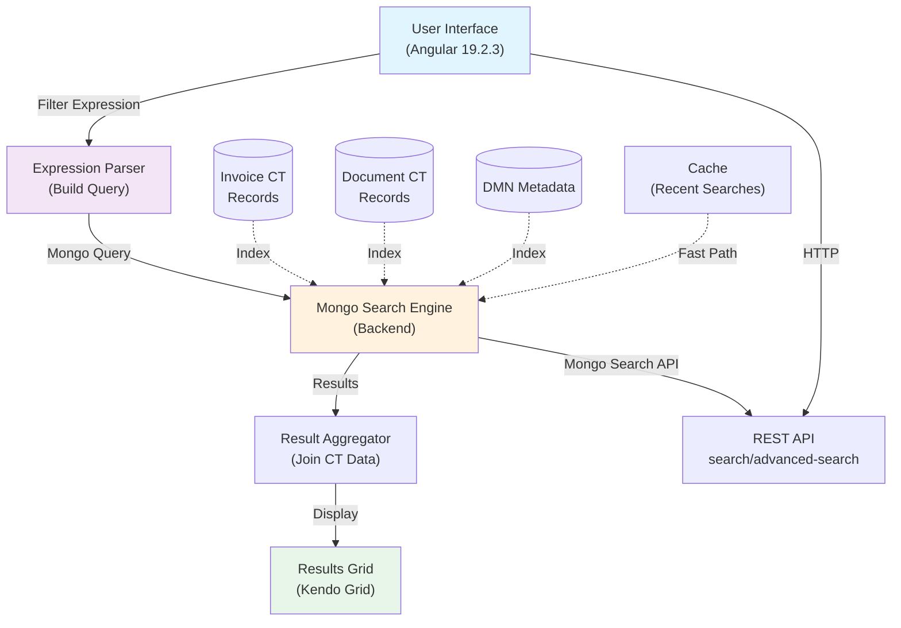
```mermaid
graph TB
    USER["User Interface<br/>(Angular 19.2.3)"] -->|Filter Expression| PARSER["Expression Parser<br/>(Build Query)"]
    PARSER -->|Mongo Query| MONGO["Mongo Search Engine<br/>(Backend)"]
    MONGO -->|Results| AGGREGATOR["Result Aggregator<br/>(Join CT Data)"]
    AGGREGATOR -->|Display| GRID["Results Grid<br/>(Kendo Grid)"]
    
    DB1[("Invoice CT<br/>Records")] -.->|Index| MONGO
    DB2[("Document CT<br/>Records")] -.->|Index| MONGO
    DB3[("DMN Metadata")] -.->|Index| MONGO
    
    CACHE["Cache<br/>(Recent Searches)"] -.->|Fast Path| MONGO
    
    MONGO -->|Mongo Search API| API["REST API<br/>search/advanced-search"]
    USER -->|HTTP| API
    
    style USER fill:#e1f5ff
    style MONGO fill:#fff3e0
    style GRID fill:#e8f5e9
    style PARSER fill:#f3e5f5
```

## Diagram 2: Advanced Search Page Layout

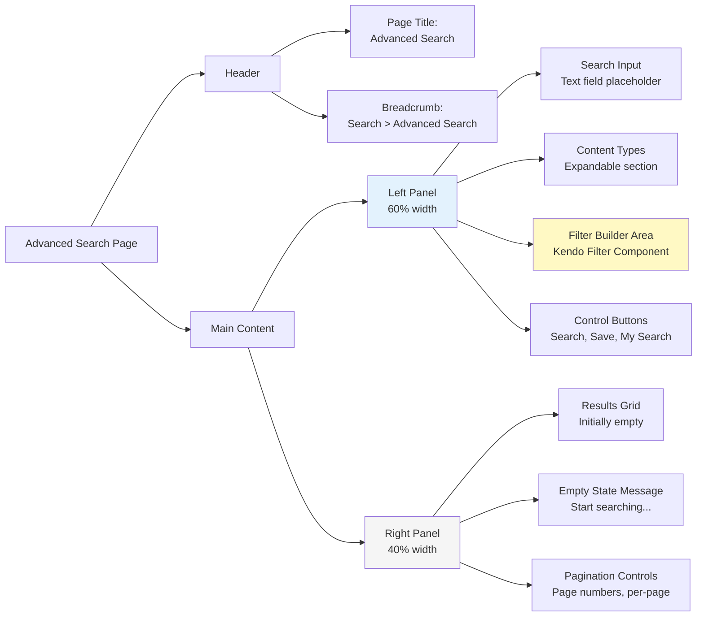
```mermaid
graph LR
    PAGE["Advanced Search Page"] --> HEADER["Header"]
    PAGE --> CONTENT["Main Content"]
    
    HEADER --> TITLE["Page Title:<br/>Advanced Search"]
    HEADER --> BREADCRUMB["Breadcrumb:<br/>Search > Advanced Search"]
    
    CONTENT --> LEFT["Left Panel<br/>60% width"]
    CONTENT --> RIGHT["Right Panel<br/>40% width"]
    
    LEFT --> SEARCH_INPUT["Search Input<br/>Text field placeholder"]
    LEFT --> CONTENT_TYPE["Content Types<br/>Expandable section"]
    LEFT --> FILTER_AREA["Filter Builder Area<br/>Kendo Filter Component"]
    LEFT --> CONTROLS["Control Buttons<br/>Search, Save, My Search"]
    
    RIGHT --> RESULTS["Results Grid<br/>Initially empty"]
    RIGHT --> EMPTY_STATE["Empty State Message<br/>Start searching..."]
    RIGHT --> PAGINATION["Pagination Controls<br/>Page numbers, per-page"]
    
    style LEFT fill:#e3f2fd
    style RIGHT fill:#f5f5f5
    style FILTER_AREA fill:#fff9c4
```

## Diagram 3: Filter Builder Component Structure

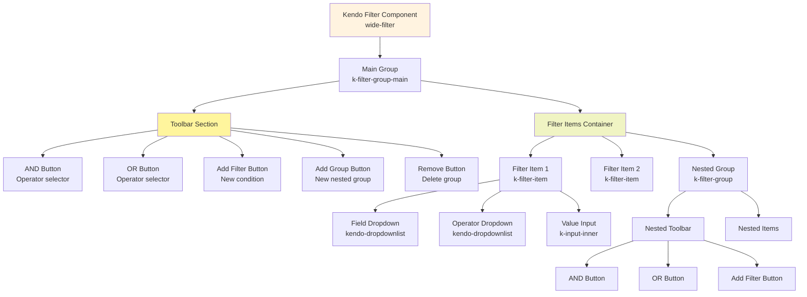
```mermaid
graph TD
    FILTER["Kendo Filter Component<br/>wide-filter"]
    
    FILTER --> MAIN_GROUP["Main Group<br/>k-filter-group-main"]
    
    MAIN_GROUP --> TOOLBAR["Toolbar Section"]
    MAIN_GROUP --> FILTER_ITEMS["Filter Items Container"]
    
    TOOLBAR --> AND_BTN["AND Button<br/>Operator selector"]
    TOOLBAR --> OR_BTN["OR Button<br/>Operator selector"]
    TOOLBAR --> ADD_FILTER["Add Filter Button<br/>New condition"]
    TOOLBAR --> ADD_GROUP["Add Group Button<br/>New nested group"]
    TOOLBAR --> REMOVE["Remove Button<br/>Delete group"]
    
    FILTER_ITEMS --> ITEM1["Filter Item 1<br/>k-filter-item"]
    FILTER_ITEMS --> ITEM2["Filter Item 2<br/>k-filter-item"]
    FILTER_ITEMS --> GROUP["Nested Group<br/>k-filter-group"]
    
    ITEM1 --> FIELD1["Field Dropdown<br/>kendo-dropdownlist"]
    ITEM1 --> OPERATOR1["Operator Dropdown<br/>kendo-dropdownlist"]
    ITEM1 --> VALUE1["Value Input<br/>k-input-inner"]
    
    GROUP --> NESTED_TOOLBAR["Nested Toolbar"]
    GROUP --> NESTED_ITEMS["Nested Items"]
    
    NESTED_TOOLBAR --> NESTED_AND["AND Button"]
    NESTED_TOOLBAR --> NESTED_OR["OR Button"]
    NESTED_TOOLBAR --> NESTED_ADD["Add Filter Button"]
    
    style FILTER fill:#fff3e0
    style TOOLBAR fill:#fff59d
    style FILTER_ITEMS fill:#f0f4c3
```

## Diagram 4: Filter Row Structure (Field + Operator + Value)

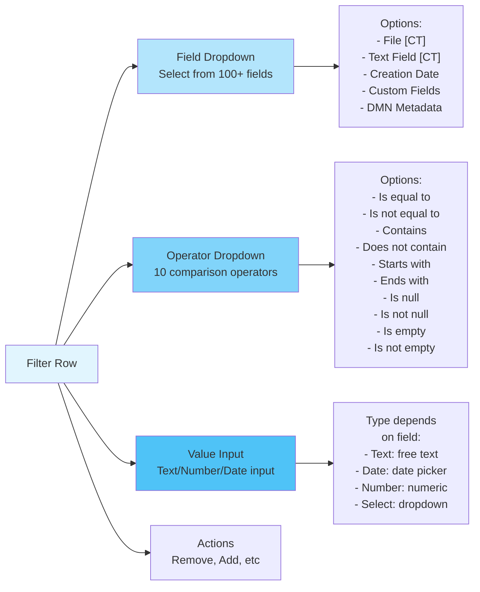
```mermaid
graph LR
    ROW["Filter Row"] --> FIELD["Field Dropdown<br/>Select from 100+ fields"]
    ROW --> OPERATOR["Operator Dropdown<br/>10 comparison operators"]
    ROW --> VALUE["Value Input<br/>Text/Number/Date input"]
    ROW --> ACTIONS["Actions<br/>Remove, Add, etc"]
    
    FIELD --> FIELD_OPTIONS["Options:<br/>- File [CT]<br/>- Text Field [CT]<br/>- Creation Date<br/>- Custom Fields<br/>- DMN Metadata"]
    
    OPERATOR --> OP_OPTIONS["Options:<br/>- Is equal to<br/>- Is not equal to<br/>- Contains<br/>- Does not contain<br/>- Starts with<br/>- Ends with<br/>- Is null<br/>- Is not null<br/>- Is empty<br/>- Is not empty"]
    
    VALUE --> VALUE_TYPE["Type depends<br/>on field:<br/>- Text: free text<br/>- Date: date picker<br/>- Number: numeric<br/>- Select: dropdown"]
    
    style ROW fill:#e1f5fe
    style FIELD fill:#b3e5fc
    style OPERATOR fill:#81d4fa
    style VALUE fill:#4fc3f7
```

## Diagram 5: Logical Operators - AND vs OR

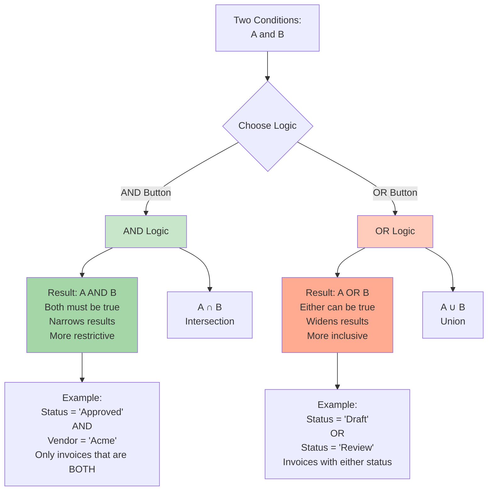
```mermaid
graph TD
    START["Two Conditions:<br/>A and B"] --> SPLIT{Choose Logic}
    
    SPLIT -->|AND Button| AND_LOGIC["AND Logic"]
    SPLIT -->|OR Button| OR_LOGIC["OR Logic"]
    
    AND_LOGIC --> AND_RESULT["Result: A AND B<br/>Both must be true<br/>Narrows results<br/>More restrictive"]
    AND_LOGIC --> AND_VENN["A ∩ B<br/>Intersection"]
    
    OR_LOGIC --> OR_RESULT["Result: A OR B<br/>Either can be true<br/>Widens results<br/>More inclusive"]
    OR_LOGIC --> OR_VENN["A ∪ B<br/>Union"]
    
    AND_RESULT --> AND_EXAMPLE["Example:<br/>Status = 'Approved'<br/>AND<br/>Vendor = 'Acme'<br/>Only invoices that are BOTH"]
    
    OR_RESULT --> OR_EXAMPLE["Example:<br/>Status = 'Draft'<br/>OR<br/>Status = 'Review'<br/>Invoices with either status"]
    
    style AND_LOGIC fill:#c8e6c9
    style OR_LOGIC fill:#ffccbc
    style AND_RESULT fill:#a5d6a7
    style OR_RESULT fill:#ffab91
```

## Diagram 6: Group Nesting & Precedence

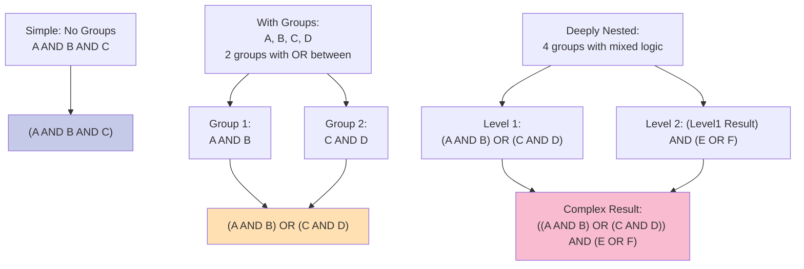
```mermaid
graph TD
    SIMPLE["Simple: No Groups<br/>A AND B AND C"] --> SIMPLE_RESULT["(A AND B AND C)"]
    
    GROUPED["With Groups:<br/>A, B, C, D<br/>2 groups with OR between"] --> GROUP1["Group 1:<br/>A AND B"]
    GROUPED --> GROUP2["Group 2:<br/>C AND D"]
    GROUP1 --> GROUP_RESULT["(A AND B) OR (C AND D)"]
    GROUP2 --> GROUP_RESULT
    
    NESTED["Deeply Nested:<br/>4 groups with mixed logic"] --> LEVEL1["Level 1:<br/>(A AND B) OR (C AND D)"]
    NESTED --> LEVEL2["Level 2: (Level1 Result) AND (E OR F)"]
    
    LEVEL1 --> COMPLEX["Complex Result:<br/>((A AND B) OR (C AND D)) AND (E OR F)"]
    LEVEL2 --> COMPLEX
    
    style SIMPLE_RESULT fill:#c5cae9
    style GROUP_RESULT fill:#ffe0b2
    style COMPLEX fill:#f8bbd0
```

## Diagram 7: Filter Operators Decision Tree

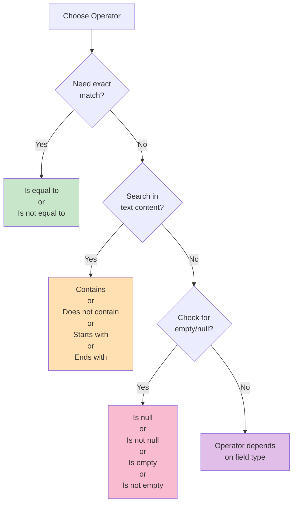
```mermaid
flowchart TD
    START["Choose Operator"] --> Q1{"Need exact<br/>match?"}
    
    Q1 -->|Yes| EXACT["Is equal to<br/>or<br/>Is not equal to"]
    Q1 -->|No| Q2{"Search in<br/>text content?"}
    
    Q2 -->|Yes| TEXT_MATCH["Contains<br/>or<br/>Does not contain<br/>or<br/>Starts with<br/>or<br/>Ends with"]
    Q2 -->|No| Q3{"Check for<br/>empty/null?"}
    
    Q3 -->|Yes| NULL_CHECK["Is null<br/>or<br/>Is not null<br/>or<br/>Is empty<br/>or<br/>Is not empty"]
    Q3 -->|No| CUSTOM["Operator depends<br/>on field type"]
    
    style EXACT fill:#c8e6c9
    style TEXT_MATCH fill:#ffe0b2
    style NULL_CHECK fill:#f8bbd0
    style CUSTOM fill:#e1bee7
```

## Diagram 8: Field Type to Operator Mapping

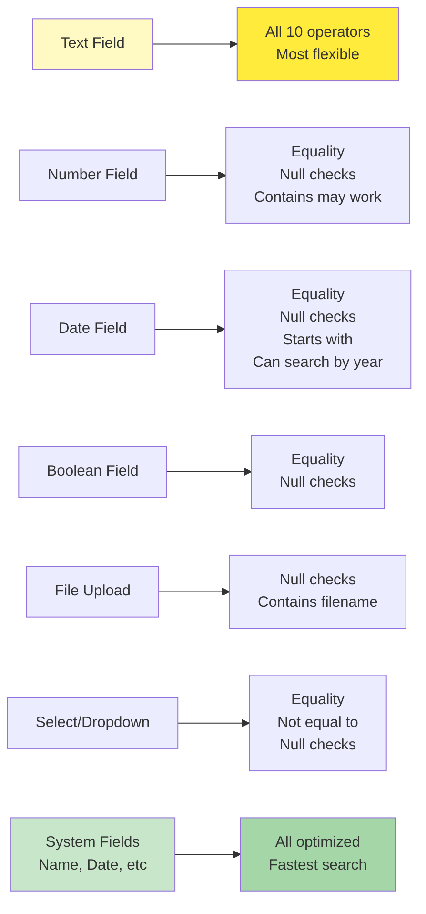
```mermaid
graph LR
    TEXT["Text Field"] --> TEXT_OPS["All 10 operators<br/>Most flexible"]
    
    NUMBER["Number Field"] --> NUMBER_OPS["Equality<br/>Null checks<br/>Contains may work"]
    
    DATE["Date Field"] --> DATE_OPS["Equality<br/>Null checks<br/>Starts with<br/>Can search by year"]
    
    BOOL["Boolean Field"] --> BOOL_OPS["Equality<br/>Null checks"]
    
    FILE["File Upload"] --> FILE_OPS["Null checks<br/>Contains filename"]
    
    SELECT["Select/Dropdown"] --> SELECT_OPS["Equality<br/>Not equal to<br/>Null checks"]
    
    SYSTEM["System Fields<br/>Name, Date, etc"] --> SYSTEM_OPS["All optimized<br/>Fastest search"]
    
    style TEXT fill:#fff9c4
    style TEXT_OPS fill:#ffeb3b
    style SYSTEM fill:#c8e6c9
    style SYSTEM_OPS fill:#a5d6a7
```

## Diagram 9: Complex Filter Expression Example

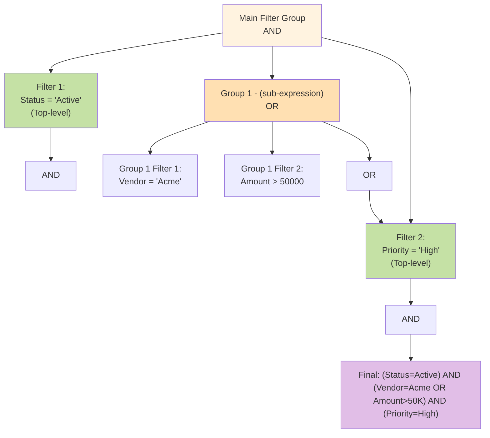
```mermaid
graph TD
    MAIN["Main Filter Group<br/>AND"]
    
    MAIN --> F1["Filter 1:<br/>Status = 'Active'<br/>(Top-level)"]
    MAIN --> GROUP1["Group 1 - (sub-expression)<br/>OR"]
    MAIN --> F2["Filter 2:<br/>Priority = 'High'<br/>(Top-level)"]
    
    GROUP1 --> G1F1["Group 1 Filter 1:<br/>Vendor = 'Acme'"]
    GROUP1 --> G1F2["Group 1 Filter 2:<br/>Amount > 50000"]
    
    F1 --> LOGIC1["AND"]
    GROUP1 --> LOGIC2["OR"]
    LOGIC2 --> F2
    F2 --> LOGIC3["AND"]
    LOGIC3 --> RESULT["Final: (Status=Active) AND (Vendor=Acme OR Amount>50K) AND (Priority=High)"]
    
    style MAIN fill:#fff3e0
    style GROUP1 fill:#ffe0b2
    style F1 fill:#c5e1a5
    style F2 fill:#c5e1a5
    style RESULT fill:#e1bee7
```

## Diagram 10: Filter Field Categories

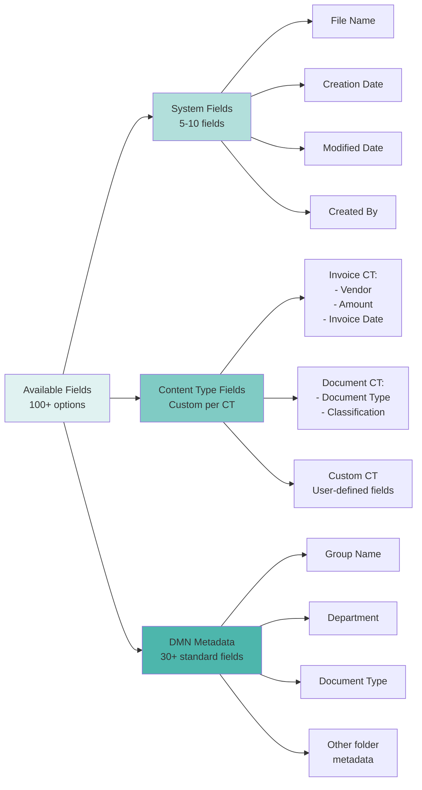
```mermaid
graph LR
    FIELDS["Available Fields<br/>100+ options"]
    
    FIELDS --> SYSTEM["System Fields<br/>5-10 fields"]
    FIELDS --> CT_FIELDS["Content Type Fields<br/>Custom per CT"]
    FIELDS --> DMN_FIELDS["DMN Metadata<br/>30+ standard fields"]
    
    SYSTEM --> SYS1["File Name"]
    SYSTEM --> SYS2["Creation Date"]
    SYSTEM --> SYS3["Modified Date"]
    SYSTEM --> SYS4["Created By"]
    
    CT_FIELDS --> CT1["Invoice CT:<br/>- Vendor<br/>- Amount<br/>- Invoice Date"]
    CT_FIELDS --> CT2["Document CT:<br/>- Document Type<br/>- Classification"]
    CT_FIELDS --> CT3["Custom CT<br/>User-defined fields"]
    
    DMN_FIELDS --> DMN1["Group Name"]
    DMN_FIELDS --> DMN2["Department"]
    DMN_FIELDS --> DMN3["Document Type"]
    DMN_FIELDS --> DMN4["Other folder<br/>metadata"]
    
    style FIELDS fill:#e0f2f1
    style SYSTEM fill:#b2dfdb
    style CT_FIELDS fill:#80cbc4
    style DMN_FIELDS fill:#4db6ac
```

## Diagram 11: Search Execution Flow

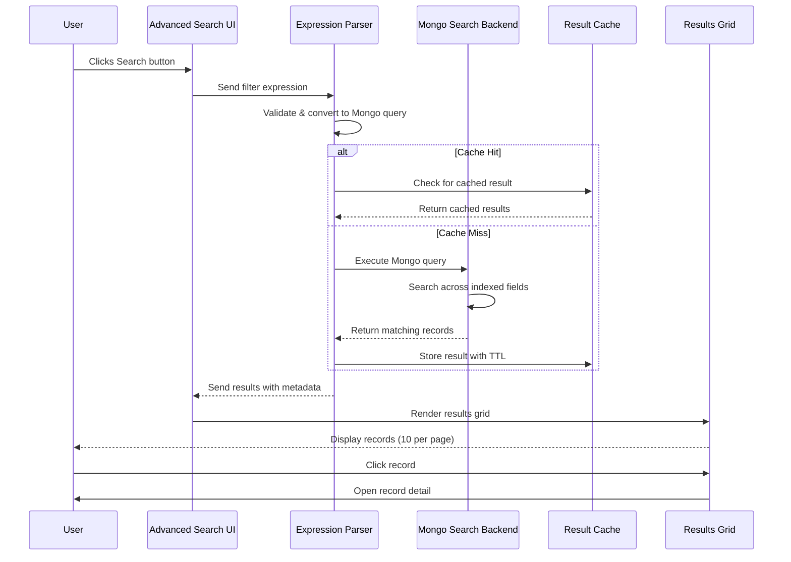
```mermaid
sequenceDiagram
    participant User as User
    participant UI as Advanced Search UI
    participant Parser as Expression Parser
    participant Mongo as Mongo Search Backend
    participant Cache as Result Cache
    participant Grid as Results Grid
    
    User->>UI: Clicks Search button
    UI->>Parser: Send filter expression
    Parser->>Parser: Validate & convert to Mongo query
    
    alt Cache Hit
        Parser->>Cache: Check for cached result
        Cache-->>Parser: Return cached results
    else Cache Miss
        Parser->>Mongo: Execute Mongo query
        Mongo->>Mongo: Search across indexed fields
        Mongo-->>Parser: Return matching records
        Parser->>Cache: Store result with TTL
    end
    
    Parser-->>UI: Send results with metadata
    UI->>Grid: Render results grid
    Grid-->>User: Display records (10 per page)
    
    User->>Grid: Click record
    Grid->>User: Open record detail
```

## Diagram 12: Results Grid Component

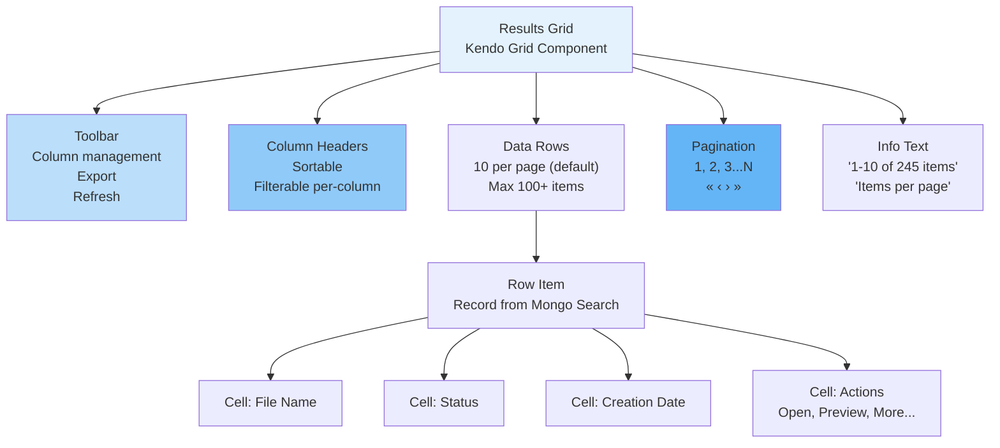
```mermaid
graph TD
    RESULTS_GRID["Results Grid<br/>Kendo Grid Component"]
    
    RESULTS_GRID --> TOOLBAR["Toolbar<br/>Column management<br/>Export<br/>Refresh"]
    RESULTS_GRID --> HEADER["Column Headers<br/>Sortable<br/>Filterable per-column"]
    RESULTS_GRID --> ROWS["Data Rows<br/>10 per page (default)<br/>Max 100+ items"]
    RESULTS_GRID --> PAGINATION["Pagination<br/>1, 2, 3...N<br/>«  ‹  ›  »"]
    RESULTS_GRID --> INFO["Info Text<br/>'1-10 of 245 items'<br/>'Items per page'"]
    
    ROWS --> ROW["Row Item<br/>Record from Mongo Search"]
    ROW --> CELL1["Cell: File Name"]
    ROW --> CELL2["Cell: Status"]
    ROW --> CELL3["Cell: Creation Date"]
    ROW --> ACTIONS["Cell: Actions<br/>Open, Preview, More..."]
    
    style RESULTS_GRID fill:#e3f2fd
    style TOOLBAR fill:#bbdefb
    style HEADER fill:#90caf9
    style PAGINATION fill:#64b5f6
```

## Diagram 13: My Search - Saved Searches Management

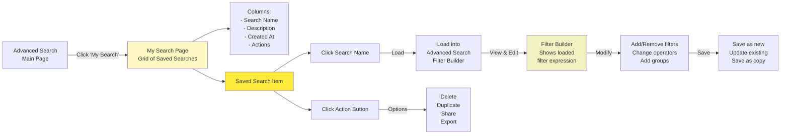
```mermaid
graph LR
    MAIN_PAGE["Advanced Search<br/>Main Page"]
    
    MAIN_PAGE -->|Click 'My Search'| MY_SEARCH["My Search Page<br/>Grid of Saved Searches"]
    
    MY_SEARCH --> COLUMNS["Columns:<br/>- Search Name<br/>- Description<br/>- Created At<br/>- Actions"]
    
    MY_SEARCH --> SEARCH_ITEM["Saved Search Item"]
    
    SEARCH_ITEM --> CLICK_NAME["Click Search Name"]
    SEARCH_ITEM --> CLICK_ACTION["Click Action Button"]
    
    CLICK_NAME -->|Load| LOAD["Load into<br/>Advanced Search<br/>Filter Builder"]
    CLICK_ACTION -->|Options| OPTIONS["Delete<br/>Duplicate<br/>Share<br/>Export"]
    
    LOAD -->|View & Edit| FILTER_BUILDER["Filter Builder<br/>Shows loaded<br/>filter expression"]
    
    FILTER_BUILDER -->|Modify| MODIFY["Add/Remove filters<br/>Change operators<br/>Add groups"]
    
    MODIFY -->|Save| SAVE_OPTIONS["Save as new<br/>Update existing<br/>Save as copy"]
    
    style MY_SEARCH fill:#fff9c4
    style SEARCH_ITEM fill:#ffeb3b
    style FILTER_BUILDER fill:#f0f4c3
```

## Diagram 14: Save Search Workflow

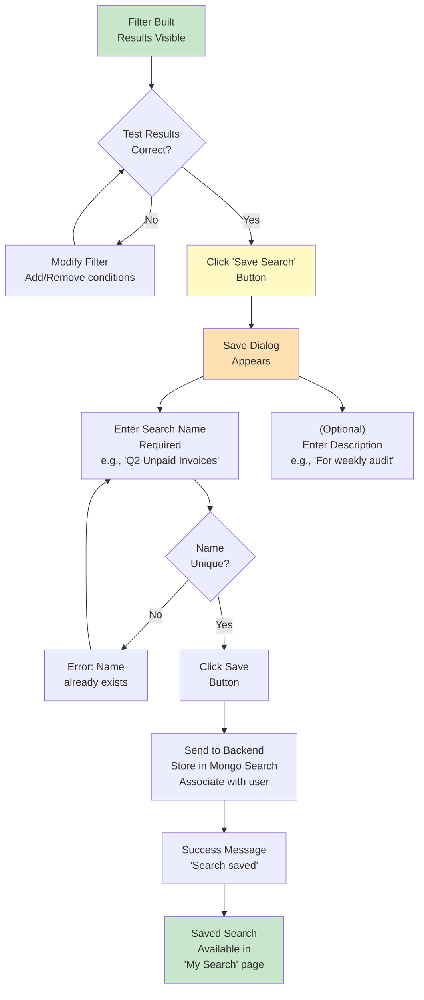
```mermaid
flowchart TD
    START["Filter Built<br/>Results Visible"] --> TEST{Test Results<br/>Correct?}
    
    TEST -->|No| MODIFY["Modify Filter<br/>Add/Remove conditions"]
    MODIFY --> TEST
    
    TEST -->|Yes| SAVE_BTN["Click 'Save Search'<br/>Button"]
    
    SAVE_BTN --> POPUP["Save Dialog<br/>Appears"]
    
    POPUP --> NAME["Enter Search Name<br/>Required<br/>e.g., 'Q2 Unpaid Invoices'"]
    POPUP --> DESC["(Optional)<br/>Enter Description<br/>e.g., 'For weekly audit'"]
    
    NAME --> VALIDATE{Name<br/>Unique?}
    
    VALIDATE -->|No| ERROR["Error: Name<br/>already exists"]
    ERROR --> NAME
    
    VALIDATE -->|Yes| CONFIRM["Click Save<br/>Button"]
    
    CONFIRM --> BACKEND["Send to Backend<br/>Store in Mongo Search<br/>Associate with user"]
    
    BACKEND --> SUCCESS["Success Message<br/>'Search saved'"]
    
    SUCCESS --> SAVED_SEARCH["Saved Search<br/>Available in<br/>'My Search' page"]
    
    style START fill:#c8e6c9
    style SAVE_BTN fill:#fff9c4
    style POPUP fill:#ffe0b2
    style SAVED_SEARCH fill:#c8e6c9
```

## Diagram 15: Content Type & Field Relationship

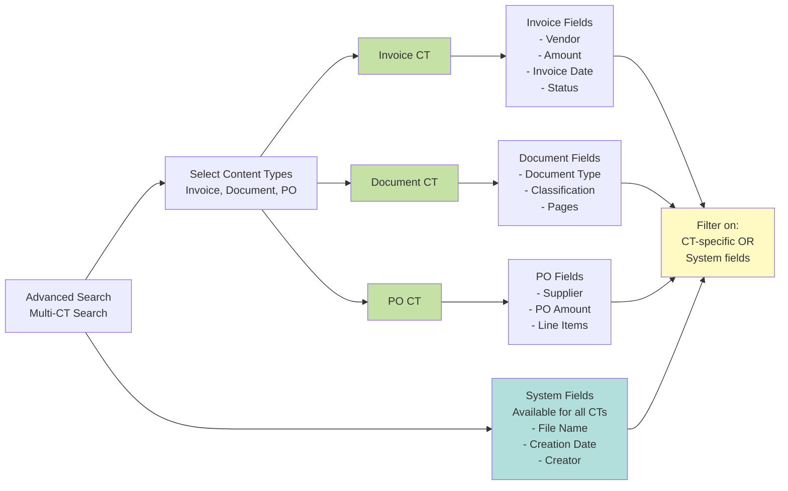
```mermaid
graph LR
    ADVANCED_SEARCH["Advanced Search<br/>Multi-CT Search"]
    
    ADVANCED_SEARCH --> SELECT_CT["Select Content Types<br/>Invoice, Document, PO"]
    
    SELECT_CT --> INVOICE["Invoice CT"]
    SELECT_CT --> DOCUMENT["Document CT"]
    SELECT_CT --> PO["PO CT"]
    
    INVOICE --> INVOICE_FIELDS["Invoice Fields<br/>- Vendor<br/>- Amount<br/>- Invoice Date<br/>- Status"]
    
    DOCUMENT --> DOCUMENT_FIELDS["Document Fields<br/>- Document Type<br/>- Classification<br/>- Pages"]
    
    PO --> PO_FIELDS["PO Fields<br/>- Supplier<br/>- PO Amount<br/>- Line Items"]
    
    ADVANCED_SEARCH --> COMMON_FIELDS["System Fields<br/>Available for all CTs<br/>- File Name<br/>- Creation Date<br/>- Creator"]
    
    ALL_FIELDS["Filter on:<br/>CT-specific OR<br/>System fields"]
    
    INVOICE_FIELDS --> ALL_FIELDS
    DOCUMENT_FIELDS --> ALL_FIELDS
    PO_FIELDS --> ALL_FIELDS
    COMMON_FIELDS --> ALL_FIELDS
    
    style INVOICE fill:#c5e1a5
    style DOCUMENT fill:#c5e1a5
    style PO fill:#c5e1a5
    style COMMON_FIELDS fill:#b2dfdb
    style ALL_FIELDS fill:#fff9c4
```

## Diagram 16: End-to-End User Journey

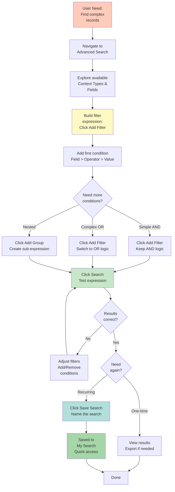
```mermaid
flowchart TD
    NEED["User Need:<br/>Find complex<br/>records"] --> NAV["Navigate to<br/>Advanced Search"]
    
    NAV --> EXPLORE["Explore available<br/>Content Types &<br/>Fields"]
    
    EXPLORE --> BUILD["Build filter<br/>expression:<br/>Click Add Filter"]
    
    BUILD --> FIRST["Add first condition<br/>Field > Operator > Value"]
    
    FIRST --> LOGIC{Need more<br/>conditions?}
    
    LOGIC -->|Simple AND| ADD_SIMPLE["Click Add Filter<br/>Keep AND logic"]
    LOGIC -->|Complex OR| ADD_OR["Click Add Filter<br/>Switch to OR logic"]
    LOGIC -->|Nested| ADD_GROUP["Click Add Group<br/>Create sub-expression"]
    
    ADD_SIMPLE --> TEST["Click Search<br/>Test expression"]
    ADD_OR --> TEST
    ADD_GROUP --> TEST
    
    TEST --> RESULTS{Results<br/>correct?}
    
    RESULTS -->|No| ADJUST["Adjust filters<br/>Add/Remove<br/>conditions"]
    ADJUST --> TEST
    
    RESULTS -->|Yes| USE_ONCE{Need<br/>again?}
    
    USE_ONCE -->|One-time| VIEW_EXPORT["View results<br/>Export if needed"]
    USE_ONCE -->|Recurring| SAVE["Click Save Search<br/>Name the search"]
    
    SAVE --> SAVED["Saved to<br/>My Search<br/>Quick access"]
    
    VIEW_EXPORT --> DONE["Done"]
    SAVED --> DONE
    
    style NEED fill:#ffccbc
    style BUILD fill:#fff9c4
    style TEST fill:#c8e6c9
    style SAVE fill:#b2dfdb
    style SAVED fill:#a5d6a7
```

## Diagram 17: Common Filter Patterns

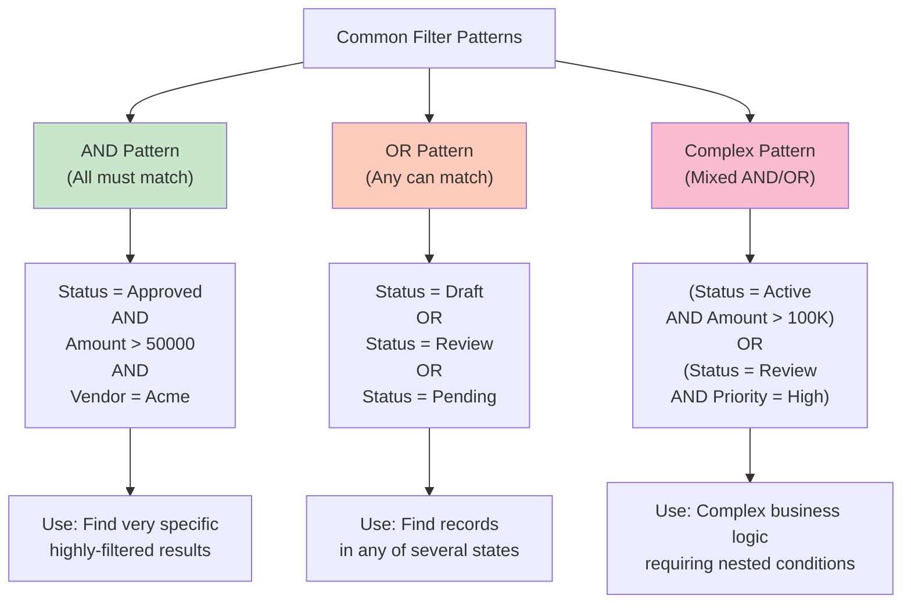
```mermaid
graph TB
    PATTERNS["Common Filter Patterns"]
    
    PATTERNS --> AND_PATTERN["AND Pattern<br/>(All must match)"]
    PATTERNS --> OR_PATTERN["OR Pattern<br/>(Any can match)"]
    PATTERNS --> COMPLEX_PATTERN["Complex Pattern<br/>(Mixed AND/OR)"]
    
    AND_PATTERN --> AND_EX1["Status = Approved<br/>AND<br/>Amount > 50000<br/>AND<br/>Vendor = Acme"]
    AND_EX1 --> AND_USE["Use: Find very specific<br/>highly-filtered results"]
    
    OR_PATTERN --> OR_EX1["Status = Draft<br/>OR<br/>Status = Review<br/>OR<br/>Status = Pending"]
    OR_EX1 --> OR_USE["Use: Find records<br/>in any of several states"]
    
    COMPLEX_PATTERN --> COMPLEX_EX1["(Status = Active<br/>AND Amount > 100K)<br/>OR<br/>(Status = Review<br/>AND Priority = High)"]
    COMPLEX_EX1 --> COMPLEX_USE["Use: Complex business logic<br/>requiring nested conditions"]
    
    style AND_PATTERN fill:#c8e6c9
    style OR_PATTERN fill:#ffccbc
    style COMPLEX_PATTERN fill:#f8bbd0
```

## Diagram 18: Performance & Caching

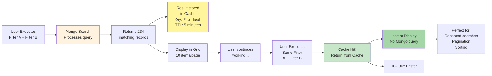
```mermaid
graph LR
    SEARCH1["User Executes<br/>Filter A + Filter B"]
    
    SEARCH1 --> MONGO1["Mongo Search<br/>Processes query"]
    
    MONGO1 --> RESULT1["Returns 234<br/>matching records"]
    
    RESULT1 --> CACHE1["Result stored<br/>in Cache<br/>Key: Filter hash<br/>TTL: 5 minutes"]
    
    RESULT1 --> DISPLAY1["Display in Grid<br/>10 items/page"]
    
    DISPLAY1 --> WAIT["User continues<br/>working..."]
    
    WAIT --> SEARCH2["User Executes<br/>Same Filter<br/>A + Filter B"]
    
    SEARCH2 --> CACHE_HIT["Cache Hit!<br/>Return from Cache"]
    
    CACHE_HIT --> INSTANT["Instant Display<br/>No Mongo query"]
    
    CACHE_HIT --> FASTER["10-100x Faster"]
    
    INSTANT --> REUSE["Perfect for:<br/>Repeated searches<br/>Pagination<br/>Sorting"]
    
    style MONGO1 fill:#fff3e0
    style CACHE1 fill:#fff59d
    style CACHE_HIT fill:#c8e6c9
    style INSTANT fill:#a5d6a7
```

## Diagram 19: Comparison: Advanced vs Quick Search

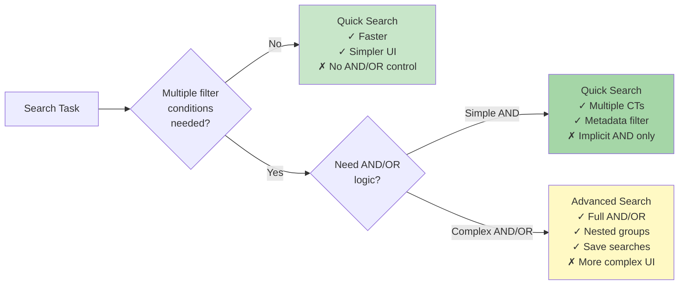
```mermaid
graph LR
    TASK["Search Task"]
    
    TASK --> Q1{"Multiple filter<br/>conditions<br/>needed?"}
    
    Q1 -->|No| QUICK["Quick Search<br/>✓ Faster<br/>✓ Simpler UI<br/>✗ No AND/OR control"]
    
    Q1 -->|Yes| Q2{"Need AND/OR<br/>logic?"}
    
    Q2 -->|Simple AND| QUICK2["Quick Search<br/>✓ Multiple CTs<br/>✓ Metadata filter<br/>✗ Implicit AND only"]
    
    Q2 -->|Complex AND/OR| ADVANCED["Advanced Search<br/>✓ Full AND/OR<br/>✓ Nested groups<br/>✓ Save searches<br/>✗ More complex UI"]
    
    style QUICK fill:#c8e6c9
    style QUICK2 fill:#a5d6a7
    style ADVANCED fill:#fff9c4
```

## Diagram 20: Field Selection Flow

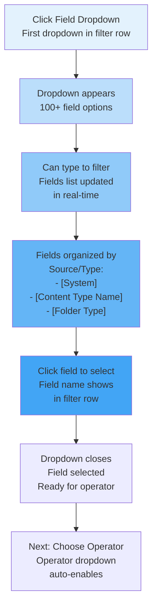
```mermaid
flowchart TD
    FILTER_ROW["Click Field Dropdown<br/>First dropdown in filter row"]
    
    FILTER_ROW --> DROPDOWN["Dropdown appears<br/>100+ field options"]
    
    DROPDOWN --> SEARCH_BOX["Can type to filter<br/>Fields list updated<br/>in real-time"]
    
    SEARCH_BOX --> CATEGORIES["Fields organized by<br/>Source/Type:<br/>- [System]<br/>- [Content Type Name]<br/>- [Folder Type]"]
    
    CATEGORIES --> SELECT["Click field to select<br/>Field name shows<br/>in filter row"]
    
    SELECT --> CONFIRM["Dropdown closes<br/>Field selected<br/>Ready for operator"]
    
    CONFIRM --> NEXT["Next: Choose Operator<br/>Operator dropdown<br/>auto-enables"]
    
    style FILTER_ROW fill:#e3f2fd
    style DROPDOWN fill:#bbdefb
    style SEARCH_BOX fill:#90caf9
    style CATEGORIES fill:#64b5f6
    style SELECT fill:#42a5f5
```

---

## Key Visual Concepts

### Color Coding Guide

```mermaid
graph LR
    SYSTEM["System Fields<br/>Blue"]
    CT["Content Type Fields<br/>Green"]
    DMN["Metadata Fields<br/>Teal"]
    OPERATOR["Operators<br/>Yellow"]
    RESULT["Results<br/>Light Gray"]
    
    style SYSTEM fill:#bbdefb
    style CT fill:#c5e1a5
    style DMN fill:#80cbc4
    style OPERATOR fill:#fff59d
    style RESULT fill:#f5f5f5
```

### Symbol Legend

- **[ ]** = Dropdown/Select field
- **{ }** = Input field
- **→** = Process flow
- **←** = Return/Response
- **(A AND B)** = Grouped expression
- **|** = OR separator

---

## What's Next?

- **[Knowledge Overview](%F0%9F%A7%A0%20Knowledge%20Overview.md)** - Concepts and architecture
- **[Using Advanced Search](%F0%9F%9B%A0%20Using%20Advanced%20Search.md)** - Step-by-step workflows
- **[Quick Search Diagrams](../Quick%20Search/%F0%9F%97%BA%20Diagrams.md)** - Comparison reference

---

**Version**: v7.50.0+  
**Last Updated**: 2026-06-09  
**Powered by Contellect**
