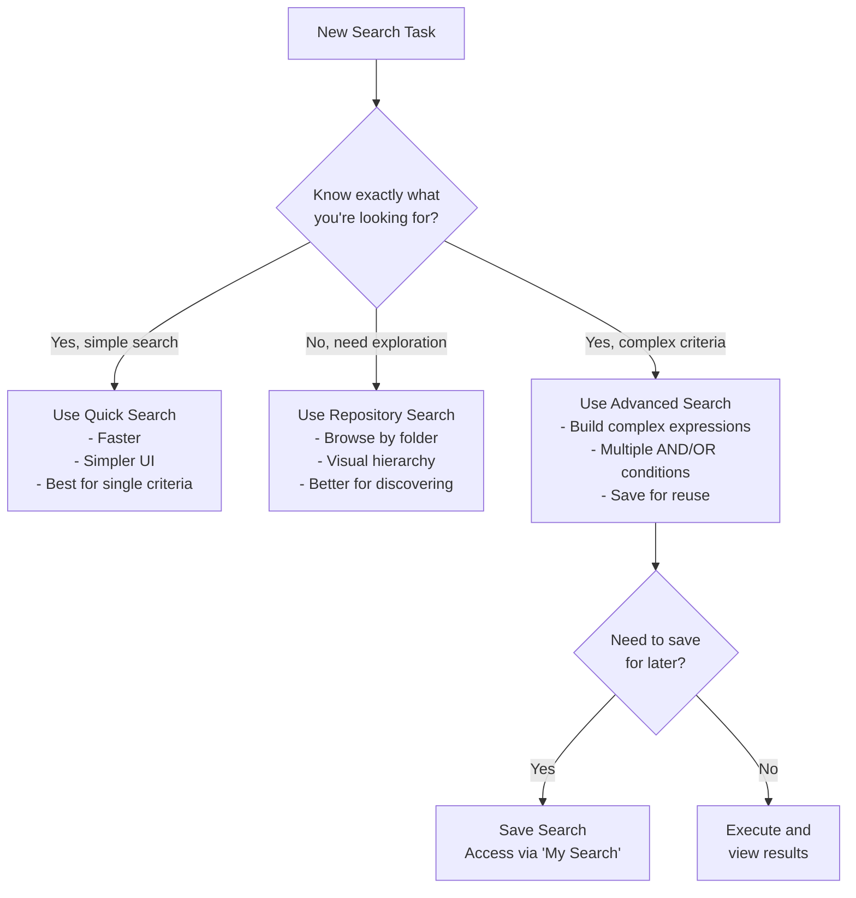
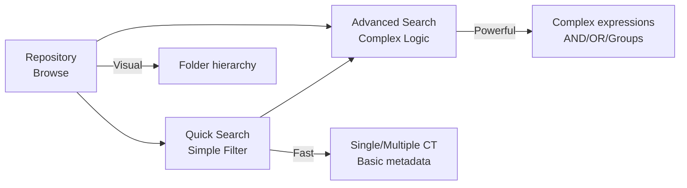

---
id: advanced-search-knowledge-overview
title: "🧠 Advanced Search - Knowledge Overview"
sidebar_label: "🧠 Knowledge Overview"
sidebar_position: 1
name: "🧠 Knowledge Overview"
slug: /advanced-search/knowledge-overview
tags: [search, advanced-search, filtering, mongo-search]
---

# Advanced Search - Knowledge Overview

:::tip 📌 At a Glance
**Document Type**: Knowledge Overview  
**Goal**: Follow the unified ECM User Guide design and structure for this page.
:::


## What is Advanced Search?

Advanced Search is a powerful, expression-based search feature in Contellect ECM that enables you to create complex, multi-criteria queries across your entire repository. Unlike Quick Search which provides simple filtering by content type and metadata, Advanced Search allows you to build sophisticated logical expressions with nested conditions, AND/OR operators, and comprehensive field filtering.

**Key Capability**: Advanced Search transforms you from asking simple questions ("Find all invoices") to asking complex ones ("Find all invoices created after January 2026 that either contain specific keywords OR belong to a specific department").

:::info Mongo Search Backend
Advanced Search uses the same **Mongo Search** backend as Quick Search, providing fast, scalable search across your entire repository. This backend supports complex filtering logic, faceted search, and full-text capabilities.
:::

## Why Use Advanced Search?

### When Quick Search Isn't Enough

| Scenario | Quick Search | Advanced Search |
|----------|--------------|-----------------|
| Find records by multiple Content Types | ✅ Yes | ✅ Yes |
| Filter by metadata fields | ✅ Basic | ✅ Advanced |
| Combine filters with AND | ✅ Limited | ✅ Full Control |
| Combine filters with OR | ❌ No | ✅ Yes |
| Create nested logical groups | ❌ No | ✅ Yes |
| Filter on custom fields | ✅ Yes | ✅ Yes |
| Save search expressions | ❌ No | ✅ Yes |
| Reuse saved searches | ❌ No | ✅ Yes |
| Complex multi-level conditions | ❌ No | ✅ Yes |

### Use Cases

:::success Legal/Compliance
Search for "all contracts expiring within 60 days that belong to IT department AND are either high-value OR flagged for review"
:::

:::success Finance
Find "invoice records created by specific vendor AND (status = 'unpaid' OR status = 'disputed') AND amount > $50,000"
:::

:::success Operations
Locate "all documents matching keyword 'compliance' OR 'audit' that were modified in last 30 days AND have not been archived"
:::

## When to Use Each Search Feature



## Key Concepts in Advanced Search

### Filter Expression

A **filter expression** is the core of Advanced Search. It consists of:

```
[Field] [Operator] [Value]
```

Example: `Contract Type [Folder Field] is equal to Supplier Agreement`

### Logical Operators

- **AND**: Both conditions must be true (narrows results)
- **OR**: Either condition can be true (widens results)

:::warning Operator Precedence
When combining multiple AND/OR conditions, AND has higher precedence than OR. Use Groups to control evaluation order.
:::

### Filter Groups

**Groups** allow you to create nested logical expressions and control operator precedence.

Example:
```
(Condition A AND Condition B) OR (Condition C AND Condition D)
```

### Available Filter Fields

Advanced Search allows filtering on **any field** from:

- **System Fields**:
  - File name/metadata
  - Creation date
  - Modification date
  - Creator
  - Last modified by

- **Content Type Fields**: All custom fields from any Content Type
  - Text fields
  - Number fields
  - Date fields
  - Select/dropdown fields
  - File upload fields

- **Metadata Fields**: Dynamic fields from folder types (DMN)
  - Group Name
  - Department
  - Document Type
  - And 30+ other DMN fields

### Filter Operators

Advanced Search supports 10 comparison operators:

| Operator | Description | Use Case |
|----------|-------------|----------|
| Is equal to | Exact match | `Status = 'Approved'` |
| Is not equal to | Exclude value | `Status ≠ 'Draft'` |
| Contains | Substring match | `File name contains 'Invoice'` |
| Does not contain | Exclude substring | `File name not contains 'Draft'` |
| Starts with | Prefix match | `Description starts with 'REV'` |
| Ends with | Suffix match | `File name ends with '.pdf'` |
| Is null | Empty/missing field | `Approval Date is null` |
| Is not null | Non-empty field | `Approval Date is not null` |
| Is empty | Empty string | `Notes is empty` |
| Is not empty | Non-empty string | `Notes is not empty` |

:::tip Operator Selection
The system automatically suggests relevant operators based on field type (text, number, date, etc.)
:::

## Advanced Search UI Components

### Main Filter Area

The filter area on the left side of Advanced Search contains:

| Component | Purpose |
|-----------|---------|
| **Search Input** | Quick text-based search (optional) |
| **Content Types** | Select which Content Types to search |
| **Add Additional Criteria** | Help text and instructions |
| **Filter Expression Builder** | Build complex multi-condition filters |
| **AND/OR Buttons** | Set logical relationships |
| **Add Filter** | Add another condition to current group |
| **Add Group** | Create a new nested logical group |

### Results Area

Once you execute a search, you'll see:

| Component | Purpose |
|-----------|---------|
| **Results Grid** | Displays matching records |
| **Columns** | Customizable record fields |
| **Pagination** | Navigate through results |
| **Sorting** | Click column headers to sort |
| **Record Actions** | Open, preview, or manage records |

### Control Buttons

| Button | Function |
|--------|----------|
| **Search** | Execute the current filter expression |
| **Save Search** | Save current expression for reuse |
| **My Search** | View and manage saved searches |

## Role-Based Quick Starts

### End User Workflow

You want to find specific records using multiple criteria:

:::tip Quick Start
1. Navigate to **Advanced Search**
2. (Optional) Select specific **Content Types** to narrow scope
3. Click **Add Filter** to create your first condition
4. Select field → operator → value
5. Click **Add Filter** again for additional conditions
6. Choose AND/OR between conditions
7. Click **Search** to execute
8. Review results and click any record to open it
:::

### Power User Workflow

You work with complex, recurring search needs:

:::tip Quick Start
1. Build your filter expression (multiple filters with groups)
2. Test it by clicking **Search** to verify results
3. If satisfied, click **Save Search**
4. Give it a meaningful name: e.g., "High-Value Unpaid Invoices"
5. (Optional) Add description for team reference
6. Next time, go to **My Search** and click saved search to load it
7. Modify or execute as-is
:::

### Administrator Workflow

You need to audit records matching specific criteria:

:::tip Quick Start
1. Navigate to **Advanced Search**
2. Select relevant **Content Types**
3. Create filter expression for audit criteria
4. Use **Add Group** for complex nested logic if needed
5. Click **Search** to see all matching records
6. Customize columns as needed for reporting
7. Export results (if feature available)
8. (Optional) Save search for regular auditing
:::

## Comparison: Search Features



## Performance Considerations

:::info Search Performance
Advanced Search uses the Mongo Search backend, optimized for fast queries across large datasets. However:

- Simpler filter expressions execute faster than complex nested groups
- Searching on indexed fields (like ID, Content Type) is faster than full-text search
- Results are cached, so repeated searches are faster
- Search results are limited to 10 items per page by default
:::

## Common Patterns

### Pattern 1: Multi-Criteria AND

Find records matching ALL conditions:

```
[Field A] = [Value1]
AND
[Field B] = [Value2]
AND
[Field C] = [Value3]
```

**Use Case**: "Find all invoices from Vendor X, created in 2026, with status = Unpaid"
## Save Search vs Save Template

Advanced Search supports two different save mechanisms, each serving different purposes:

| Feature | Save Search | Save Template |
|---------|-------------|---------------|
| **Purpose** | Personal saved search expressions | Reusable filter templates for team |
| **Storage** | User-specific in "My Search" | Organization-wide in "Search Template" |
| **Use Case** | Recurring personal searches | Common searches for team standardization |
| **Accessible From** | My Search tab | Search Template tab |
| **Who Can Access** | Only current user | Team members (permissions-based) |
| **Modification** | User can edit anytime | May require admin approval |
| **Dialog Title** | "Save Search" | "Save as a Template" |
| **Name Field** | "Name Your Search" | "Name Your Template" |
| **Description** | "Description Search" | "Template Description" |

### Save Search Workflow

1. Build filter expression with multiple conditions
2. Click "Save Search" button
3. Select **"Save Search"** from dropdown menu
4. Enter search name (e.g., "Q2 Unpaid Invoices")
5. (Optional) Add description for future reference
6. Click "Save"
7. Search appears in **My Search** tab for quick reuse

:::tip Personal Workflows
Use "Save Search" for your frequently-used searches that are specific to your role or recurring tasks.
:::

### Save Template Workflow

1. Build filter expression that represents common search need
2. Click "Save Search" button
3. Select **"Save Template"** from dropdown menu
4. Enter template name (e.g., "All Unpaid Invoices > $50K")
5. (Optional) Add description explaining template purpose
6. Click "Save"
7. Template appears in **Search Template** tab
8. Team members can access and use template (based on permissions)

:::success Team Standardization
Use "Save Template" to create standardized searches your team can reuse. This ensures consistency in reporting and analysis.
:::

### Pattern 2: Multiple Conditions with OR

Find records matching ANY condition:

```
[Field A] = [Value1]
OR
[Field B] = [Value2]
OR
[Field C] = [Value3]
```

**Use Case**: "Find records with status = Draft OR status = Pending OR status = Review"

### Pattern 3: Grouped Expressions

Combine AND/OR with logical groups:

```
([Field A] = [Value1] AND [Field B] = [Value2])
OR
([Field C] = [Value3] AND [Field D] = [Value4])
```

**Use Case**: "Find invoices from Vendor A with Amount > $50K OR from Vendor B with Amount > $100K"

## What's Next?

- **[Using Advanced Search](%F0%9F%9B%A0%20Using%20Advanced%20Search.md)** - Step-by-step workflows and detailed examples
- **[Advanced Search Diagrams](%F0%9F%97%BA%20Diagrams.md)** - Architecture, UI structures, and filter logic flows
- **[Quick Search](../Quick%20Search/%F0%9F%A7%A0%20Knowledge%20Overview.md)** - For simpler search needs
- **[Repository](../Repository/%F0%9F%A7%A0%20Knowledge%20Overview.md)** - For browsing by folder hierarchy

---

**Version**: v7.50.0+  
**Last Updated**: 2026-06-09  
**Powered by Contellect**
