---
sidebar_label: "🗺 Diagrams"
sidebar_position: 3
name: "🗺 Diagrams"
description: Visual workflows, architecture diagrams, and system integration for File CT
user-invocable: true
---

# 📊 File Content Types - Diagrams

:::tip 📌 At a Glance
**Document Type**: Diagrams  
**Goal**: Follow the unified ECM User Guide design and structure for this page.
:::

This page contains comprehensive architecture diagrams, workflow flows, and visual references to help you understand how File Content Types work across the ECM system.

:::info Key Insight
File CT is the **metadata schema** that defines what fields appear when users create file records in Repository, Workspace, and Workflows.
:::

---

## 🏗️ Architecture & System Integration

### File CT Ecosystem Map

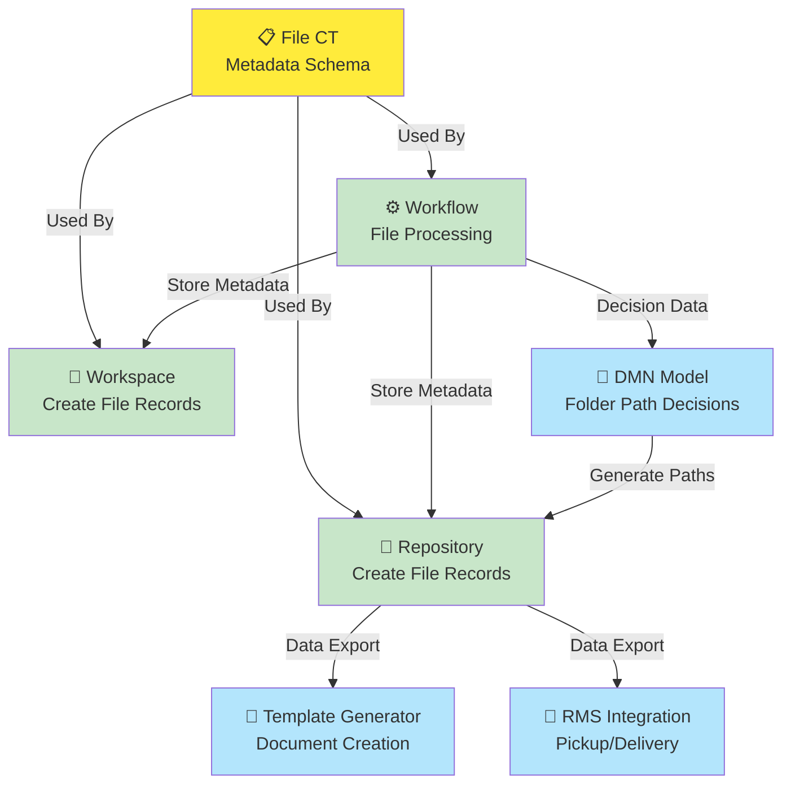

---

## 🎯 File CT Creation Lifecycle

### Configuration to Deployment

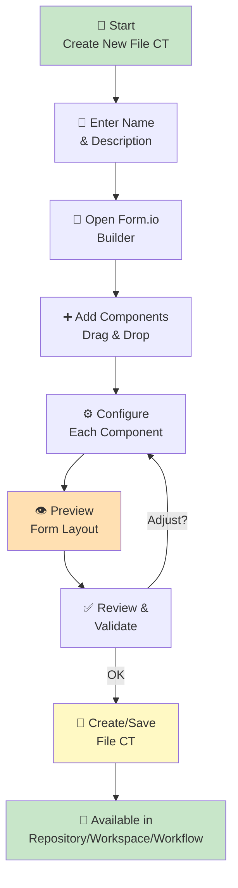

---

## 🔗 File CT and Workflows

### Auto-Created Workflows per File CT

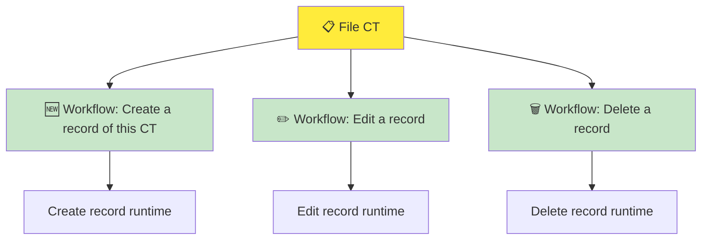

### CT Change Synchronization Rule

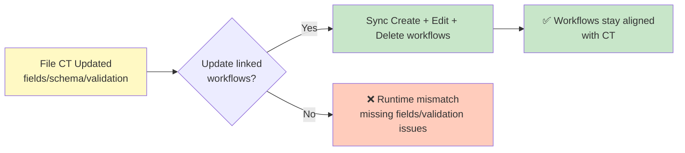

:::warning Synchronization Required
When File CT changes, update the 3 linked workflows (Create/Edit/Delete) to keep runtime forms and validation aligned with the latest CT definition.
:::

---

## 📋 Component Organization

### All 33+ Components Available in File CT

```mermaid
graph TD
    All["📊 File CT Components<br/>33 Form.io + 1 Contellect"]
    
    All --> Basic["🔤 Basic: 9"]
    Basic --> B1["Text Field, Text Area"]
    Basic --> B2["Number, Password"]
    Basic --> B3["Checkbox, Select"]
    Basic --> B4["Radio, Button"]
    
    All --> Advanced["⚡ Advanced: 8"]
    Advanced --> A1["Email, URL, Phone"]
    Advanced --> A2["Tags, Date/Time"]
    Advanced --> A3["Currency, Survey"]
    Advanced --> A4["Signature"]
    
    All --> Layout["📐 Layout: 9"]
    Layout --> L1["HTML, Content"]
    Layout --> L2["Columns, Field Set"]
    Layout --> L3["Panel, Table, Tabs"]
    Layout --> L4["Well"]
    
    All --> Data["💾 Data: 6"]
    Data --> D1["Hidden, Container"]
    Data --> D2["Data Grid, Edit Grid"]
    Data --> D3["Nested Form"]
    
    All --> Custom["🎯 Contellect: 1"]
    Custom --> C1["File Upload<br/>Component"]
    
    style All fill:#ffeb3b
    style Basic fill:#c8e6c9
    style Advanced fill:#c8e6c9
    style Layout fill:#c8e6c9
    style Data fill:#c8e6c9
    style Custom fill:#ffccbc
```

---

## ⚙️ Configuration Workflow

### Building a File CT Step-by-Step

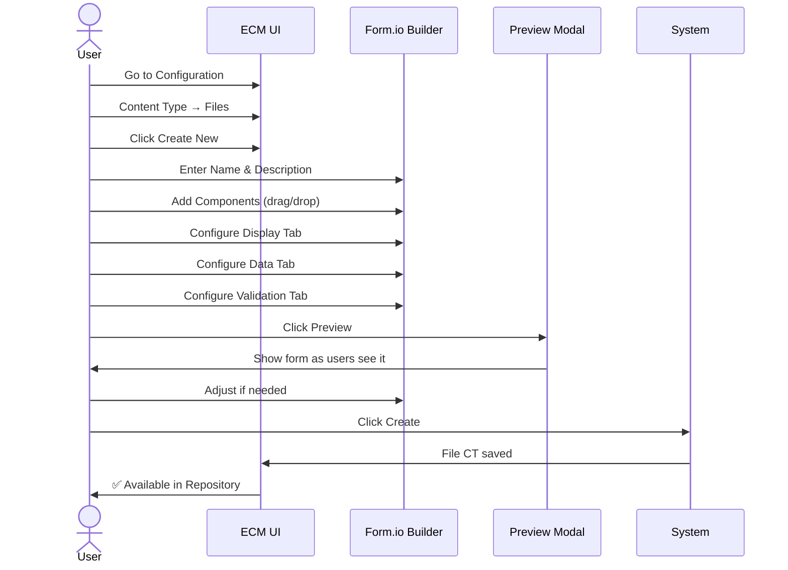

---

## 🔄 Data Flow: File Record Creation

### User Creates File Record in Repository

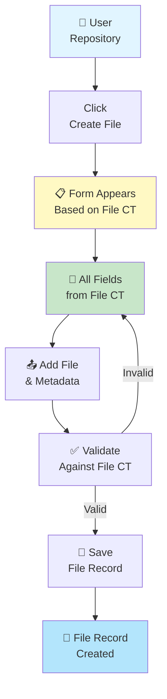

---

## 🔐 Component Visibility Logic

### How Hidden & Visible Components Work

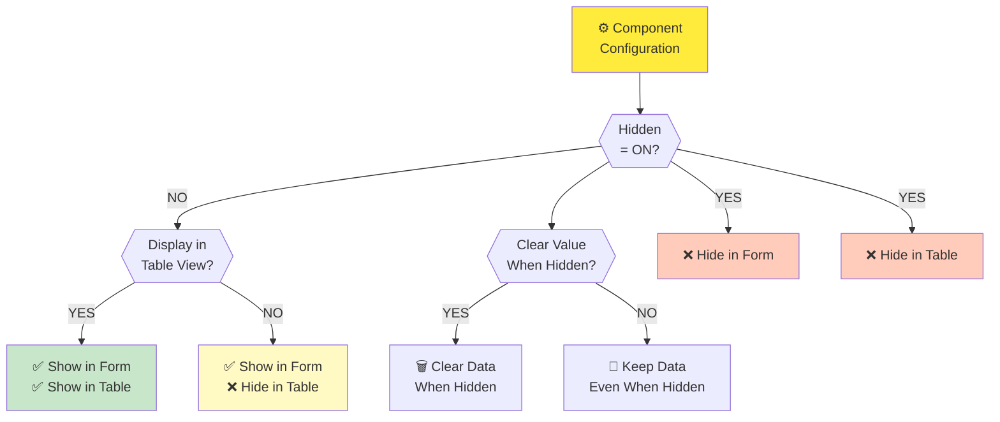

---

## 📊 File CT in Different Workflows

### File CT Usage in Repository vs Workspace

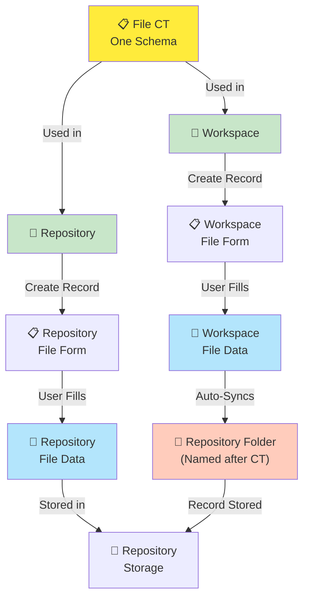

### Workspace Record Creation and Repository Sync

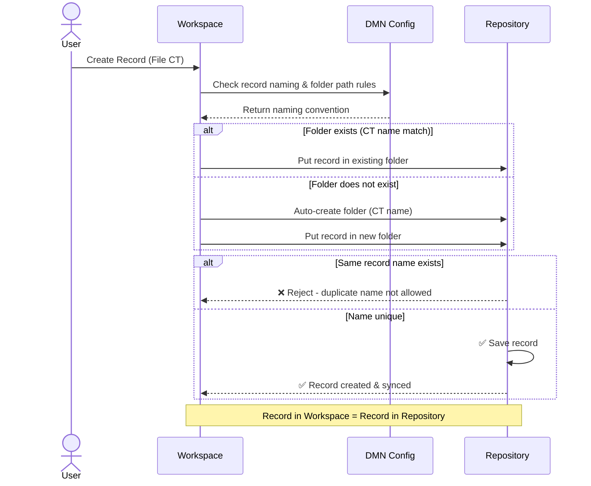

---

## 🔄 Component Configuration Tabs

### Five Configuration Areas for Each Component

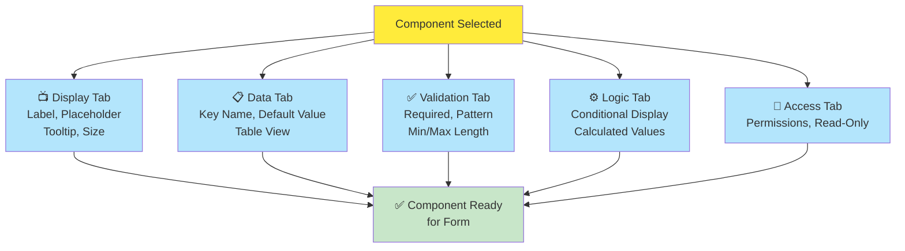

---

## 📋 Form Builder UI Layout

### File CT Builder Interface

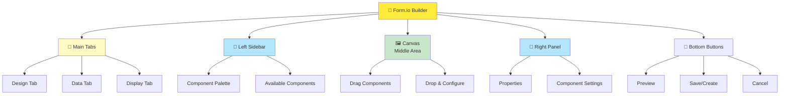

---

## 📤 File CT Export/Import

### Saving & Loading File CT Schemas

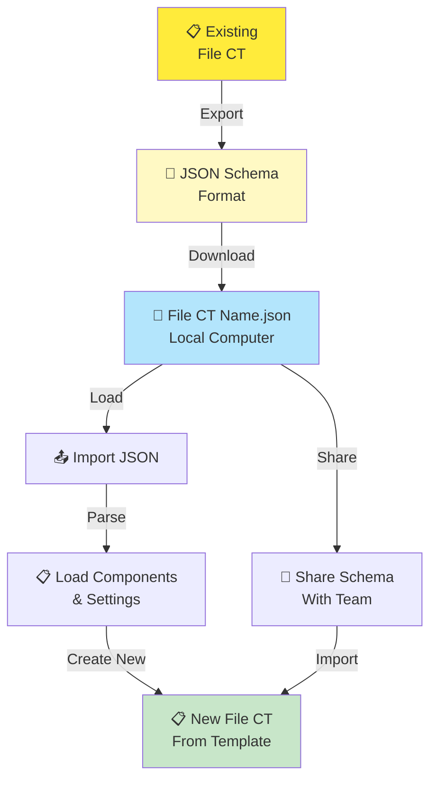

---

## ⚡ Validation Rules in File CT

### Component Validation Logic

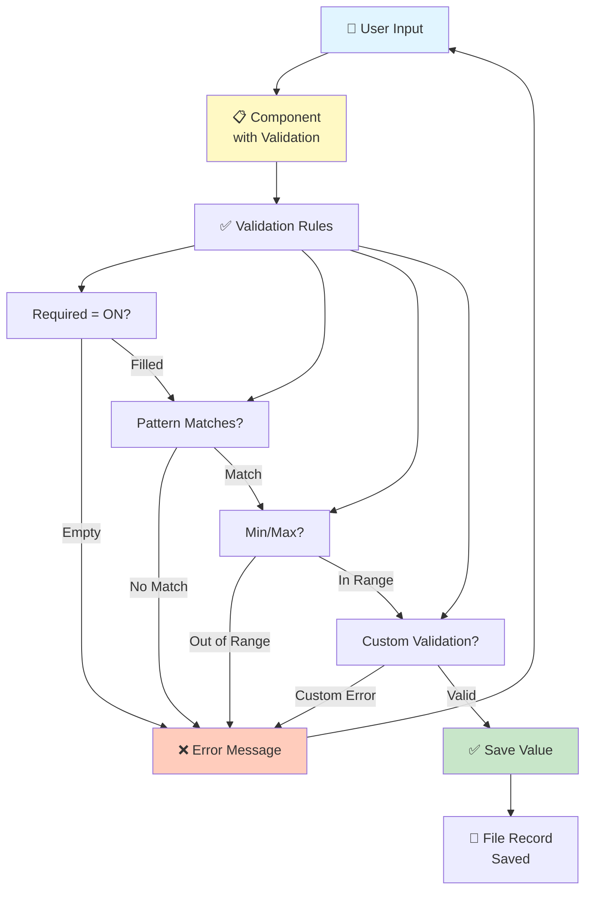

---

## 🎯 Decision Tree: Which Components to Use

### Choosing the Right Component Type

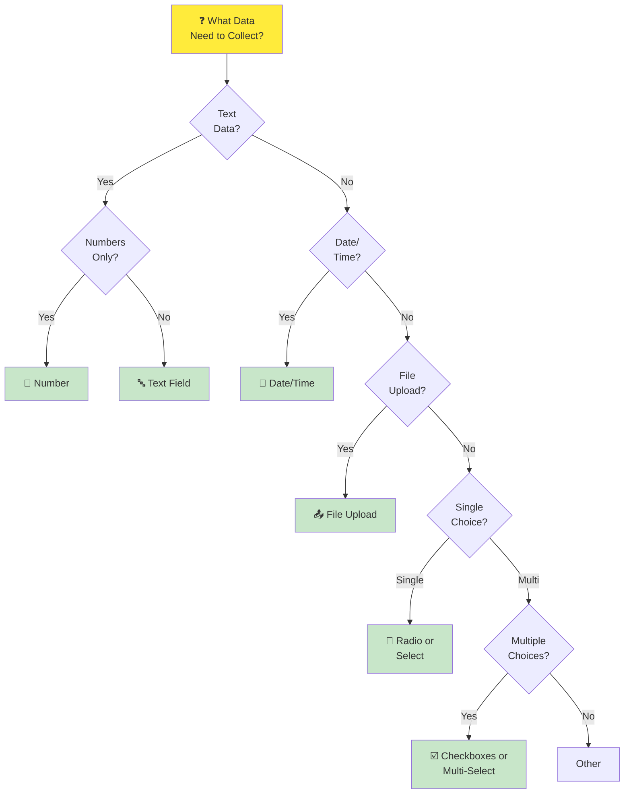

---

## 📚 Best Practices

### File CT Design Guidelines

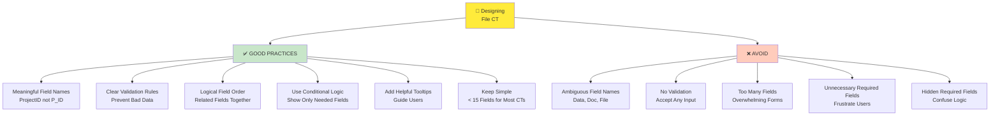

---

## 🔗 Integration Points

### Where File CT Connects to Other ECM Features

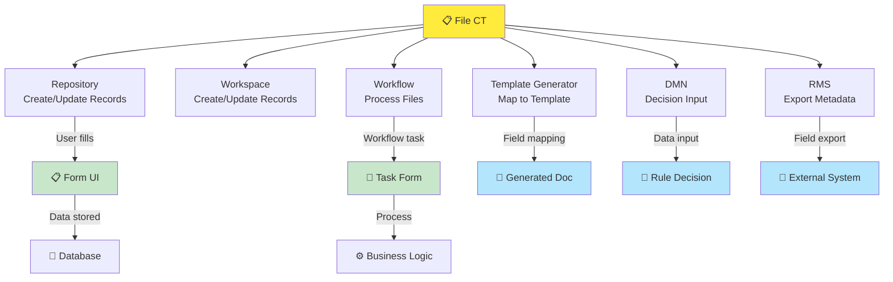

---

## 📚 Related Guides

→ [Knowledge Overview](%F0%9F%A7%A0%20Knowledge%20Overview.md) - Understand File CT basics

→ [Detailed Guide](%F0%9F%93%98%20Detailed%20Guide.md) - Step-by-step creation guide

→ [Repository Diagrams](../../Repository/%F0%9F%97%BA%20Diagrams.md) - File storage workflows
