---
sidebar_label: "🗺 Diagrams"
sidebar_position: 3
name: "🗺 Diagrams"
description: Visual workflows, architecture diagrams, and folder organization for Folder CT
user-invocable: true
---

# 📊 Folder Content Types - Diagrams

:::tip 📌 At a Glance
**Document Type**: Diagrams  
**Goal**: Follow the unified ECM User Guide design and structure for this page.
:::

This page contains comprehensive architecture diagrams, workflow flows, and visual references to help you understand how Folder Content Types work in the ECM repository system.

:::info Key Insight
Folder CT is the **metadata schema** for folders in Repository. It defines what attributes folders can have for organization, search, and compliance.
:::

---

## 🏗️ Architecture & System Integration

### Folder CT Ecosystem Map

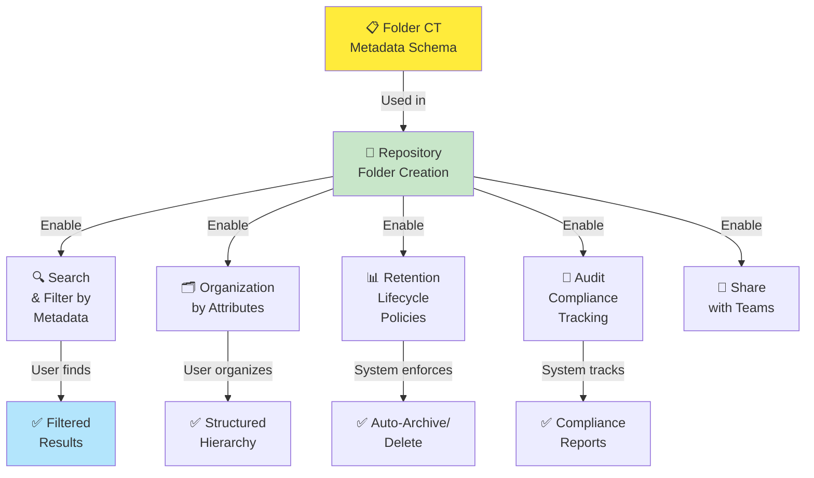

---

## 🎯 Folder Creation Lifecycle

### Configuration to Deployment

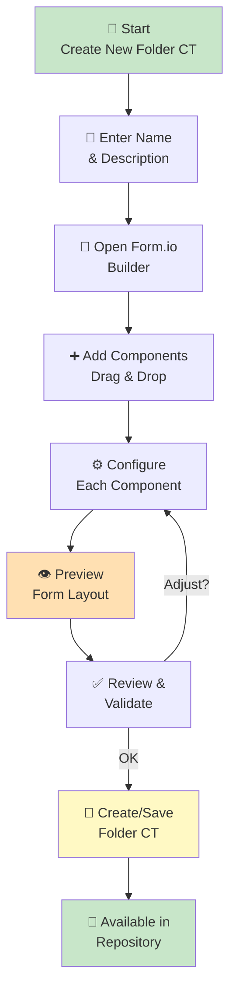

---

## 📋 Component Organization

### All 33+ Components Available in Folder CT

```mermaid
graph TD
    All["📊 Folder CT Components<br/>33 Form.io"]
    
    All --> Basic["🔤 Basic: 9"]
    Basic --> B1["Text Field, Text Area"]
    Basic --> B2["Number, Password"]
    Basic --> B3["Checkbox, Select"]
    Basic --> B4["Radio, Button"]
    
    All --> Advanced["⚡ Advanced: 8"]
    Advanced --> A1["Email, URL, Phone"]
    Advanced --> A2["Tags, Date/Time"]
    Advanced --> A3["Currency, Survey"]
    Advanced --> A4["Signature"]
    
    All --> Layout["📐 Layout: 9"]
    Layout --> L1["HTML, Content"]
    Layout --> L2["Columns, Field Set"]
    Layout --> L3["Panel, Table, Tabs"]
    Layout --> L4["Well"]
    
    All --> Data["💾 Data: 6"]
    Data --> D1["Hidden, Container"]
    Data --> D2["Data Grid, Edit Grid"]
    Data --> D3["Nested Form"]
    
    All --> Note["📌 Note"]
    Note --> N1["No File Upload<br/>Component<br/>(Folders don't store files)"]
    
    style All fill:#ffeb3b
    style Basic fill:#c8e6c9
    style Advanced fill:#c8e6c9
    style Layout fill:#c8e6c9
    style Data fill:#c8e6c9
    style N1 fill:#ffe0b2
```

---

## ⚙️ Configuration Workflow

### Building a Folder CT Step-by-Step

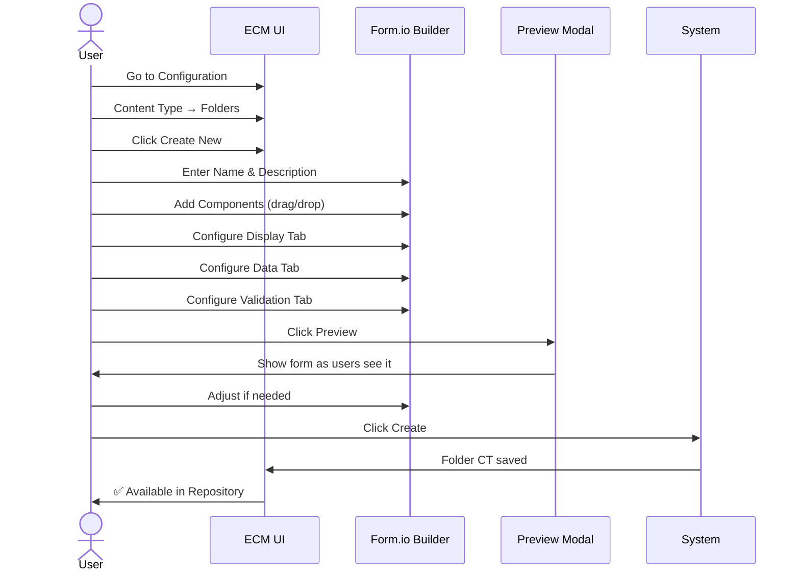

---

## 🔄 Data Flow: Folder Creation

### User Creates Folder in Repository

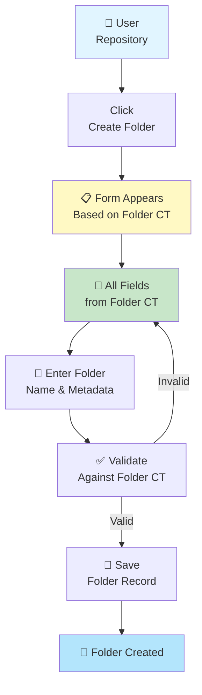

---

## 🔐 Component Visibility Logic

### How Hidden & Visible Components Work

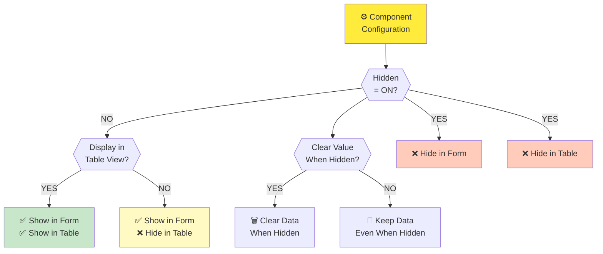

---

## 📊 Folder Hierarchy Structure

### How Folder CT Enables Hierarchical Organization

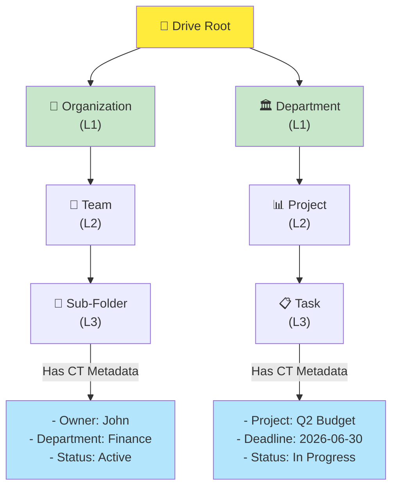

---

## 🔍 Search Using Folder CT Metadata

### Finding Folders by Metadata Attributes

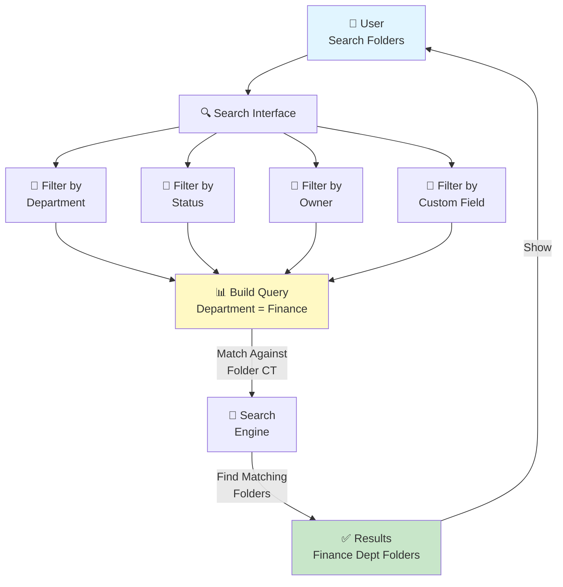

---

## 📋 Folder CT Field Types

### Common Metadata Fields for Folders

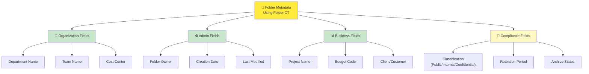

---

## 🎯 Conditional Logic for Folders

### Show/Hide Fields Based on Context

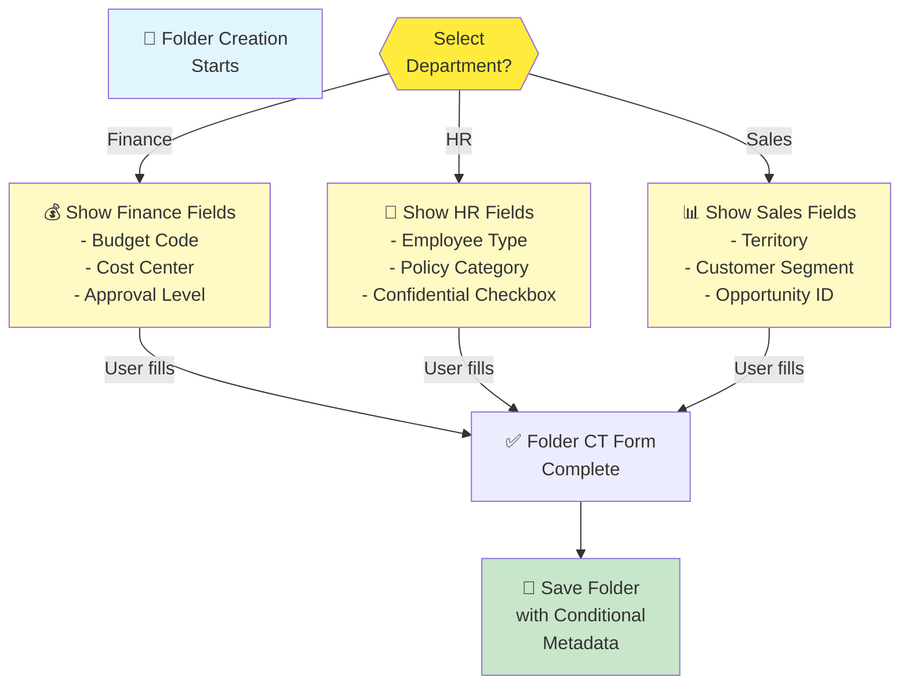

---

## 🔄 Permission Inheritance from Folder CT

### How Folder Metadata Enables Permission Management

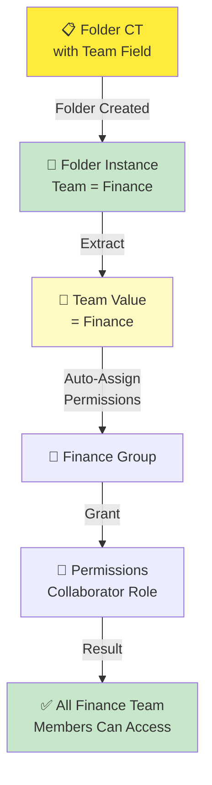

---

## 📚 Folder CT vs File CT

### Key Differences

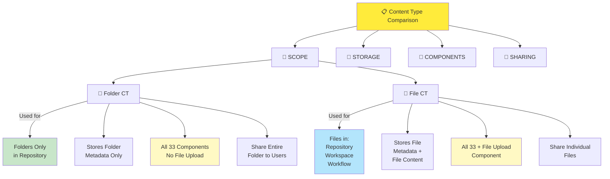

---

## ⚡ Validation Rules in Folder CT

### Component Validation Logic

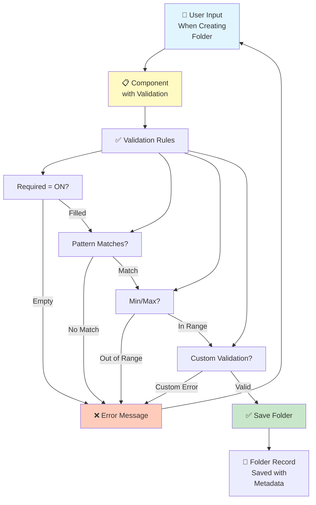

---

## 🎯 Decision Tree: Folder Organization Strategy

### Choosing How to Structure Folders with Metadata

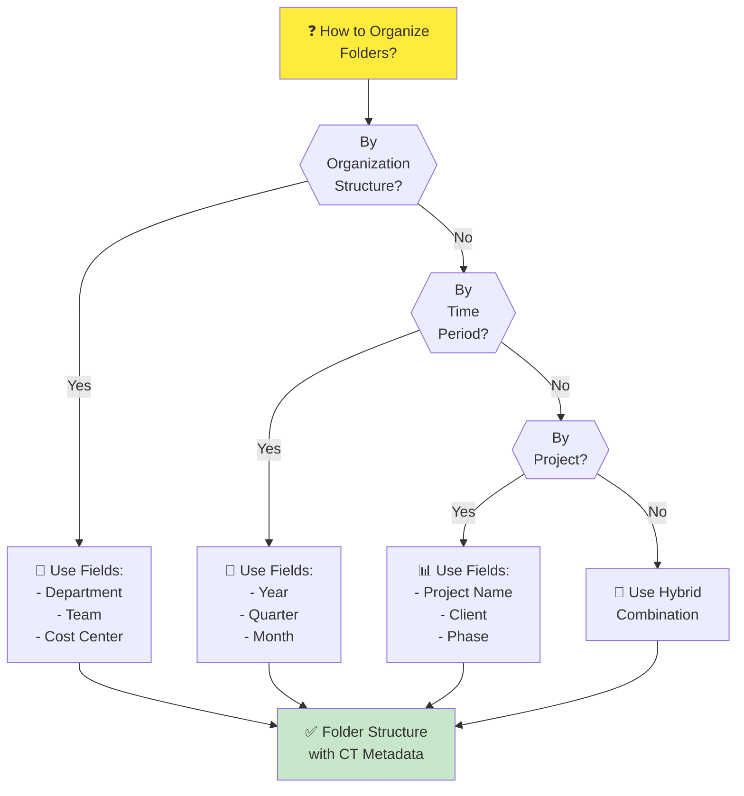

---

## 📊 Best Practices

### Folder CT Design Guidelines

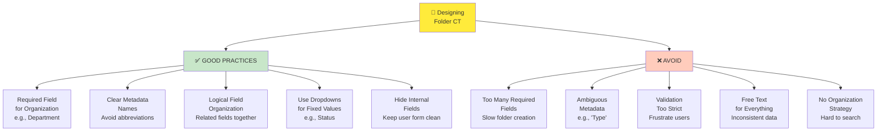

---

## 📚 Related Guides

→ [Knowledge Overview](%F0%9F%A7%A0%20Knowledge%20Overview.md) - Understand Folder CT basics

→ [Detailed Guide](%F0%9F%93%98%20Detailed%20Guide.md) - Step-by-step creation guide

→ [Task CT Diagrams](../Task%20CT/%F0%9F%97%BA%20Diagram.md) - Approval workflows

### Form Builder Button Actions
All available buttons in the Folder CT builder.

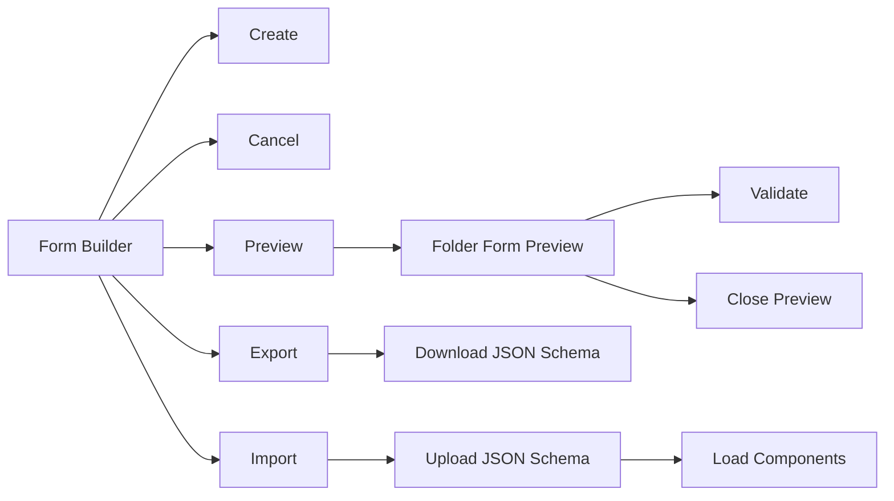

### List View Row Actions Map
Quick reference for Folder CT list actions.

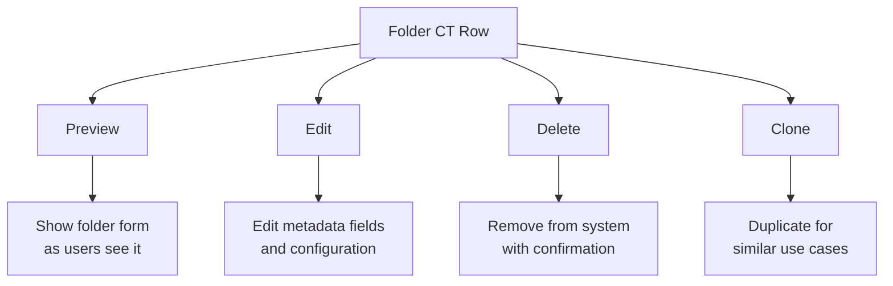

## Comparison: File CT vs. Folder CT

Difference in scope and where each is used.

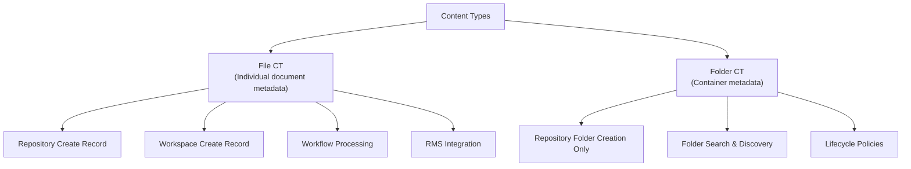

## Folder Organization Examples

### Multi-Department Folder Structure
How different departments might use different Folder CTs.

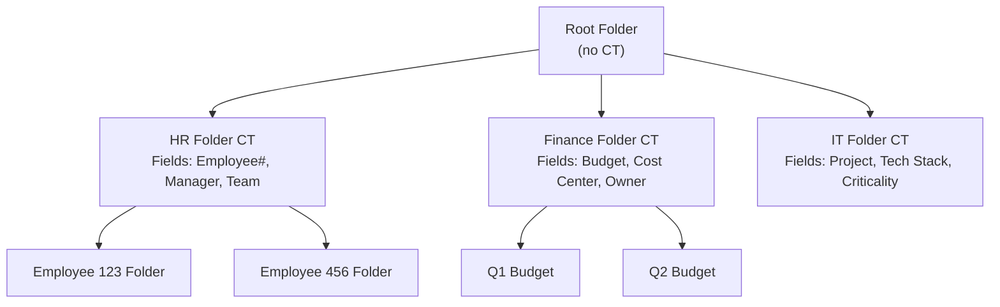

---

For detailed step-by-step folder configuration guides, see the **📘 Detailed Guide.md** file.
