---
sidebar_label: "🗺 Diagrams"
sidebar_position: 3
name: "🗺 Diagrams"
description: Visual workflows, architecture diagrams, and decision routing for Task CT
user-invocable: true
---

# 📊 Task Form Content Types - Diagrams


:::tip 📌 At a Glance
**Document Type**: Diagrams  
**Goal**: Follow the unified ECM User Guide design and structure for this page.
:::


This page contains comprehensive architecture diagrams, workflow flows, and visual references to help you understand how Task Form Content Types work in ECM workflows.

:::info Key Insight
Task CT is the **form schema** shown to users when they receive workflow tasks. It handles approvals, reviews, and user input.
:::

---

## 🏗️ Architecture & System Integration

### Task CT in Workflow Engine

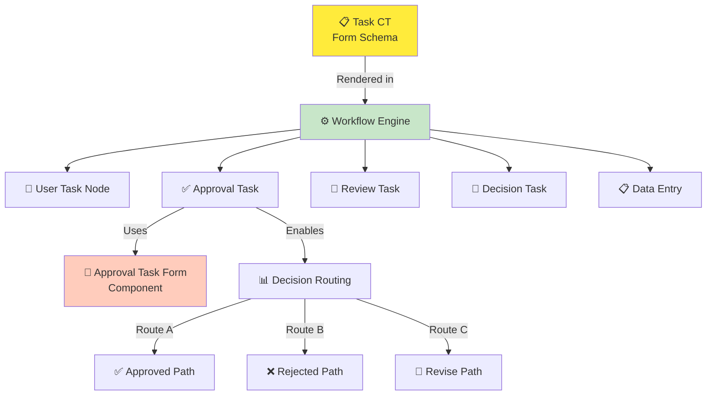
```mermaid
graph TB
    TCT["📋 Task CT<br/>Form Schema"]
    
    TCT -->|Rendered in| WF["⚙️ Workflow Engine"]
    
    WF --> Task1["👤 User Task Node"]
    WF --> Task2["✅ Approval Task"]
    WF --> Task3["📝 Review Task"]
    WF --> Task4["🤔 Decision Task"]
    WF --> Task5["📋 Data Entry"]
    
    Task2 -->|Uses| ATF["🎯 Approval Task Form<br/>Component"]
    Task2 -->|Enables| Routing["📊 Decision Routing"]
    
    Routing -->|Route A| PathA["✅ Approved Path"]
    Routing -->|Route B| PathB["❌ Rejected Path"]
    Routing -->|Route C| PathC["🔄 Revise Path"]
    
    style TCT fill:#ffeb3b
    style WF fill:#c8e6c9
    style ATF fill:#ffccbc
```

---

## 🎯 Task Execution Lifecycle

### From Workflow Assignment to Completion

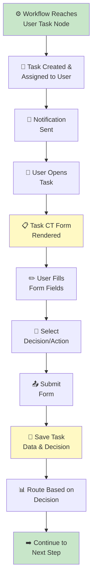
```mermaid
graph TD
    Start["⚙️ Workflow Reaches<br/>User Task Node"]
    Trigger["📢 Task Created &<br/>Assigned to User"]
    Notify["📧 Notification<br/>Sent"]
    User["👤 User Opens<br/>Task"]
    Form["📋 Task CT Form<br/>Rendered"]
    Fill["✏️ User Fills<br/>Form Fields"]
    Decision["🎯 Select<br/>Decision/Action"]
    Submit["📤 Submit<br/>Form"]
    Save["💾 Save Task<br/>Data & Decision"]
    Route["📊 Route Based on<br/>Decision"]
    Next["➡️ Continue to<br/>Next Step"]
    
    Start --> Trigger
    Trigger --> Notify
    Notify --> User
    User --> Form
    Form --> Fill
    Fill --> Decision
    Decision --> Submit
    Submit --> Save
    Save --> Route
    Route --> Next
    
    style Start fill:#c8e6c9
    style Next fill:#c8e6c9
    style Form fill:#fff9c4
    style Save fill:#fff9c4
```

---

## ✅ Approval Task Form Component

### Special Component for Approval Workflows

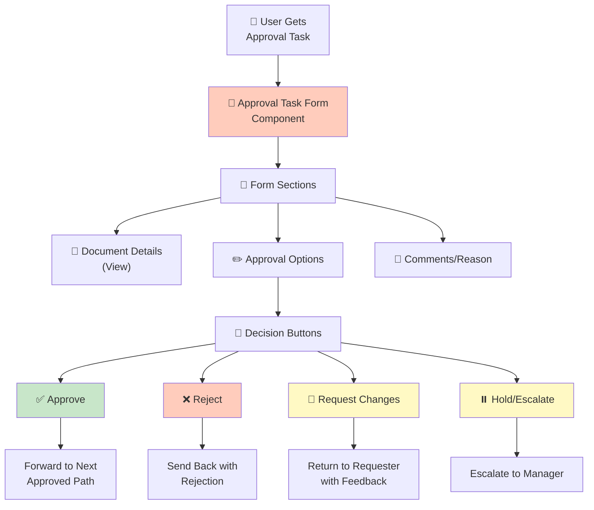
```mermaid
graph TB
    Task["👤 User Gets<br/>Approval Task"]
    
    Task --> ATF["🎯 Approval Task Form<br/>Component"]
    
    ATF --> Sections["📑 Form Sections"]
    Sections --> S1["📄 Document Details<br/>(View)"]
    Sections --> S2["✏️ Approval Options"]
    Sections --> S3["📝 Comments/Reason"]
    
    S2 --> Buttons["🔘 Decision Buttons"]
    Buttons --> B1["✅ Approve"]
    Buttons --> B2["❌ Reject"]
    Buttons --> B3["🔄 Request Changes"]
    Buttons --> B4["⏸️ Hold/Escalate"]
    
    B1 --> Outcome1["Forward to Next<br/>Approved Path"]
    B2 --> Outcome2["Send Back with<br/>Rejection"]
    B3 --> Outcome3["Return to Requester<br/>with Feedback"]
    B4 --> Outcome4["Escalate to Manager"]
    
    style ATF fill:#ffccbc
    style B1 fill:#c8e6c9
    style B2 fill:#ffccbc
    style B3 fill:#fff9c4
    style B4 fill:#fff9c4
```

---

## 🔄 Decision Routing Paths

### How Approval Decisions Route Workflows

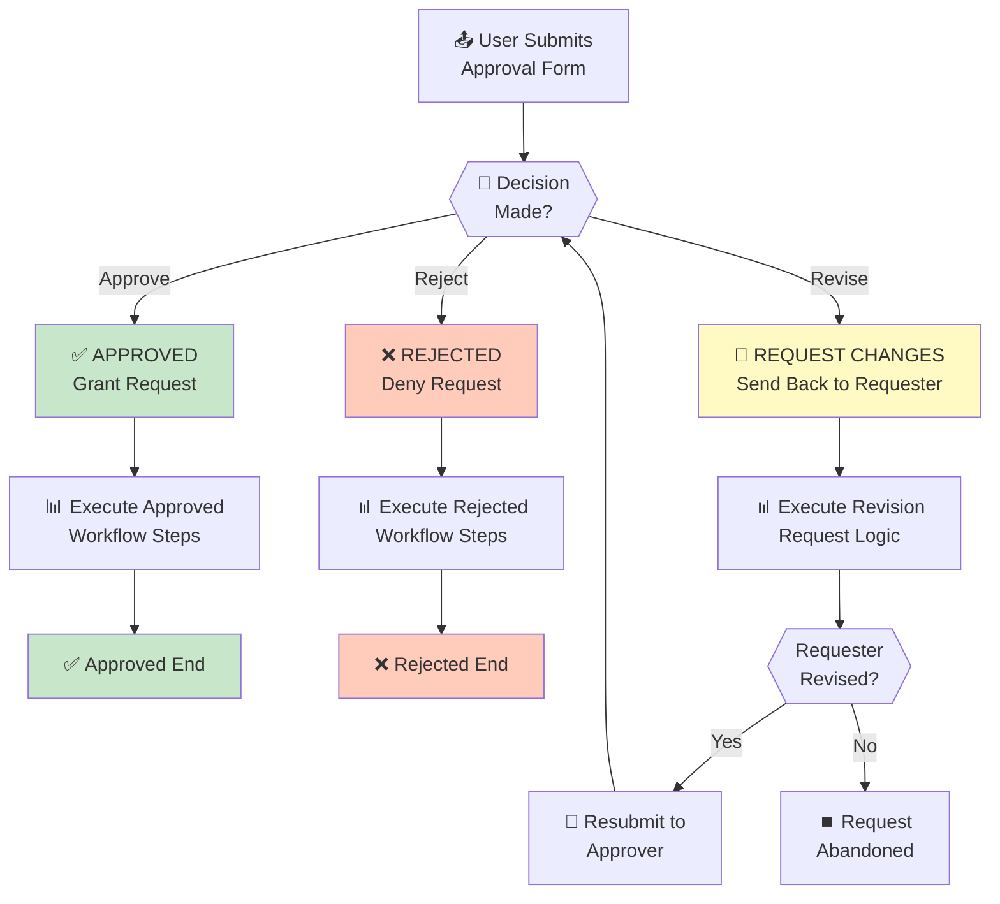
```mermaid
graph TD
    FormSubmit["📤 User Submits<br/>Approval Form"]
    
    FormSubmit --> Decision{{"🎯 Decision<br/>Made?"}}
    
    Decision -->|Approve| Approve["✅ APPROVED<br/>Grant Request"]
    Decision -->|Reject| Reject["❌ REJECTED<br/>Deny Request"]
    Decision -->|Revise| Revise["🔄 REQUEST CHANGES<br/>Send Back to Requester"]
    
    Approve --> ApproveStep["📊 Execute Approved<br/>Workflow Steps"]
    Reject --> RejectStep["📊 Execute Rejected<br/>Workflow Steps"]
    Revise --> ReviseStep["📊 Execute Revision<br/>Request Logic"]
    
    ApproveStep --> ApproveEnd["✅ Approved End"]
    RejectStep --> RejectEnd["❌ Rejected End"]
    ReviseStep --> RequesterRevised{{"Requester<br/>Revised?"}}
    
    RequesterRevised -->|Yes| Resubmit["🔄 Resubmit to<br/>Approver"]
    RequesterRevised -->|No| Abandoned["⏹️ Request<br/>Abandoned"]
    
    Resubmit --> Decision
    
    style Approve fill:#c8e6c9
    style Reject fill:#ffccbc
    style Revise fill:#fff9c4
    style ApproveEnd fill:#c8e6c9
    style RejectEnd fill:#ffccbc
```

---

## 📋 Task Form Components

### All 33+ Components Available in Task CT

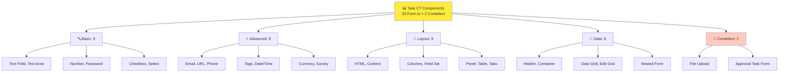
```mermaid
graph TD
    All["📊 Task CT Components<br/>33 Form.io + 2 Contellect"]
    
    All --> Basic["🔤 Basic: 9"]
    Basic --> B1["Text Field, Text Area"]
    Basic --> B2["Number, Password"]
    Basic --> B3["Checkbox, Select"]
    
    All --> Advanced["⚡ Advanced: 8"]
    Advanced --> A1["Email, URL, Phone"]
    Advanced --> A2["Tags, Date/Time"]
    Advanced --> A3["Currency, Survey"]
    
    All --> Layout["📐 Layout: 9"]
    Layout --> L1["HTML, Content"]
    Layout --> L2["Columns, Field Set"]
    Layout --> L3["Panel, Table, Tabs"]
    
    All --> Data["💾 Data: 6"]
    Data --> D1["Hidden, Container"]
    Data --> D2["Data Grid, Edit Grid"]
    Data --> D3["Nested Form"]
    
    All --> Custom["🎯 Contellect: 2"]
    Custom --> C1["File Upload"]
    Custom --> C2["Approval Task Form"]
    
    style All fill:#ffeb3b
    style Custom fill:#ffccbc
```

---

## ⚙️ Configuration Workflow

### Building a Task CT Step-by-Step

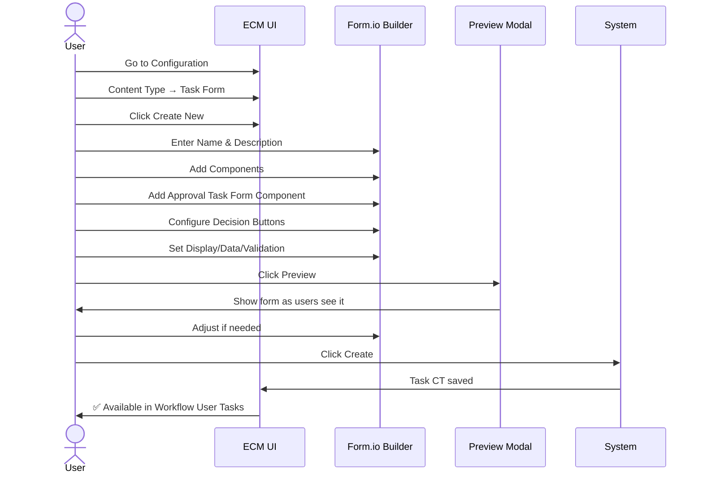
```mermaid
sequenceDiagram
    actor User
    participant ECM as ECM UI
    participant Builder as Form.io Builder
    participant Preview as Preview Modal
    participant Save as System

    User->>ECM: Go to Configuration
    User->>ECM: Content Type → Task Form
    User->>ECM: Click Create New
    User->>Builder: Enter Name & Description
    User->>Builder: Add Components
    User->>Builder: Add Approval Task Form Component
    User->>Builder: Configure Decision Buttons
    User->>Builder: Set Display/Data/Validation
    User->>Preview: Click Preview
    Preview->>User: Show form as users see it
    User->>Builder: Adjust if needed
    User->>Save: Click Create
    Save->>ECM: Task CT saved
    ECM->>User: ✅ Available in Workflow User Tasks
```

---

## 🔐 Component Visibility Logic

### How Hidden & Display Components Work in Tasks

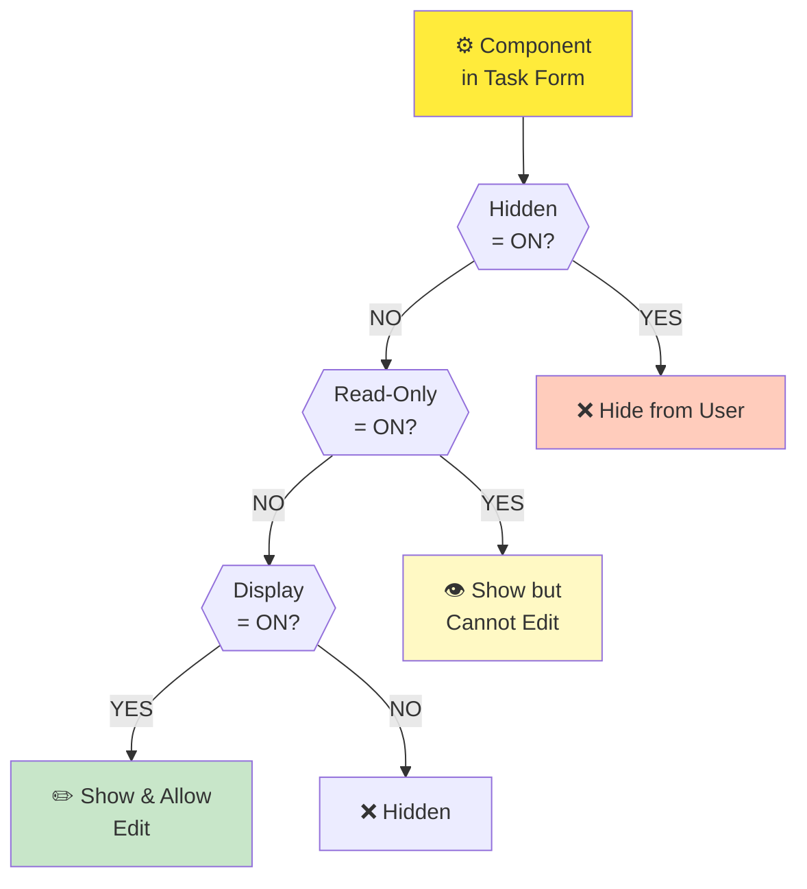
```mermaid
graph TD
    Comp["⚙️ Component<br/>in Task Form"]
    Hidden{{"Hidden<br/>= ON?"}}
    Readonly{{"Read-Only<br/>= ON?"}}
    Display{{"Display<br/>= ON?"}}
    
    Comp --> Hidden
    
    Hidden -->|YES| HideComp["❌ Hide from User"]
    Hidden -->|NO| Readonly
    
    Readonly -->|YES| ReadComp["👁️ Show but<br/>Cannot Edit"]
    Readonly -->|NO| Display
    
    Display -->|YES| ShowComp["✏️ Show & Allow<br/>Edit"]
    Display -->|NO| HideDisplay["❌ Hidden"]
    
    style Comp fill:#ffeb3b
    style ReadComp fill:#fff9c4
    style ShowComp fill:#c8e6c9
    style HideComp fill:#ffccbc
```

---

## 🎯 Multi-Level Approval Workflow

### Complex Approval Process with Multiple Reviewers

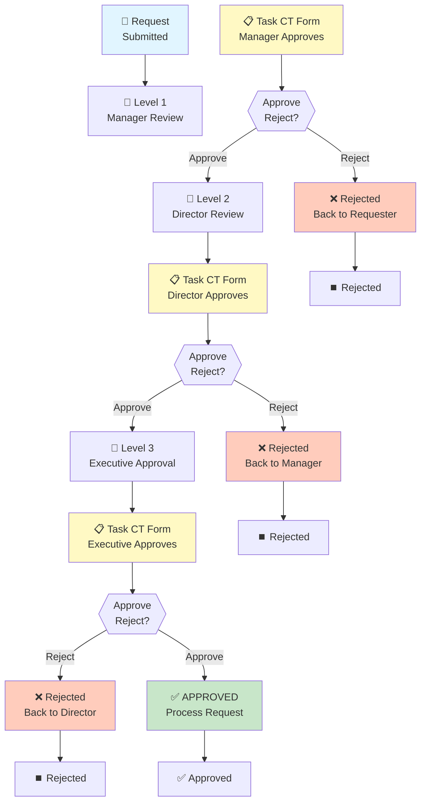
```mermaid
graph TD
    Start["📄 Request<br/>Submitted"]
    L1["👤 Level 1<br/>Manager Review"]
    L1Task["📋 Task CT Form<br/>Manager Approves"]
    
    L1Task --> L1Decision{{"Approve<br/>Reject?"}}
    L1Decision -->|Reject| Reject1["❌ Rejected<br/>Back to Requester"]
    L1Decision -->|Approve| L2["👤 Level 2<br/>Director Review"]
    
    L2Task["📋 Task CT Form<br/>Director Approves"]
    L2 --> L2Task
    L2Task --> L2Decision{{"Approve<br/>Reject?"}}
    L2Decision -->|Reject| Reject2["❌ Rejected<br/>Back to Manager"]
    L2Decision -->|Approve| L3["👤 Level 3<br/>Executive Approval"]
    
    L3Task["📋 Task CT Form<br/>Executive Approves"]
    L3 --> L3Task
    L3Task --> L3Decision{{"Approve<br/>Reject?"}}
    L3Decision -->|Reject| Reject3["❌ Rejected<br/>Back to Director"]
    L3Decision -->|Approve| Final["✅ APPROVED<br/>Process Request"]
    
    Start --> L1
    
    Reject1 --> End1["⏹️ Rejected"]
    Reject2 --> End2["⏹️ Rejected"]
    Reject3 --> End3["⏹️ Rejected"]
    Final --> End4["✅ Approved"]
    
    style Start fill:#e1f5ff
    style L1Task fill:#fff9c4
    style L2Task fill:#fff9c4
    style L3Task fill:#fff9c4
    style Final fill:#c8e6c9
    style Reject1 fill:#ffccbc
    style Reject2 fill:#ffccbc
    style Reject3 fill:#ffccbc
```

---

## 📊 Task Form Data Flow

### How Task Data Flows in Workflows

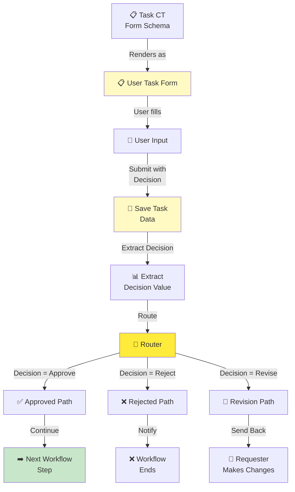
```mermaid
graph TB
    TCT["📋 Task CT<br/>Form Schema"]
    
    TCT -->|Renders as| Form["📋 User Task Form"]
    Form -->|User fills| Input["📝 User Input"]
    Input -->|Submit with<br/>Decision| Save["💾 Save Task<br/>Data"]
    
    Save -->|Extract Decision| Extract["📊 Extract<br/>Decision Value"]
    Extract -->|Route| Route["🔄 Router"]
    
    Route -->|Decision = Approve| Path1["✅ Approved Path"]
    Route -->|Decision = Reject| Path2["❌ Rejected Path"]
    Route -->|Decision = Revise| Path3["🔄 Revision Path"]
    
    Path1 -->|Continue| Next["➡️ Next Workflow<br/>Step"]
    Path2 -->|Notify| End["❌ Workflow<br/>Ends"]
    Path3 -->|Send Back| RequesterTask["👤 Requester<br/>Makes Changes"]
    
    style Form fill:#fff9c4
    style Save fill:#fff9c4
    style Route fill:#ffeb3b
    style Next fill:#c8e6c9
```

---

## 🎓 Form Validation in Tasks

### Ensuring Valid Data Entry Before Submission

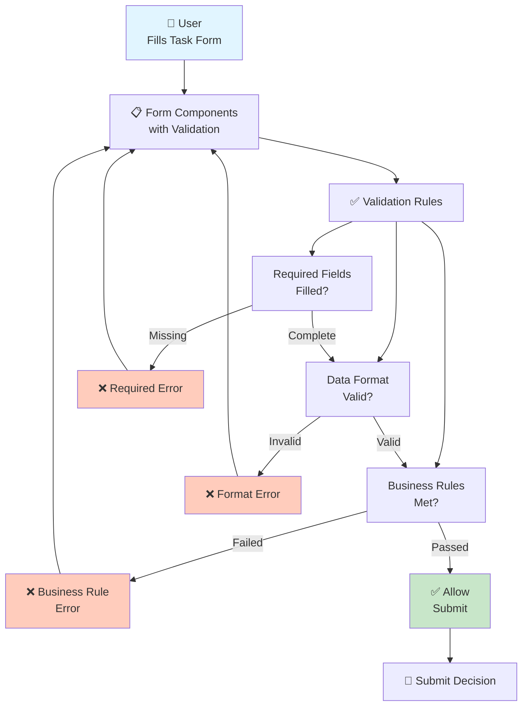
```mermaid
graph TD
    User["👤 User<br/>Fills Task Form"]
    Components["📋 Form Components<br/>with Validation"]
    
    Components --> Rules["✅ Validation Rules"]
    Rules --> R1["Required Fields<br/>Filled?"]
    Rules --> R2["Data Format<br/>Valid?"]
    Rules --> R3["Business Rules<br/>Met?"]
    
    R1 -->|Missing| Error1["❌ Required Error"]
    R1 -->|Complete| R2
    R2 -->|Invalid| Error2["❌ Format Error"]
    R2 -->|Valid| R3
    R3 -->|Failed| Error3["❌ Business Rule<br/>Error"]
    R3 -->|Passed| Submit["✅ Allow<br/>Submit"]
    
    User --> Components
    Error1 --> Components
    Error2 --> Components
    Error3 --> Components
    Submit --> Decision["🎯 Submit Decision"]
    
    style User fill:#e1f5ff
    style Submit fill:#c8e6c9
    style Error1 fill:#ffccbc
    style Error2 fill:#ffccbc
    style Error3 fill:#ffccbc
```

---

## 💬 Comments & Audit Trail

### Capturing Approval Reasons & History

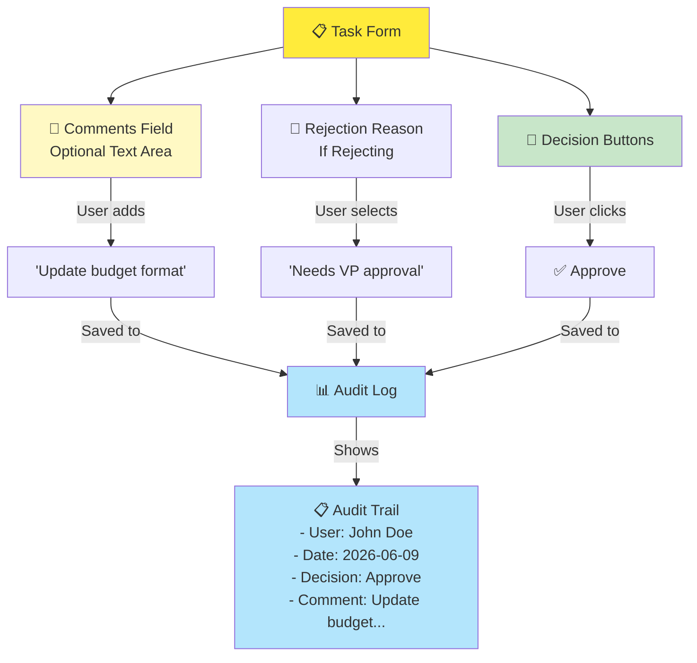
```mermaid
graph TD
    Task["📋 Task Form"]
    
    Task --> Comments["💬 Comments Field<br/>Optional Text Area"]
    Task --> Reason["📝 Rejection Reason<br/>If Rejecting"]
    Task --> Decision["🎯 Decision Buttons"]
    
    Comments -->|User adds| CommentText["'Update budget format'"]
    Reason -->|User selects| RejectReason["'Needs VP approval'"]
    Decision -->|User clicks| DecisionMade["✅ Approve"]
    
    CommentText -->|Saved to| Audit["📊 Audit Log"]
    RejectReason -->|Saved to| Audit
    DecisionMade -->|Saved to| Audit
    
    Audit -->|Shows| AuditView["📋 Audit Trail<br/>- User: John Doe<br/>- Date: 2026-06-09<br/>- Decision: Approve<br/>- Comment: Update budget..."]
    
    style Task fill:#ffeb3b
    style Comments fill:#fff9c4
    style Decision fill:#c8e6c9
    style Audit fill:#b3e5fc
    style AuditView fill:#b3e5fc
```

---

## 🔄 Conditional Display in Task Forms

### Showing/Hiding Fields Based on Workflow State

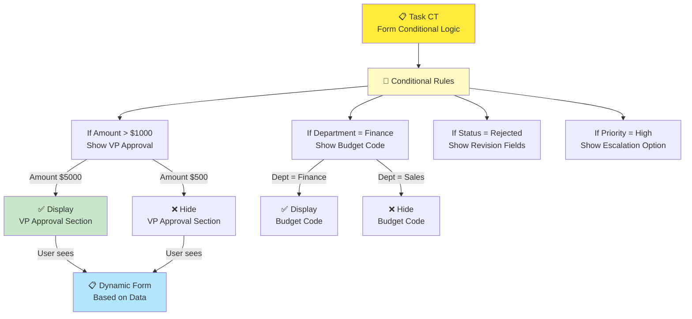
```mermaid
graph TD
    TCT["📋 Task CT<br/>Form Conditional Logic"]
    
    TCT --> Conditions["🎯 Conditional Rules"]
    
    Conditions --> C1["If Amount > $1000<br/>Show VP Approval"]
    Conditions --> C2["If Department = Finance<br/>Show Budget Code"]
    Conditions --> C3["If Status = Rejected<br/>Show Revision Fields"]
    Conditions --> C4["If Priority = High<br/>Show Escalation Option"]
    
    C1 -->|Amount $5000| Show1["✅ Display<br/>VP Approval Section"]
    C1 -->|Amount $500| Hide1["❌ Hide<br/>VP Approval Section"]
    
    C2 -->|Dept = Finance| Show2["✅ Display<br/>Budget Code"]
    C2 -->|Dept = Sales| Hide2["❌ Hide<br/>Budget Code"]
    
    Show1 -->|User sees| Dynamic["📋 Dynamic Form<br/>Based on Data"]
    Hide1 -->|User sees| Dynamic
    
    style TCT fill:#ffeb3b
    style Conditions fill:#fff9c4
    style Show1 fill:#c8e6c9
    style Dynamic fill:#b3e5fc
```

---

## 📋 Approval Patterns

### Common Approval Workflow Scenarios

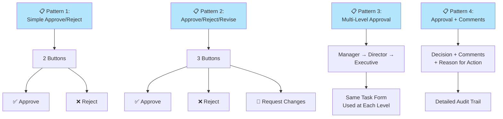
```mermaid
graph TB
    Pattern1["📋 Pattern 1:<br/>Simple Approve/Reject"]
    Pattern1 --> S1["2 Buttons"]
    S1 --> S1a["✅ Approve"]
    S1 --> S1b["❌ Reject"]
    
    Pattern2["📋 Pattern 2:<br/>Approve/Reject/Revise"]
    Pattern2 --> S2["3 Buttons"]
    S2 --> S2a["✅ Approve"]
    S2 --> S2b["❌ Reject"]
    S2 --> S2c["🔄 Request Changes"]
    
    Pattern3["📋 Pattern 3:<br/>Multi-Level Approval"]
    Pattern3 --> S3["Manager → Director →<br/>Executive"]
    S3 --> S3a["Same Task Form<br/>Used at Each Level"]
    
    Pattern4["📋 Pattern 4:<br/>Approval + Comments"]
    Pattern4 --> S4["Decision + Comments<br/>+ Reason for Action"]
    S4 --> S4a["Detailed Audit Trail"]
    
    style Pattern1 fill:#b3e5fc
    style Pattern2 fill:#b3e5fc
    style Pattern3 fill:#b3e5fc
    style Pattern4 fill:#b3e5fc
```

---

## 🆘 Common Task Form Scenarios

### Real-World Workflow Examples

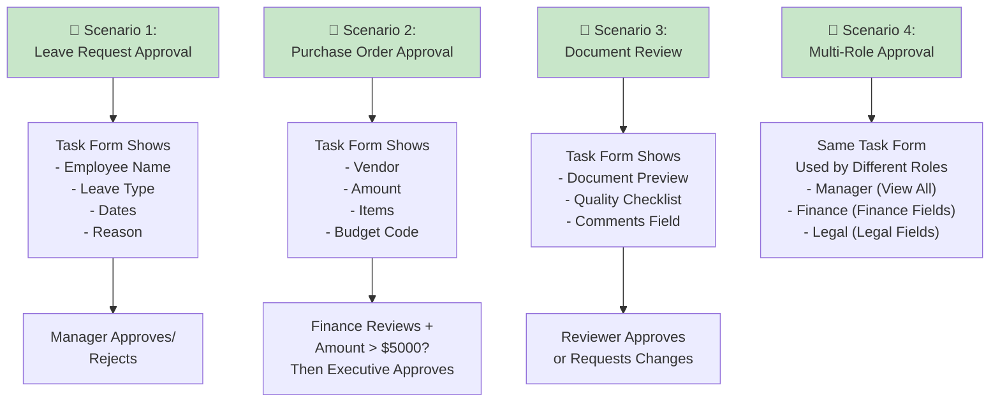
```mermaid
graph TD
    Scenario1["📑 Scenario 1:<br/>Leave Request Approval"]
    Scenario1 --> S1["Task Form Shows<br/>- Employee Name<br/>- Leave Type<br/>- Dates<br/>- Reason"]
    S1 --> S1a["Manager Approves/<br/>Rejects"]
    
    Scenario2["📑 Scenario 2:<br/>Purchase Order Approval"]
    Scenario2 --> S2["Task Form Shows<br/>- Vendor<br/>- Amount<br/>- Items<br/>- Budget Code"]
    S2 --> S2a["Finance Reviews +<br/>Amount > $5000?<br/>Then Executive Approves"]
    
    Scenario3["📑 Scenario 3:<br/>Document Review"]
    Scenario3 --> S3["Task Form Shows<br/>- Document Preview<br/>- Quality Checklist<br/>- Comments Field"]
    S3 --> S3a["Reviewer Approves<br/>or Requests Changes"]
    
    Scenario4["📑 Scenario 4:<br/>Multi-Role Approval"]
    Scenario4 --> S4["Same Task Form<br/>Used by Different Roles<br/>- Manager (View All)<br/>- Finance (Finance Fields)<br/>- Legal (Legal Fields)"]
    
    style Scenario1 fill:#c8e6c9
    style Scenario2 fill:#c8e6c9
    style Scenario3 fill:#c8e6c9
    style Scenario4 fill:#c8e6c9
```

---

## 📚 Best Practices

### Task Form Design Guidelines

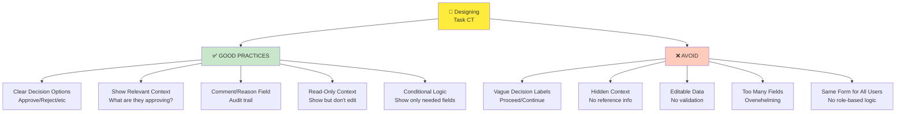
```mermaid
graph TD
    Design["🎨 Designing<br/>Task CT"]
    
    Good["✅ GOOD PRACTICES"]
    Bad["❌ AVOID"]
    
    Design --> Good
    Design --> Bad
    
    Good --> G1["Clear Decision Options<br/>Approve/Reject/etc"]
    Good --> G2["Show Relevant Context<br/>What are they approving?"]
    Good --> G3["Comment/Reason Field<br/>Audit trail"]
    Good --> G4["Read-Only Context<br/>Show but don't edit"]
    Good --> G5["Conditional Logic<br/>Show only needed fields"]
    
    Bad --> B1["Vague Decision Labels<br/>Proceed/Continue"]
    Bad --> B2["Hidden Context<br/>No reference info"]
    Bad --> B3["Editable Data<br/>No validation"]
    Bad --> B4["Too Many Fields<br/>Overwhelming"]
    Bad --> B5["Same Form for All Users<br/>No role-based logic"]
    
    style Design fill:#ffeb3b
    style Good fill:#c8e6c9
    style Bad fill:#ffccbc
```

---

## 📚 Related Guides

→ [Knowledge Overview](%F0%9F%A7%A0%20Knowledge%20Overview.md) - Understand Task CT basics

→ [Detailed Guide](%F0%9F%93%98%20Detailed%20Guide.md) - Step-by-step creation guide

→ [File CT Diagrams](../File%20CT/%F0%9F%97%BA%20Diagram.md) - File content type workflows
  C -->|Escalate| G["Route to Manager<br/>Executive Review"]
  
  D --> H["Workflow Complete"]
  E --> H
  F --> H
  G --> H
```

### Multi-Step Approval Workflow (Sequential)
Approval workflows with multiple decision points.

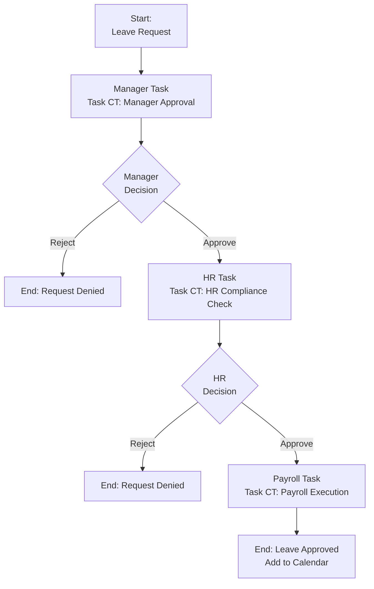
```mermaid
flowchart TD
  START["Start:<br/>Leave Request"] --> MGMT["Manager Task<br/>Task CT: Manager Approval"]
  
  MGMT --> MGMT_DEC{"Manager<br/>Decision"}
  MGMT_DEC -->|Reject| END1["End: Request Denied"]
  MGMT_DEC -->|Approve| HR["HR Task<br/>Task CT: HR Compliance Check"]
  
  HR --> HR_DEC{"HR<br/>Decision"}
  HR_DEC -->|Reject| END2["End: Request Denied"]
  HR_DEC -->|Approve| FINAL["Payroll Task<br/>Task CT: Payroll Execution"]
  
  FINAL --> COMPLETE["End: Leave Approved<br/>Add to Calendar"]
```

## Component Visibility Logic
Decision tree for component attributes in task forms.

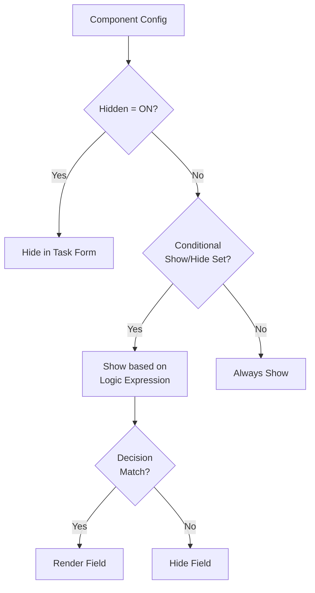
```mermaid
flowchart TD
  A[Component Config] --> B{Hidden = ON?}
  B -->|Yes| C[Hide in Task Form]
  B -->|No| D{Conditional<br/>Show/Hide Set?}
  D -->|Yes| E["Show based on<br/>Logic Expression"]
  D -->|No| F["Always Show"]

  E --> G{Decision<br/>Match?}
  G -->|Yes| H["Render Field"]
  G -->|No| I["Hide Field"]
```

## Button Actions & Controls

### Form Builder Button Actions
All available buttons in the Task CT builder.

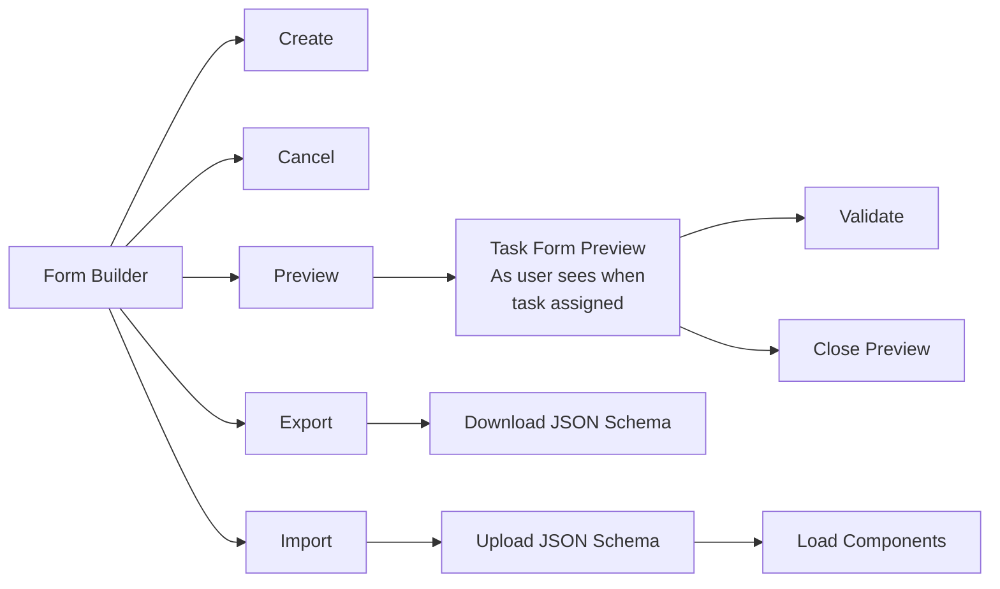
```mermaid
flowchart LR
  A[Form Builder] --> B[Create]
  A --> C[Cancel]
  A --> D[Preview]
  A --> E[Export]
  A --> F[Import]

  D --> D1["Task Form Preview<br/>As user sees when<br/>task assigned"]
  D1 --> D2[Validate]
  D1 --> D3[Close Preview]

  E --> E1[Download JSON Schema]
  F --> F1[Upload JSON Schema]
  F1 --> F2[Load Components]
```

### List View Row Actions
Quick reference for Task CT list actions.

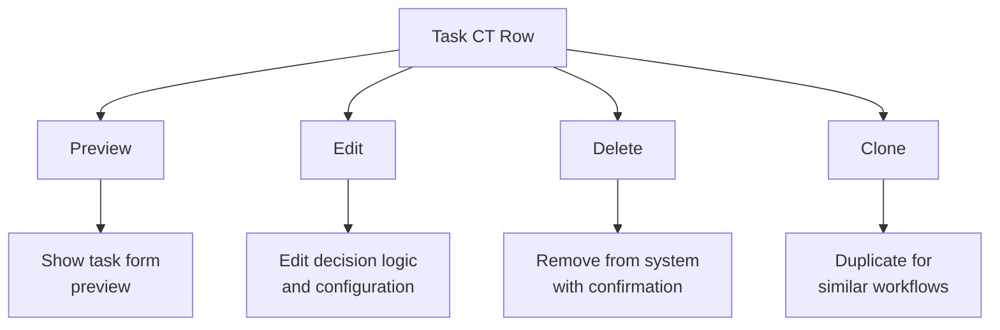
```mermaid
flowchart TD
  A[Task CT Row] --> B[Preview]
  A --> C[Edit]
  A --> D[Delete]
  A --> E[Clone]

  B --> B1["Show task form<br/>preview"]
  C --> C1["Edit decision logic<br/>and configuration"]
  D --> D1["Remove from system<br/>with confirmation"]
  E --> E1["Duplicate for<br/>similar workflows"]
```

## Comparison: File CT vs. Task CT

Differences in use and rendering context.

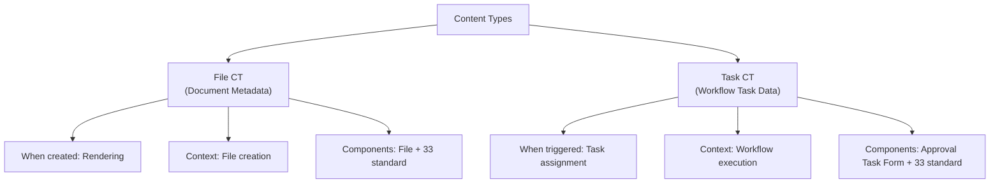
```mermaid
graph TD
  CT["Content Types"]
  
  CT --> File["File CT<br/>(Document Metadata)"]
  CT --> Task["Task CT<br/>(Workflow Task Data)"]
  
  File --> FU1["When created: Rendering"]
  File --> FU2["Context: File creation"]
  File --> FU3["Components: File + 33 standard"]
  
  Task --> TU1["When triggered: Task assignment"]
  Task --> TU2["Context: Workflow execution"]
  Task --> TU3["Components: Approval Task Form + 33 standard"]
```

## Approval Task Form Component
Specialized task component for approval-based workflows.

```mermaid
graph TD
  ATF["Approval Task Form<br/>(TASK CT ONLY)"]
  
  ATF --> INPUT["Input:<br/>Document/Request<br/>to Approve"]
  ATF --> OPTIONS["Decision Options<br/>Approve<br/>Reject<br/>Revise<br/>Escalate"]
  ATF --> FIELDS["Capture:<br/>Comments<br/>Justification<br/>Notes"]
  ATF --> OUTPUT["Output:<br/>Decision Result<br/>Feeds to Workflow<br/>for Routing"]
  
  OUTPUT --> ROUTE["Conditional Routing<br/>Each decision →<br/>Different next step"]
```

## Task Form Data Flow
How task form data flows through the workflow system.

```mermaid
flowchart TD
  DOC["Document/Request"] --> TASK["Workflow Task<br/>assigned to User"]
  TASK --> FORM["Task CT Form<br/>Rendered to User"]
  FORM --> USER["User Fills<br/>& Submits"]
  USER --> DATA["Task Form Data<br/>Captured"]
  
  DATA --> DECISION["Approval Task Form<br/>Output"]
  DECISION --> ROUTING["DMN Decision<br/>Model / Workflow Logic"]
  ROUTING --> NEXT["Next Step<br/>Executed"]
```

---

For detailed step-by-step task form configuration guides, see the **📘 Detailed Guide.md** file.
