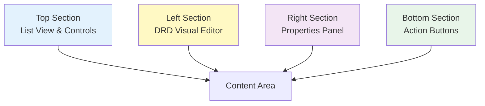
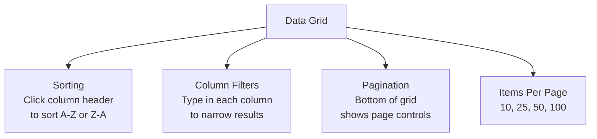
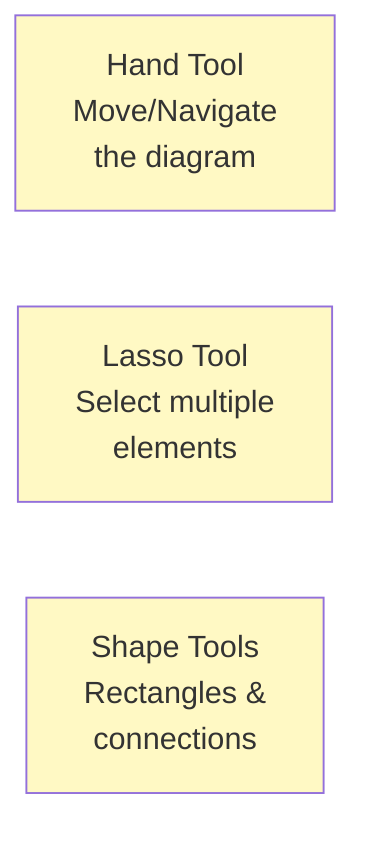
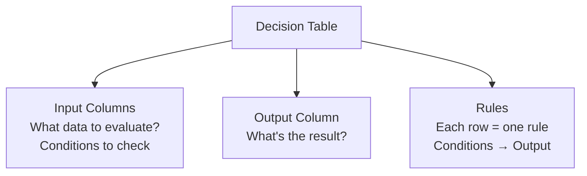
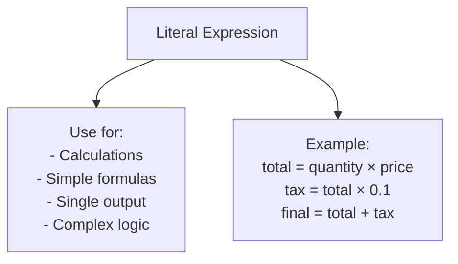
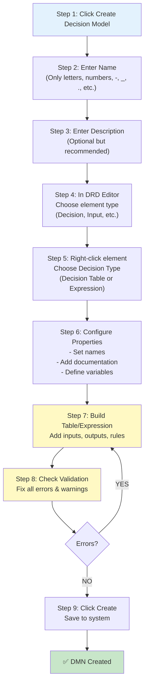
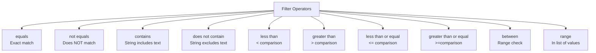
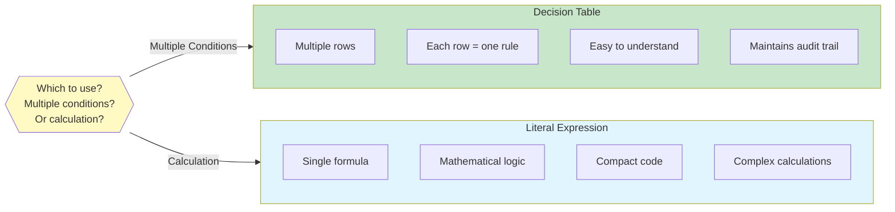

---
id: dmn-detailed-guide
title: "📘 DMN Detailed Guide - Components & Interface Reference"
sidebar_label: "📘 Detailed Guide"
sidebar_position: 2
name: "📘 Detailed Guide"
slug: /dmn/detailed-guide
tags: [dmn, interface, components, user-interface, reference]
---

# DMN Detailed Guide - Components & Interface Reference

:::tip 📌 At a Glance
**Document Type**: Detailed Guide  
**Goal**: Follow the unified ECM User Guide design and structure for this page.
:::


This guide provides a complete reference of all user interface components, fields, and options available in the **Manage Decision Model** feature of Contellect ECM.

## Overview of Manage Decision Model Interface

The Manage Decision Model page is divided into several key sections:



---

## 1. Manage DMN List View (Manage Decision Model Page)

When you navigate to **Configuration → Manage Decision Model**, you see a list of all DMN rules.

### Top Bar Controls

| Component | Purpose | Action |
|-----------|---------|--------|
| **Custom DMNs** | Filter/selector for DMN types | Click to select DMN category |
| **Refresh** | Reload the list | Click to refresh displayed rules |
| **Export** | Export selected rules | Export to file format |
| **Create Decision Model** | Add new DMN rule | Opens create page |

### Data Grid Columns

The grid displays these columns:

| Column | Content | Sortable | Filterable |
|--------|---------|----------|-----------|
| **rowIndex** | Row number | Yes | No |
| **Decision Name** | DMN rule name | Yes | Yes (text search) |
| **Description** | Rule description | Yes | Yes (text search) |
| **Created At** | Timestamp | Yes | Yes (date picker) |
| **Created By** | Author user name | Yes | Yes (text search) |
| **Actions** | Edit/Delete buttons | No | No |

### Filter Row Options

Each column has a filter row with:

1. **Text Input** - Type to search/filter
2. **Operator Dropdown** - Choose filter logic:
   - Contains
   - Equals
   - Starts with
   - Ends with
   - Does not contain
3. **Date Picker** (for Created At column)

### Grid Features



---

## 2. Create Decision Model Page - Complete Interface Reference

When you click **"Create Decision Model"**, you enter the DMN editor. This is where you design your decision rules.

### 2.1 Top Section - Model Metadata

```
┌─────────────────────────────────────────────────────┐
│  Name:          [Test_Approval_Routing________]    │
│  Description:   [Route invoices to correct...]     │
│                                                     │
│  ⚠️  Caution: Only letters, numbers, '-', '_',    │
│     '.', '()' and spaces allowed...                 │
└─────────────────────────────────────────────────────┘
```

#### Name Field
- **Required**: Yes
- **Max Length**: Typically 255 characters
- **Allowed Characters**: Letters, numbers, `-`, `_`, `.`, `()`, spaces
- **Validation**: Shows caution message about invalid characters
- **Purpose**: System-level identifier used in paths and APIs

#### Description Field
- **Required**: No
- **Purpose**: Human-readable explanation of what the DMN rule does
- **Example**: "Route invoices to correct approver based on amount"

---

### 2.2 Left Section - DRD (Decision Requirements Diagram) Visual Editor

The left side contains a visual editor for designing the decision logic using a diagram format.

#### Toolbar Elements



#### Available Shape Tools

| Tool | Element Type | Purpose |
|------|--------------|---------|
| 📦 **Box** | Input Data | Represents input variables/data |
| 🔷 **Diamond** | Decision | Represents a decision node (main element) |
| 📚 **Book** | Knowledge Source | References external knowledge/rules |
| 🧠 **Model** | Business Knowledge Model | Reusable decision logic |

#### Context Menu (Right-click on Element)

When you right-click on a decision element, you get options:

```
┌─────────────────────────────┐
│ ➕ Append decision          │
│ ➕ Append knowledge source  │
│ ➕ Append business knowledge│
│ ➕ Append input data        │
│ 📝 Add text annotation      │
│ ↔️  Connect to other element│
│ 🔄 Change type              │
│ 🗑️  Delete                  │
└─────────────────────────────┘
```

#### Element Selection

When you click on a decision element:

1. It becomes **highlighted with a blue border**
2. A context menu appears with quick actions
3. The **right panel updates** to show its properties
4. Options appear for:
   - **Decision Table** - Create a table with conditions
   - **Literal Expression** - Write a formula/expression

---

### 2.3 Right Section - Properties Panel

The right panel displays properties for the currently selected element. It has multiple sections:

#### Section: DECISION / INPUT DATA / OUTPUT

**Header** shows the element type and auto-generated ID

#### Tab 1: General

Contains basic element configuration:

| Field | Type | Purpose | Example |
|-------|------|---------|---------|
| **Name** | Text | Display name of element | "decision_9af8a1dd-2cfd..." |
| **ID** | Text (Read-only) | System identifier | "d_9af8a1dd-2cfd..." |
| **Version tag** | Text | Optional version info | "v1.0" or "2026-06" |

#### Tab 2: Documentation

Provides detailed information about the element:

| Field | Type | Purpose | Example |
|-------|------|---------|---------|
| **Description** | Text Area | What does this element do? | "Determine approval route" |
| **Question** | Text Area | What question does it answer? | "Who should approve this invoice?" |
| **Allowed answers** | Text Area | What are valid outputs? | "MANAGER, FINANCE_HEAD, CFO" |

#### Section: Variable

Defines the data type for the element:

| Field | Type | Options | Purpose |
|-------|------|---------|---------|
| **Type** | Dropdown | string, boolean, number, date, time, dateTime, dayTimeDuration, yearMonthDuration, Any | Data type of this variable |

---

### 2.4 Decision Table Specifics

When you create a **Decision Table** (most common type), you get a table editor with:

#### Decision Table Components



#### Table Structure

```
┌──────────────────────┬──────────────────┬─────────────┐
│ Input Column 1       │ Input Column 2   │ Output      │
│ (Amount)             │ (Vendor Approved)│ (Approver)  │
├──────────────────────┼──────────────────┼─────────────┤
│ < 5000               │ true             │ MANAGER     │ ← Rule 1
├──────────────────────┼──────────────────┼─────────────┤
│ 5000-50000           │ true             │ FINANCE_HEAD│ ← Rule 2
├──────────────────────┼──────────────────┼─────────────┤
│ > 50000              │ any              │ CFO         │ ← Rule 3
└──────────────────────┴──────────────────┴─────────────┘
```

#### Decision Table Configuration

**For each Input Column:**
- Name (e.g., "invoice_amount")
- Expression (e.g., "amount")
- Type (string, number, boolean, etc.)

**For Output Column:**
- Name (e.g., "approval_route")
- Type (string, number, boolean, etc.)

---

### 2.5 Literal Expression Specifics

When you choose **Literal Expression** instead of Decision Table:



---

### 2.6 Validation & Error Reporting

The interface shows validation issues at the top:

#### Error/Warning Panel

```
⚡ Issues • 1 error, 3 warnings [collapse] [close]
├─ ❌ ERROR (empty-decision-table)
│  Decision table should have at least one rule
├─ ⚠️  WARN (label-required)
│  Element is missing label/name
├─ ⚠️  WARN (io-name-type-required)
│  Input clause must have an input expression
└─ ⚠️  WARN (io-name-type-required)
   Output clause must have a name
```

**Common Errors:**

| Error | Meaning | Fix |
|-------|---------|-----|
| **Decision table should have at least one rule** | No rows in table | Add at least one rule row |
| **Input clause must have an input expression** | Input column not configured | Click column header, set expression |
| **Output clause must have a name** | Output column missing name | Click column header, enter name |
| **Label/name required** | Element has no display name | Enter name in right panel |

---

### 2.7 Action Buttons

At the bottom of the create page:

```
┌─────────────────────────────────────────────┐
│  [Create] [Cancel]   [Export] [Import] [Clear] │
└─────────────────────────────────────────────┘
```

#### Button Descriptions

| Button | Action | Status | Purpose |
|--------|--------|--------|---------|
| **Create** | Save DMN | Enabled when no errors | Saves rule to system |
| **Cancel** | Go back | Always enabled | Close without saving |
| **Export** | Download DMN | Always enabled | Save as XML file |
| **Import** | Load DMN | Always enabled | Import from file |
| **Clear** | Reset all | Always enabled | Clear entire design |

:::warning
The **Create** button is **DISABLED** if there are validation errors. Resolve all errors before saving.
:::

---

## 3. Edit Decision Model Page

When you click **Edit** on an existing rule, the interface is identical to Create except:

1. Fields are **pre-populated** with existing data
2. Button says **"Update"** instead of "Create"
3. You can **see the previous version** (if history is enabled)

---

## 4. Complete DMN Creation Workflow - Step by Step



---

## 5. Data Types Available

When configuring inputs and outputs, these data types are available:

| Type | Example | Use Case |
|------|---------|----------|
| **string** | "Manager", "Invoice" | Text values |
| **boolean** | true, false | Yes/No flags |
| **number** | 5000, 50000.50 | Amounts, quantities |
| **date** | 2026-06-11 | Date values |
| **time** | 14:30:00 | Time values |
| **dateTime** | 2026-06-11T14:30:00 | Timestamp |
| **dayTimeDuration** | P5D, PT2H | Duration (days, hours) |
| **yearMonthDuration** | P1Y6M | Duration (years, months) |
| **Any** | (default) | Any type - flexible |

---

## 6. Filter Operators Available

In the decision table rows, you can use these operators:



---

## 7. Example: Complete Invoice Routing DMN

### Full Component Breakdown

```
┌─ MODEL METADATA ─────────────────────────────┐
│ Name: Invoice_Approval_Routing              │
│ Description: Route invoices by amount       │
└──────────────────────────────────────────────┘

┌─ DRD DIAGRAM ────────────────────────────────┐
│                                              │
│  [📦 invoice_amount] ──┐                    │
│  [📦 vendor_approved]──┤──[🔷 Decision]     │
│  [📦 department]──────┘                     │
│                                              │
│    Decision Type: Decision Table             │
│                                              │
└──────────────────────────────────────────────┘

┌─ DECISION TABLE COLUMNS ─────────────────────┐
│ INPUT 1: invoice_amount (type: number)      │
│ INPUT 2: vendor_approved (type: boolean)    │
│ INPUT 3: department (type: string)          │
│ OUTPUT: approval_route (type: string)       │
└──────────────────────────────────────────────┘

┌─ DECISION TABLE RULES ───────────────────────┐
│ Rule 1: < 5000 & true  & any    → MANAGER   │
│ Rule 2: 5-50K  & true  & any    → FINANCE   │
│ Rule 3: > 50K  & any   & any    → CFO       │
└──────────────────────────────────────────────┘

┌─ VALIDATION ─────────────────────────────────┐
│ ✅ All errors resolved                       │
│ ✅ Ready to save                             │
└──────────────────────────────────────────────┘
```

---

## 8. Common Configuration Tasks

### Task: Change Element Name

1. Click element in DRD diagram
2. In right panel → **General** tab
3. Enter new name in **Name** field
4. Name updates immediately

### Task: Add Documentation

1. Click element
2. Right panel → **Documentation** tab
3. Fill in:
   - **Description**: What does it do?
   - **Question**: What question does it answer?
   - **Allowed answers**: What are valid outputs?

### Task: Change Data Type

1. Click element
2. Right panel → **Variable** section
3. Click **Type** dropdown
4. Select new type (string, number, boolean, etc.)

### Task: Add New Input Column

1. Click decision table element
2. Right-click → **Add input clause**
3. Click column header to configure:
   - Name (e.g., "invoice_amount")
   - Expression (e.g., amount)
   - Type (number)

### Task: View/Fix Validation Errors

1. Look at **Issues panel** at top
2. Click **focus** button next to error
3. Navigate to problematic element
4. Fix the issue (add name, add rule, etc.)
5. Error disappears when fixed

---

## 9. Keyboard Shortcuts (If Supported)

| Shortcut | Action |
|----------|--------|
| `Ctrl+Z` | Undo |
| `Ctrl+Y` | Redo |
| `Delete` | Delete selected element |
| `Escape` | Deselect element |
| `Ctrl+S` | Save (if available) |

---

## 10. Comparison: Decision Table vs Expression



---

## 11. Import/Export Capabilities

### Export DMN
- **Format**: XML (DMN standard format)
- **Use Case**: Backup, version control, sharing
- **File Extension**: `.dmn` or `.xml`

### Import DMN
- **Format**: XML (DMN standard format)
- **Use Case**: Load previously exported rules, migrate from other systems
- **Supported**: DMN 1.3+ format

---

## 12. Settings & Configuration Options

### Available Settings

| Setting | Purpose | Options |
|---------|---------|---------|
| **Hit Policy** | How to handle multiple matching rules | First, Any, Priority, etc. |
| **Built-in Aggregator** | Combine multiple rule outputs | Count, Sum, Min, Max, etc. |
| **Default Output Value** | What to return if no rules match | Any value |

---

## 13. Tips for Creating Effective DMN Rules

:::tip Best Practices
1. **Keep it simple** - One decision = one table
2. **Name clearly** - Use descriptive names for elements
3. **Order rules** - Put most common rules first
4. **Test thoroughly** - Verify with real data before deploying
5. **Document** - Add description and question fields
6. **Validate** - Fix all errors before saving
7. **Version control** - Export backup copies
:::

---

## 14. Troubleshooting Common Issues

### Issue 1: Create Button is Disabled

**Cause**: Validation errors exist  
**Solution**: 
1. Check the Issues panel for error messages
2. Click "focus" to navigate to problem
3. Fix the error (add name, add rule, etc.)

### Issue 2: Can't Add Elements to Diagram

**Cause**: Wrong tool selected or diagram locked  
**Solution**:
1. Make sure Hand or Lasso tool selected first
2. Right-click on existing element to add new ones
3. Or use toolbar icons to create elements

### Issue 3: Column Configuration Unclear

**Cause**: Input/output column headers not clicked  
**Solution**:
1. Click on column header
2. Enter:
   - Name (display name)
   - Expression (what field to check)
   - Type (data type)

### Issue 4: Decision Table Too Complex

**Cause**: Too many conditions in one table  
**Solution**:
1. Break into multiple simpler tables
2. Use nested decisions (one table calls another)
3. Simplify rule conditions

---

## What's Next?

- **[Knowledge Overview](%F0%9F%A7%A0%20Knowledge%20Overview.md)** - Understand DMN concepts
- **[Diagrams](%F0%9F%97%BA%20Diagrams.md)** - Visual architecture examples
- **[Using Guide](%F0%9F%9B%A0%20Using%20Guide.md)** - Step-by-step business case workflows

---

**Version**: v7.49.0+  
**Last Updated**: 2026-06-11  
**Powered by Contellect**
