---
id: dmn-diagrams-business-cases
title: "🗺 DMN Diagrams, Architecture & Business Cases"
sidebar_label: "🗺 Diagrams"
sidebar_position: 3
name: "🗺 Diagrams"
slug: /dmn/diagrams-business-cases
tags: [dmn, diagrams, business-cases, decision-flows, architecture]
---

# DMN Diagrams, Architecture & Business Cases

:::tip 📌 At a Glance
**Document Type**: Diagrams  
**Goal**: Follow the unified ECM User Guide design and structure for this page.
:::


This section provides visual representations of DMN concepts, architecture, integration patterns, and detailed real-world business case examples.

## 1. DMN System Architecture

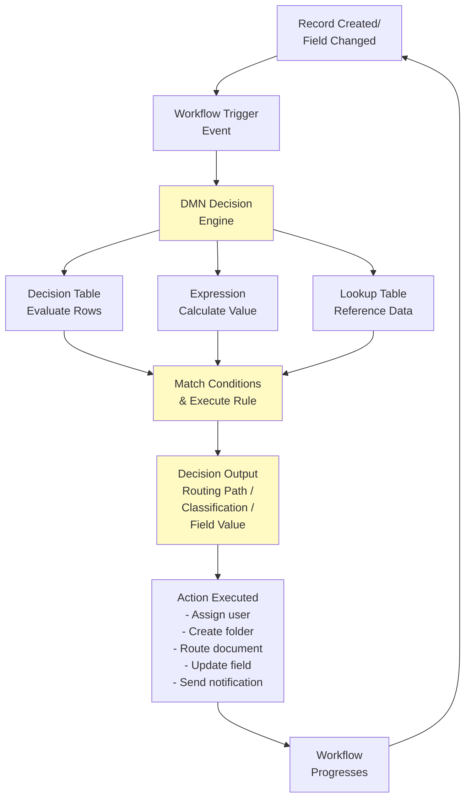

## 2. DMN Decision Table Components

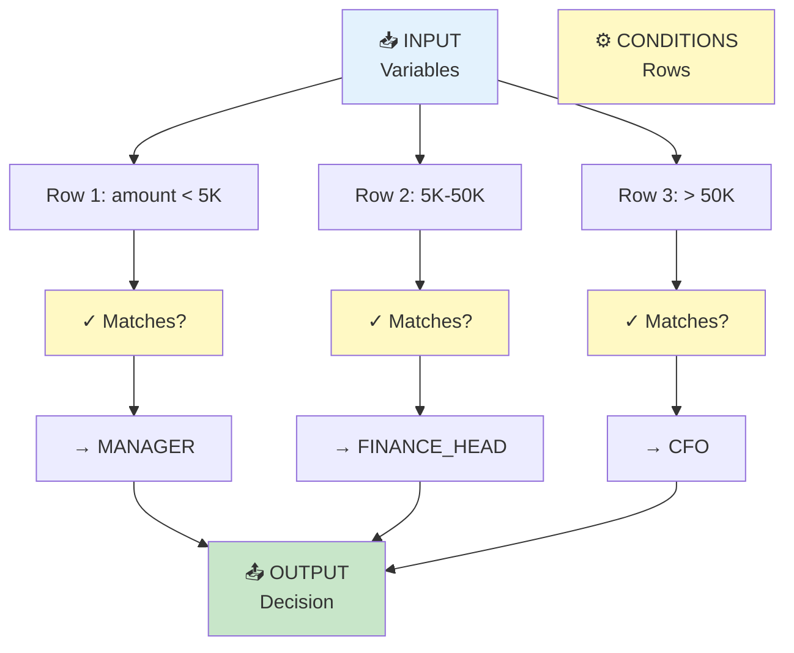

## 3. Invoice Approval Routing - Complete Business Case

### Business Case Overview
- **Company**: Global Finance Inc.
- **Annual Volume**: 50,000 invoices/year
- **Current Process**: Manual routing, 3-5 day delays
- **Goal**: Auto-route within 1 minute

### Current State (Before DMN)

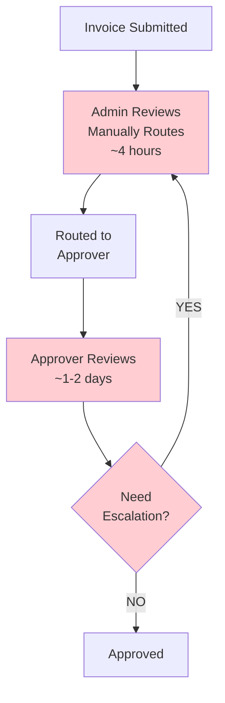

**Pain Points**:
- ❌ Manual routing errors (wrong approver)
- ❌ Delays waiting for admin review
- ❌ Escalation required for some invoices (adds more delays)
- ❌ No audit trail of routing decisions
- ❌ Inconsistent rules applied

### Future State (With DMN)

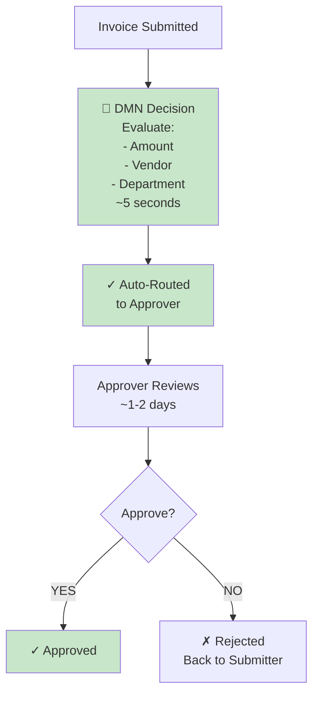

**Benefits**:
- ✅ Instant routing (no admin delays)
- ✅ Consistent rules applied to every invoice
- ✅ Audit trail stored automatically
- ✅ Fewer escalations (rules handle edge cases)
- ✅ Faster overall approval time

### DMN Approval Decision Table

```
Input Variables:
├── invoice_amount (Decimal)
├── vendor_is_approved (Boolean)
├── department (String)
└── purchase_order_exists (Boolean)

Decision Rows:
┌────────────────┬───────────────┬────────────┬───────────┬────────────────┐
│ Amount         │ Approved      │ Department │ PO Exists │ Approval Route │
│                │ Vendor        │            │           │                │
├────────────────┼───────────────┼────────────┼───────────┼────────────────┤
│ < $5,000       │ YES           │ Any        │ Any       │ MANAGER        │
│ < $5,000       │ NO            │ Finance    │ YES       │ FINANCE_HEAD   │
│ < $5,000       │ NO            │ Finance    │ NO        │ CFO            │
│ < $5,000       │ NO            │ Other      │ Any       │ MANAGER        │
├────────────────┼───────────────┼────────────┼───────────┼────────────────┤
│ $5,000-50K     │ YES           │ Any        │ YES       │ FINANCE_HEAD   │
│ $5,000-50K     │ YES           │ Any        │ NO        │ CFO            │
│ $5,000-50K     │ NO            │ Any        │ Any       │ CFO            │
├────────────────┼───────────────┼────────────┼───────────┼────────────────┤
│ > $50,000      │ Any           │ Any        │ Any       │ CFO            │
└────────────────┴───────────────┴────────────┴───────────┴────────────────┘
```

### DMN Execution Flow

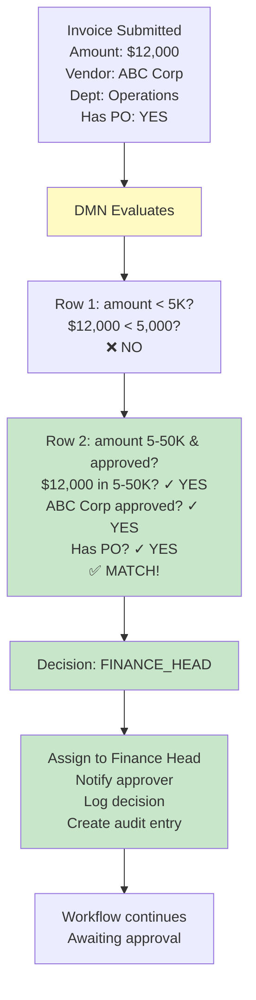

### Business Impact

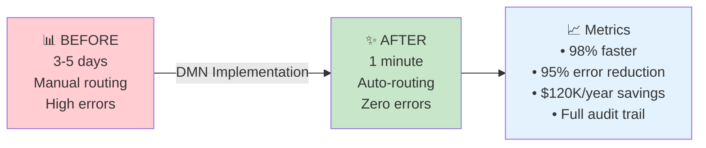

---

## 4. Document Classification Business Case

### Scenario
**Organization**: Legal Document Services  
**Challenge**: 1,000 documents uploaded daily; manual classification takes 8 hours/day  
**Solution**: DMN auto-classifies by content analysis

### Classification Rules Flowchart

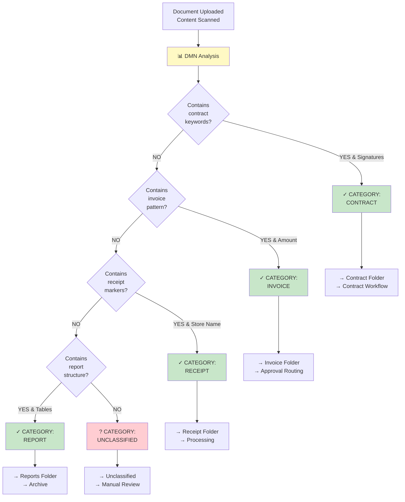

### Time Savings Analysis

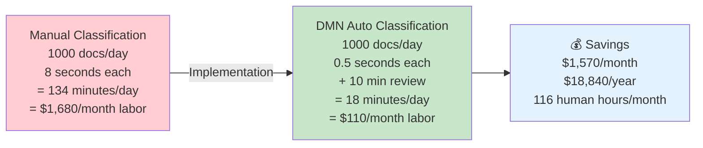

---

## 5. Field Visibility Control Business Case

### Healthcare Records Example

**Challenge**: Prevent unauthorized access to sensitive patient medical information

### Role-Based Visibility Rules

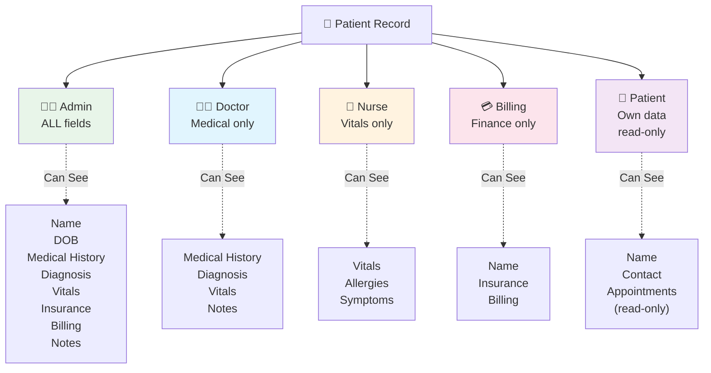

### Security Impact

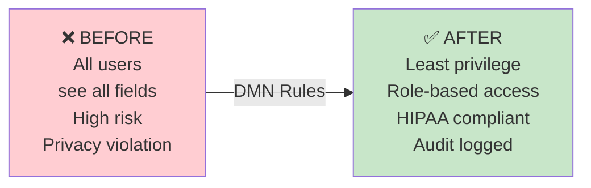

---

## 6. Folder Path Construction Business Case

### Real Estate Management Company

**Goal**: Organize property documents with auto-folder structure

### Metadata to Folder Path Mapping

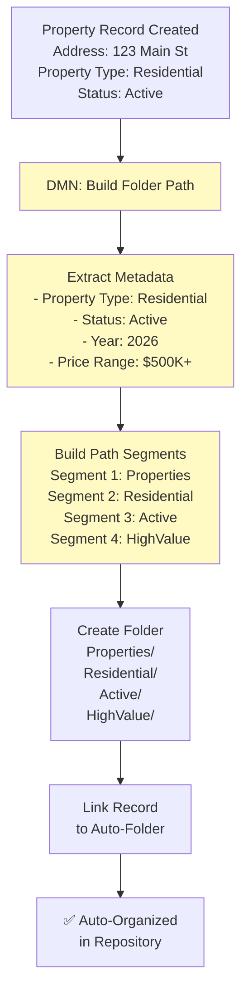

### Full Folder Structure

```
Properties/
├── Residential/
│   ├── Active/
│   │   ├── HighValue (>$500K)
│   │   ├── MidRange ($200K-500K)
│   │   └── Affordable (<$200K)
│   └── Sold/
├── Commercial/
│   ├── Active/
│   │   ├── Retail
│   │   ├── Office
│   │   └── Industrial
│   └── Leased/
└── Land/
    ├── Active/
    └── Sold/
```

---

## 7. Workflow Integration - Complete Flow

### Multi-Step Process with DMN at Each Stage

```mermaid
flowchart TD
    START["📥 Document<br/>Upload"] --> STAGE1["Stage 1:<br/>Classification"]
    
    STAGE1 --> DMN1["🎯 DMN Rule:<br/>Classify Document"]
    DMN1 --> CLASSIFY["✓ Classified as<br/>Invoice"]
    CLASSIFY --> ACTION1["Auto-assign<br/>Content Type"]
    
    ACTION1 --> STAGE2["Stage 2:<br/>Validation"]
    STAGE2 --> DMN2["🎯 DMN Rule:<br/>Validate Invoice"]
    DMN2 --> VALIDATE["✓ All fields<br/>complete"]
    VALIDATE --> ACTION2["Proceed to<br/>Routing"]
    
    ACTION2 --> STAGE3["Stage 3:<br/>Approval Routing"]
    STAGE3 --> DMN3["🎯 DMN Rule:<br/>Route by Amount"]
    DMN3 --> ROUTE["✓ Route to<br/>Finance Head"]
    ROUTE --> ACTION3["Assign to<br/>Approver Group"]
    
    ACTION3 --> STAGE4["Stage 4:<br/>Approval"]
    STAGE4 --> REVIEW["👤 Approver<br/>Reviews"]
    REVIEW --> DECISION["✓ Approves<br/>Invoice"]
    DECISION --> ACTION4["Update Status:<br/>APPROVED"]
    
    ACTION4 --> STAGE5["Stage 5:<br/>Post-Process"]
    STAGE5 --> DMN4["🎯 DMN Rule:<br/>Generate Reports"]
    DMN4 --> POSTPROCESS["✓ Generate<br/>Accounting Entry"]
    POSTPROCESS --> END["✅ Complete<br/>Archived"]
    
    style DMN1 fill:#fff9c4
    style DMN2 fill:#fff9c4
    style DMN3 fill:#fff9c4
    style DMN4 fill:#fff9c4
    style END fill:#c8e6c9
```

---

## 8. Decision Table Evaluation - Step by Step

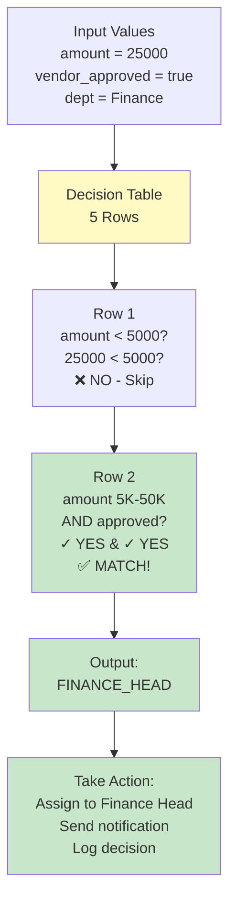

---

## 9. DMN Expression vs Decision Table

### Decision Table (Best for multiple conditions)

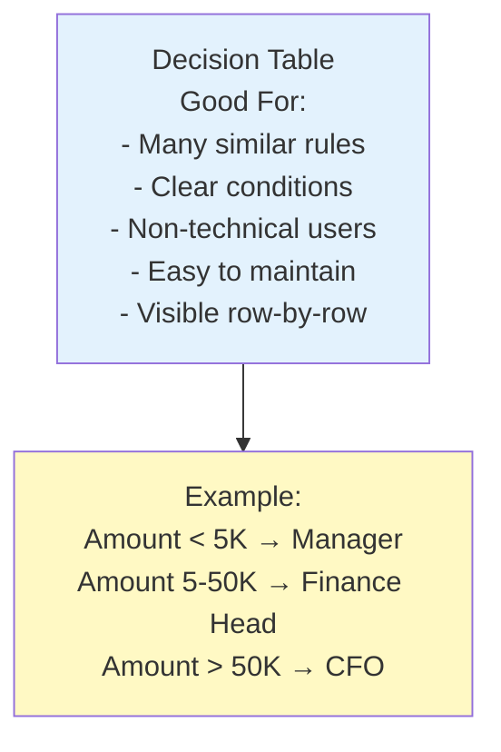

### Expression (Best for calculation logic)

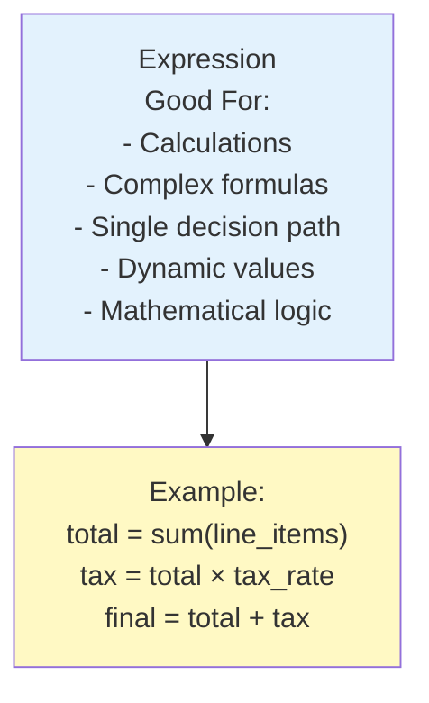

---

## 10. Comparison: DMN vs Workflow Conditionals

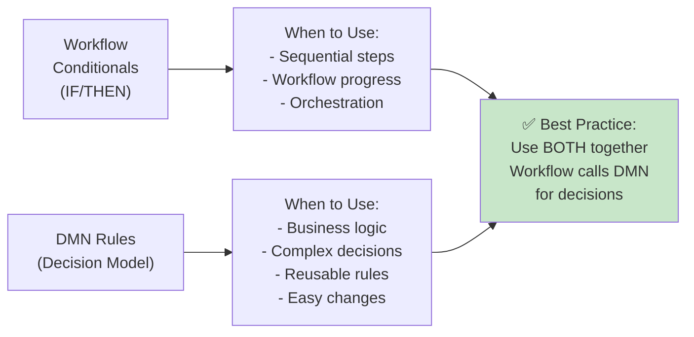

---

## 11. DMN Audit Trail & Compliance

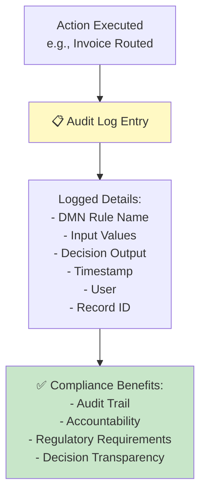

---

## 12. DMN Best Practices - Decision Tree

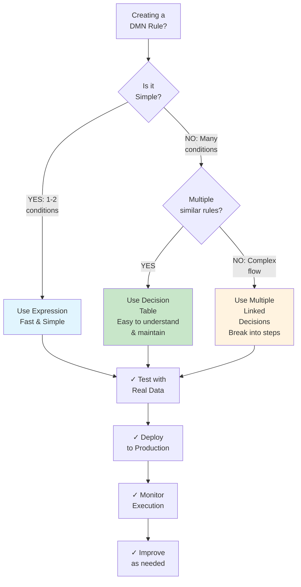

---

## 13. Common DMN Patterns Library

### Pattern 1: Tiered Approval (Most Common)

```
IF amount <= 5000 THEN manager_approval
ELSE IF amount <= 50000 THEN finance_head
ELSE cfo_approval
```

### Pattern 2: Status Workflow

```
IF status = "draft" THEN allow_edit
ELSE IF status = "submitted" THEN allow_review_only
ELSE IF status = "approved" THEN lock_record
ELSE IF status = "archived" THEN allow_view_only
```

### Pattern 3: Risk-Based Routing

```
IF risk_score < 20 THEN auto_approve
ELSE IF risk_score < 50 THEN standard_review
ELSE IF risk_score < 80 THEN enhanced_review
ELSE manual_investigation
```

---

## 14. Troubleshooting Decision Trees

### When DMN Rule Doesn't Execute

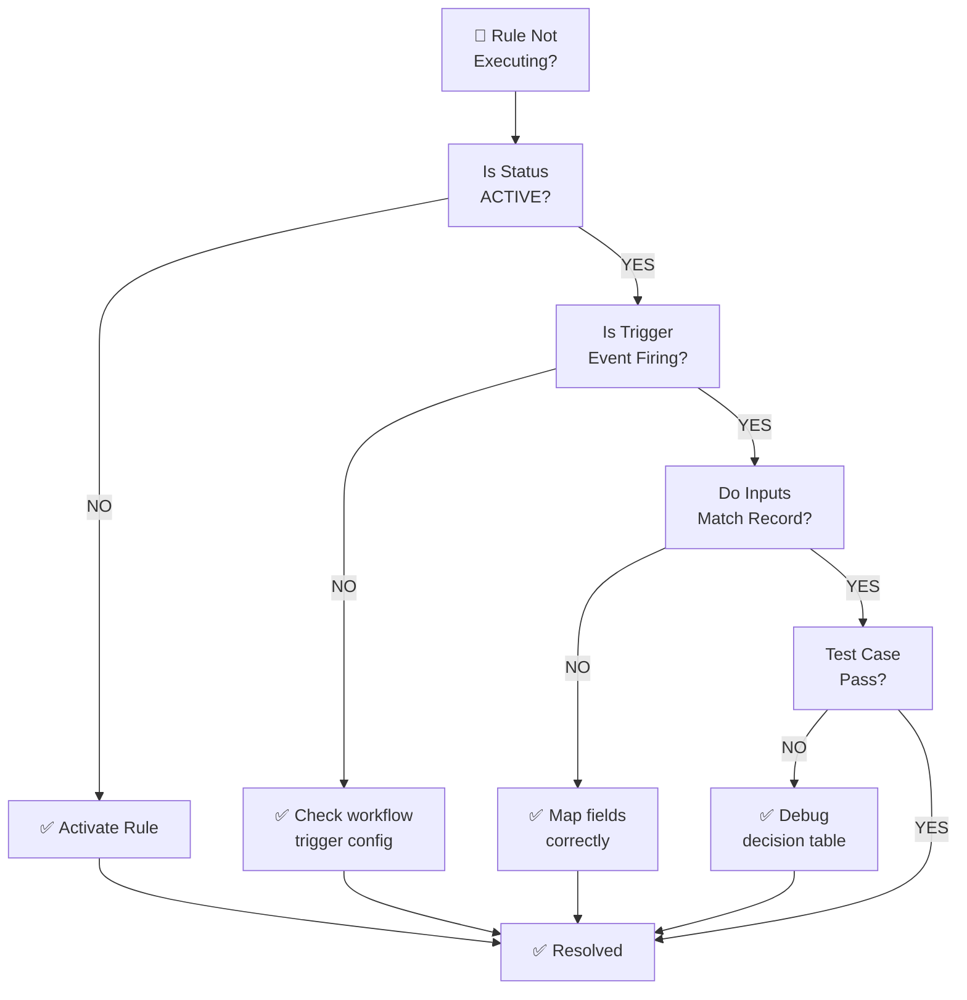

---

## 15. DMN Performance Optimization

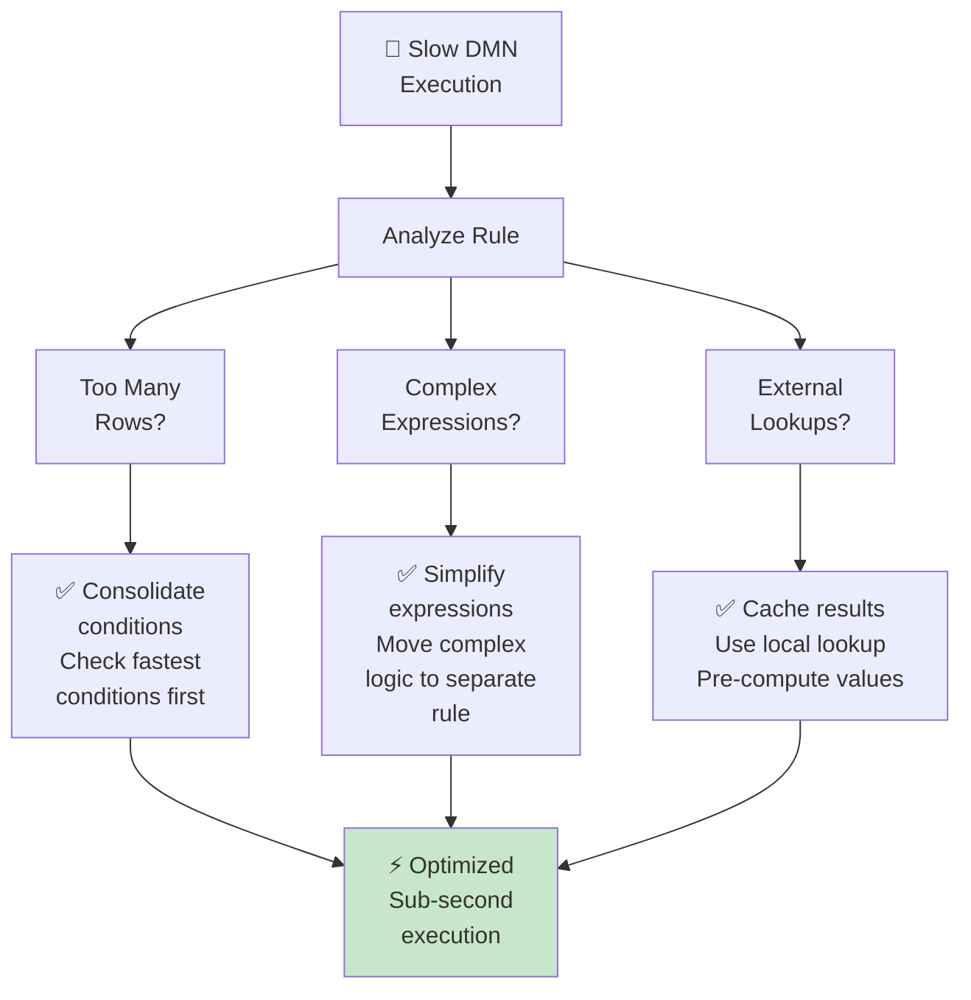

---

## 16. Integration with ECM Modules

```mermaid
graph TB
    DMN["🎯 DMN<br/>Decision Engine"]
    
    WF["Workflow<br/>Orchestration"]
    CT["Content Types<br/>& Fields"]
    SEARCH["Quick/Advanced<br/>Search"]
    REPO["Repository<br/>& Folders"]
    WORKSPACE["Workspace<br/>Records"]
    
    DMN --> WF
    DMN --> CT
    DMN --> SEARCH
    DMN --> REPO
    DMN --> WORKSPACE
    
    WF -->|Uses DMN| DETAIL1["Auto-routing<br/>Conditional actions<br/>Status-based workflow"]
    CT -->|Configured via DMN| DETAIL2["Field visibility<br/>Field validation<br/>Dynamic metadata"]
    SEARCH -->|Searches results<br/>created by DMN| DETAIL3["Filter by DMN<br/>metadata fields<br/>Find auto-classified<br/>records"]
    REPO -->|DMN creates<br/>folder paths| DETAIL4["Auto-folder<br/>creation<br/>Folder structure<br/>via DMN"]
    WORKSPACE -->|DMN sets<br/>metadata| DETAIL5["Folder path<br/>metadata<br/>Auto-folder link"]
    
    style DMN fill:#fff9c4
```

---

## Key Takeaways

| Concept | Key Point |
|---------|-----------|
| **Decision Model** | Structure that defines business rules and decisions |
| **Decision Table** | Matrix of conditions → outputs (best for multi-condition logic) |
| **Expression** | Mathematical/logical formula for single decision |
| **Trigger** | Event that causes DMN rule to execute (record create, field change) |
| **Audit Trail** | Every decision is logged with inputs, outputs, timestamp |
| **Reusable** | Create rule once, use in multiple workflows |
| **Non-Technical** | Business users can modify decision tables without coding |
| **Performance** | Decisions evaluate in milliseconds |
| **Integration** | DMN integrated at workflow, search, folder, and visibility levels |

---

## What's Next?

- **[Knowledge Overview](%F0%9F%A7%A0%20Knowledge%20Overview.md)** - Understand core DMN concepts
- **[Detailed Guide](%F0%9F%93%98%20Detailed%20Guide.md)** - Components and interface reference
- **[Using Guide](%F0%9F%9B%A0%20Using%20Guide.md)** - Step-by-step workflows
- **[Workflow Management](../Workspace/%F0%9F%A7%A0%20Knowledge%20Overview.md)** - How DMN integrates
- **[Advanced Search](../Advanced%20Search/%F0%9F%A7%A0%20Knowledge%20Overview.md)** - Search for DMN-created records

---

**Version**: v7.49.0+  
**Last Updated**: 2026-06-11  
**Powered by Contellect**
