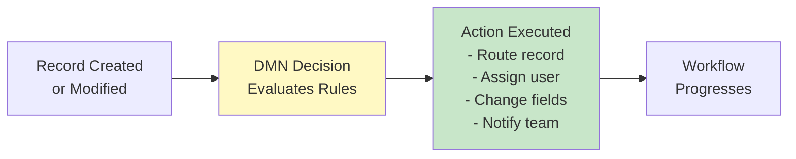
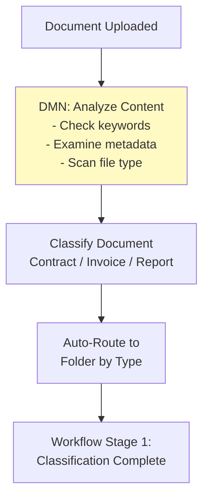
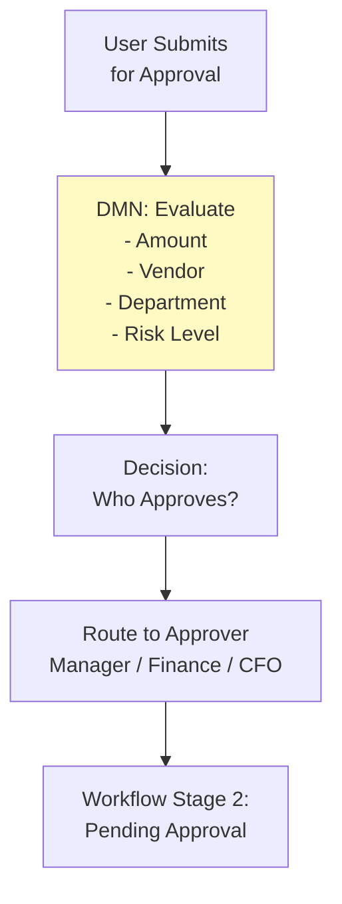
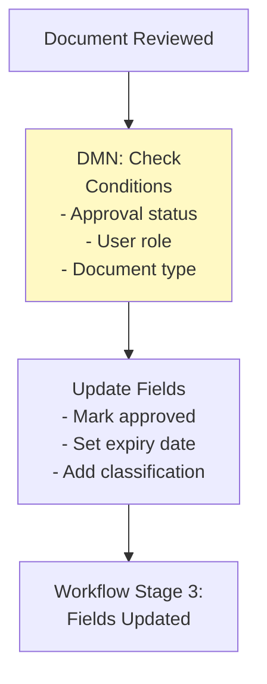
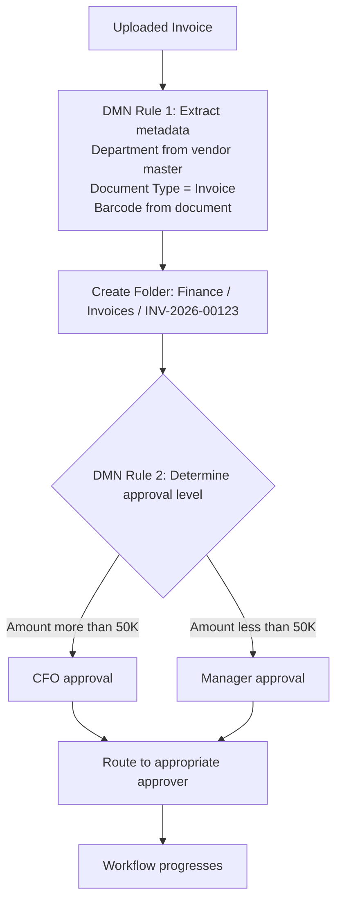

---
id: dmn-knowledge-overview
title: "🧠 Decision Model Notation (DMN) - Knowledge Overview"
sidebar_label: "🧠 Knowledge Overview"
sidebar_position: 1
name: "🧠 Knowledge Overview"
slug: /dmn/knowledge-overview
tags: [dmn, decision-logic, workflow, business-rules]
---

# Decision Model Notation (DMN) - Knowledge Overview

:::tip 📌 At a Glance
**Document Type**: Knowledge Overview  
**Goal**: Follow the unified ECM User Guide design and structure for this page.
:::


## What is DMN (Decision Model Notation)?

**Decision Model Notation (DMN)** is a standard approach for documenting business decisions in Contellect ECM. It provides a visual and executable way to define decision logic that controls how documents flow through your organization's workflows and processes.

In simple terms: DMN lets you **write business rules** that automatically determine what happens to records, who reviews them, and which paths they take through your system.

:::info Industry Standard
DMN is an Object Management Group (OMG) standard used across enterprise applications for defining decision logic in a business-friendly way.
:::

## Why Use DMN in Contellect ECM?

### Business Problems DMN Solves

| Problem | Solution |
|---------|----------|
| Manual routing decisions in workflows | Automate with DMN rules |
| Inconsistent document handling | Standardize with DMN logic |
| Complex approval chains | Define DMN decision tables |
| Conditional field visibility | Use DMN expressions |
| Dynamic folder organization | Auto-organize with DMN |
| Business rule changes require IT | Non-technical users can modify DMN |

### Real-World Scenarios

:::success Finance Automation
**Problem**: Invoices need different approval levels based on amount.
- < $5,000: Manager approval only
- $5,000-$50,000: Manager + Finance Head
- > $50,000: CFO approval required

**Solution**: Create DMN decision table with amount thresholds → automatic routing
:::

:::success Document Classification
**Problem**: Incoming documents need automatic categorization.
- Contains "Contract" + has signatures → Contract folder
- Contains "Invoice" + has vendor name → Invoice folder
- Contains "Policy" → Legal folder

**Solution**: DMN decision rules analyze content → route to correct folder
:::

:::success Permission-Based Access
**Problem**: Different users see different fields based on role.
- Admin sees all fields
- Manager sees operational fields only
- User sees limited read-only fields

**Solution**: DMN conditions control field visibility based on user role
:::

## Key Concepts in DMN

### Decision Model vs Decision Table

**Decision Model**: Overall logic structure (like a flowchart)
```
Start → Evaluate Amount → Evaluate Risk Level → Determine Approval Route
```

**Decision Table**: Specific rules within the model (like a lookup table)

| Amount | Risk Level | Approval Route |
|--------|-----------|-----------------|
| < $5K  | Low       | Manager only    |
| < $5K  | High      | Manager + CFO   |
| $5K+   | Low       | Finance Head    |
| $5K+   | High      | CFO required    |

### Decision Rules (Conditions)

A DMN rule consists of:

1. **Input**: The data to evaluate (e.g., invoice amount)
2. **Condition**: The rule logic (e.g., "amount > 50000")
3. **Output**: The result (e.g., "CFO_APPROVAL")

Example:
```
IF amount > 50000 AND vendor NOT in (approved_vendors)
THEN approval_route = "CFO"
```

### Decision Logic

DMN supports multiple decision approaches:

| Type | Use Case | Example |
|------|----------|---------|
| **Decision Table** | Multiple conditions with clear outcomes | Approval routing by amount |
| **Expression** | Single calculation or condition | Total cost = quantity × price |
| **Literal Expression** | Simple true/false | Is_Complete = Name AND Email provided |
| **Invocation** | Call another decision | Get approval rule THEN apply it |

## How DMN Integrates with Workflows

### Workflow Integration Points



### Workflow Stage 1: Document Classification (On Upload)



### Workflow Stage 2: Approval Routing (Rule-Based)



### Workflow Stage 3: Conditional Actions (Field Updates)



## DMN Folder Path Integration

:::info Folder Metadata via DMN
When you create a **Workspace record**, an **auto-folder** is created in Repository with the folder path determined by **DMN metadata fields**.

The folder structure is: `Department / Document Type / Document Barcode`

Each segment comes from DMN-configured metadata fields.
:::

### Example: Invoice Processing with DMN



## Common DMN Use Cases in Contellect ECM

### 1. Approval Routing Logic

**Trigger**: Document submission  
**DMN Decision**: Evaluate amount, department, type  
**Action**: Assign to approver  
**Workflow Impact**: Route document through approval chain

### 2. Field Visibility Control

**Trigger**: User opens record  
**DMN Decision**: Check user role and record type  
**Action**: Show/hide sensitive fields  
**Workflow Impact**: Users see only authorized fields

### 3. Automatic Folder Organization

**Trigger**: Record created  
**DMN Decision**: Evaluate metadata fields  
**Action**: Create folder path  
**Workflow Impact**: Records auto-organized in repository

### 4. Document Classification

**Trigger**: Document uploaded  
**DMN Decision**: Analyze content, keywords, metadata  
**Action**: Assign to content type  
**Workflow Impact**: Route through type-specific workflow

### 5. Status-Based Actions

**Trigger**: Status field updated  
**DMN Decision**: Evaluate current status  
**Action**: Send notifications, lock fields, trigger next step  
**Workflow Impact**: Automate multi-step processes

## DMN vs Workflows - Key Differences

| Aspect | DMN | Workflow |
|--------|-----|----------|
| **Purpose** | Define business rules & decisions | Orchestrate process steps |
| **Scope** | Make a single decision | Coordinate entire process |
| **Trigger** | Data change or action | Process milestone reached |
| **Output** | Decision result (routing path) | Next workflow stage |
| **User View** | Rules are business logic | Workflow is visible process |
| **Use Together** | YES - workflow uses DMN decisions | Workflows call DMN for routing |

:::tip Integration Pattern
Workflows are the process choreographer, DMN is the decision engine. Workflows call DMN rules to decide what happens next.
:::

## Role-Based Quick Starts

### Administrator

:::tip Quick Start
1. Navigate to Configuration → Manage DMN
2. Understand decision tables (inputs → conditions → outputs)
3. Review existing rules for business processes
4. Identify opportunities for new rules
5. Test rules before deploying to production
6. Document rules for compliance/audit
:::

### Business Analyst

:::tip Quick Start
1. Identify business decision points in processes
2. Map conditions that trigger different outcomes
3. Work with admins to translate to DMN
4. Test new rules with sample data
5. Train users on how decisions affect their work
:::

### End User

:::tip Quick Start
1. Understand which DMN rules affect YOUR records
2. Know what automatic actions happen (routing, folder creation, field updates)
3. Provide feedback on rule effectiveness
4. Help identify cases where rules don't apply correctly
:::

## Benefits of Using DMN

| Benefit | Impact |
|---------|--------|
| **Automation** | Reduce manual decisions by 70-90% |
| **Consistency** | Same rules applied to all records |
| **Speed** | Instant routing vs manual delays |
| **Audit Trail** | Decisions are logged and traceable |
| **Flexibility** | Change rules without code |
| **Documentation** | Business rules are explicit and visible |

## Common Challenges & Solutions

### Challenge 1: DMN Rules Are Too Complex

**Solution**: 
- Break into multiple simple rules instead of one complex rule
- Use decision tables (easier to understand than expressions)
- Document each rule's purpose

### Challenge 2: Rules Conflict (Multiple Match)

**Solution**:
- Define rule priority/execution order
- Use DMN "first" or "any" hit policy
- Test all rule combinations

### Challenge 3: DMN Performance Issues

**Solution**:
- Optimize rule conditions (check fastest conditions first)
- Use lookup tables instead of complex expressions
- Cache decision results for repeated scenarios

### Challenge 4: Users Don't Understand Decisions

**Solution**:
- Create simple decision flowcharts
- Document "if this, then that" clearly
- Train users on decision logic
- Provide examples of typical scenarios

## Performance Considerations

:::info Rule Execution
DMN decisions are evaluated:
- On record creation
- When trigger fields change
- At workflow checkpoints
- On search/filter operations

Optimize for fast evaluation, especially if rules run frequently.
:::

## What's Next?

- **[Detailed Guide](%F0%9F%93%98%20Detailed%20Guide.md)** - Components and interface reference
- **[Diagrams](%F0%9F%97%BA%20Diagrams.md)** - Visual workflows and real-world examples
- **[Using Guide](%F0%9F%9B%A0%20Using%20Guide.md)** - Step-by-step workflows for creating and managing DMN rules
- **[Workflow Integration](../Advanced%20Search/%F0%9F%A7%A0%20Knowledge%20Overview.md)** - How DMN works with workflows
- **[Workspace](../Workspace/%F0%9F%A7%A0%20Knowledge%20Overview.md)** - How DMN creates folder paths

---

**Version**: v7.49.0+  
**Last Updated**: 2026-06-11  
**Powered by Contellect**
