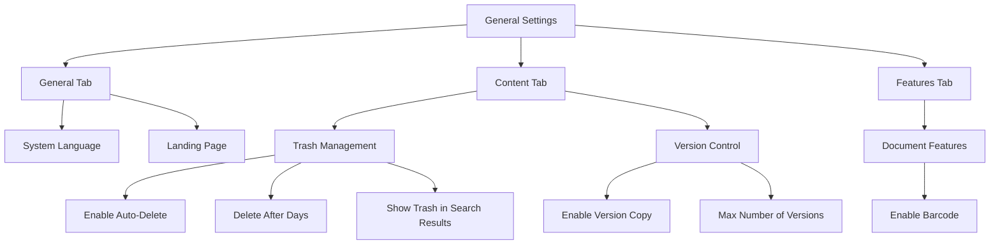
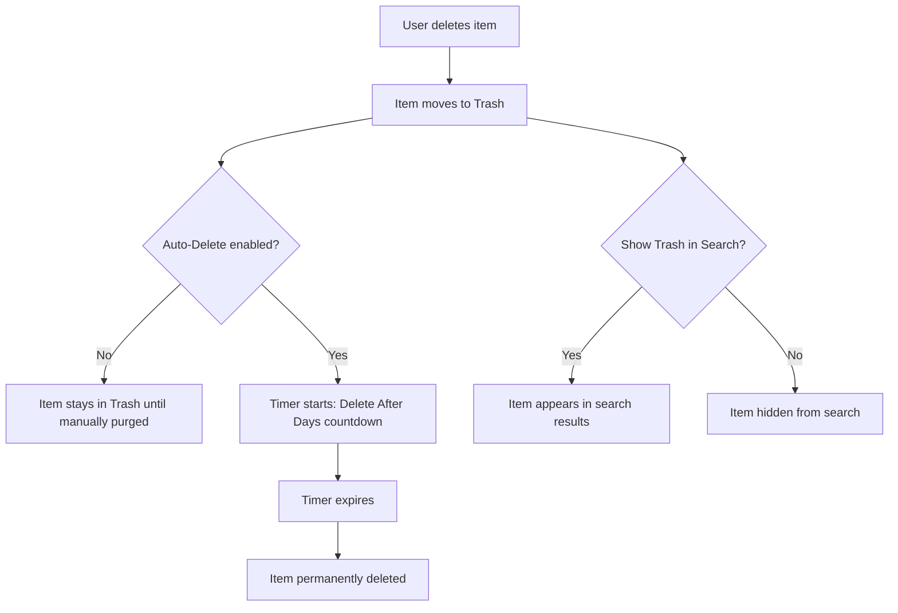
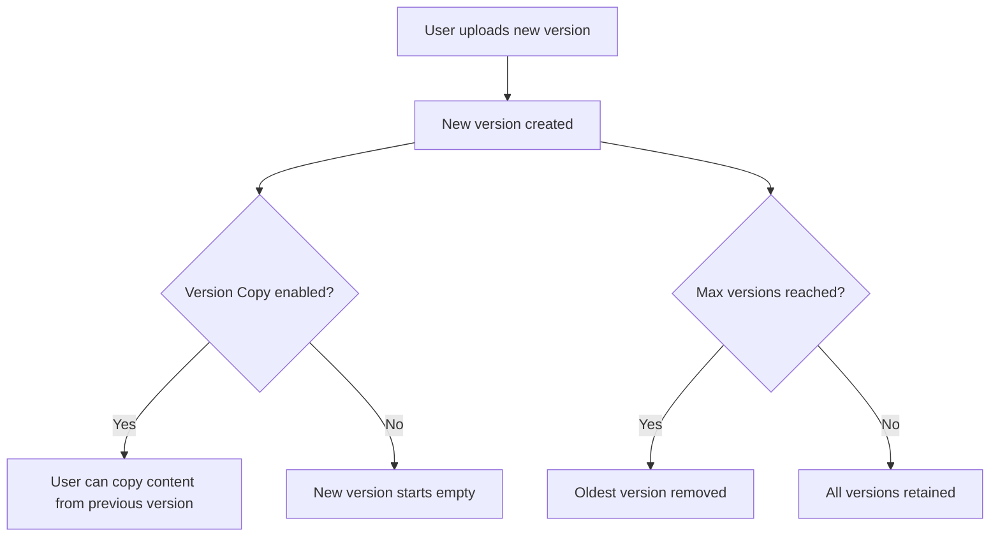

# ⚙️ General Settings - Diagrams

:::tip 📌 At a Glance
**Document Type**: Diagrams  
**Goal**: Visualize how General Settings options drive lifecycle and feature behavior.
:::

## 1) Settings Section Map

## 2) Trash Lifecycle

## 3) Version Control Flow

## Related Guides

- [🧠 Knowledge Overview](%F0%9F%A7%A0%20Knowledge%20Overview.md) - Concepts and tenant impact.
- [📘 Detailed Guide](%F0%9F%93%98%20Detailed%20Guide.md) - Step-by-step configuration details.

---

Version: live UI exploration  
Last Updated: 2026-06-21