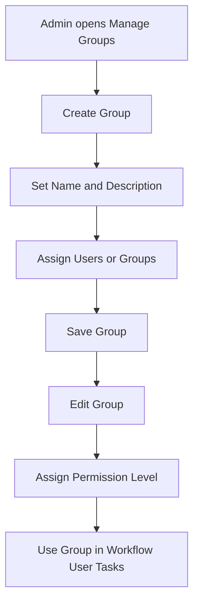
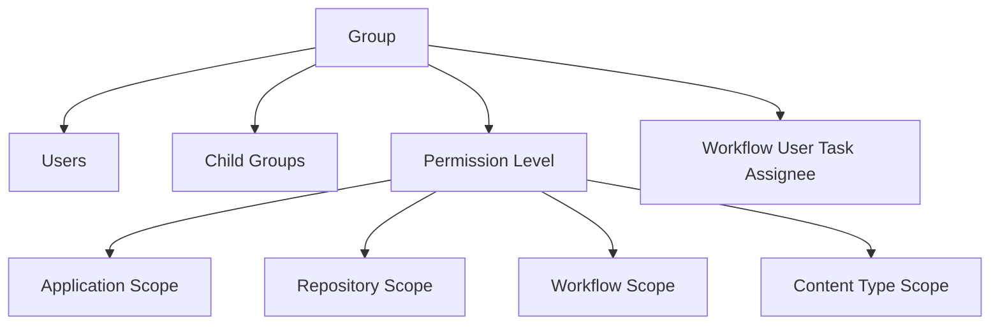
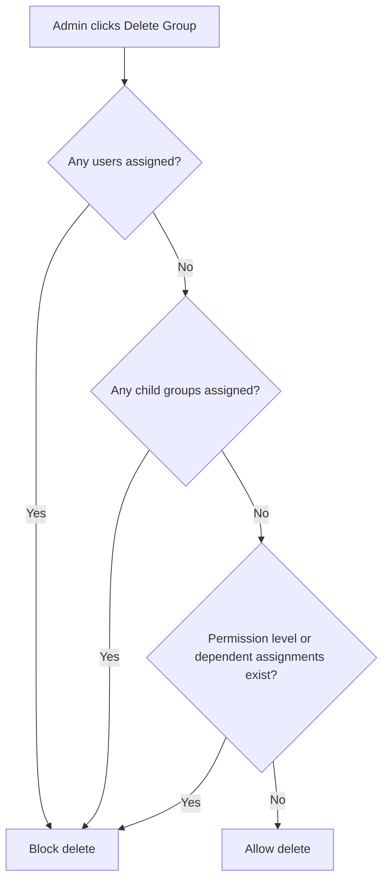
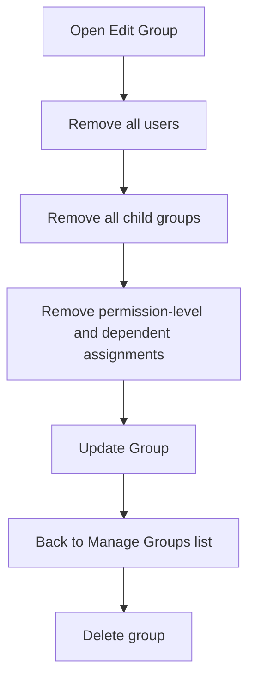

# 👥 Manage Groups - Diagrams

:::tip 📌 At a Glance
**Document Type**: Diagrams  
**Goal**: Visualize group creation lifecycle, membership model, and safe deletion sequence.
:::

## 1) Group Lifecycle

## 2) Membership Model

## 3) Deletion Guard Rules

## 4) Safe Deletion Sequence

---

## Related Guides

- [🧠 Knowledge Overview](%F0%9F%A7%A0%20Knowledge%20Overview.md) - Concepts and governance model.
- [📘 Detailed Guide](%F0%9F%93%98%20Detailed%20Guide.md) - Operational steps for admins.

---

Version: live UI exploration + tenant rules provided by user  
Last Updated: 2026-06-21