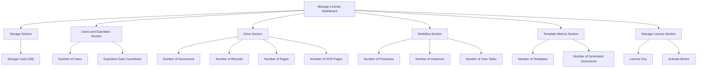
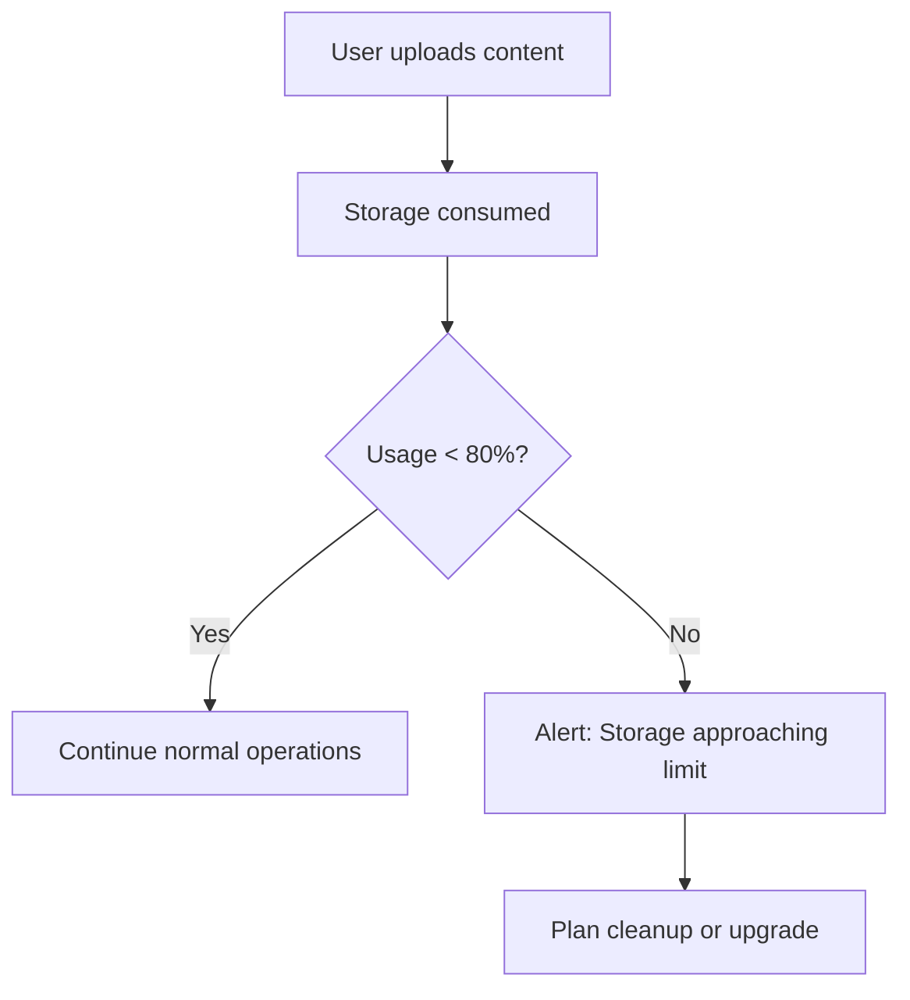
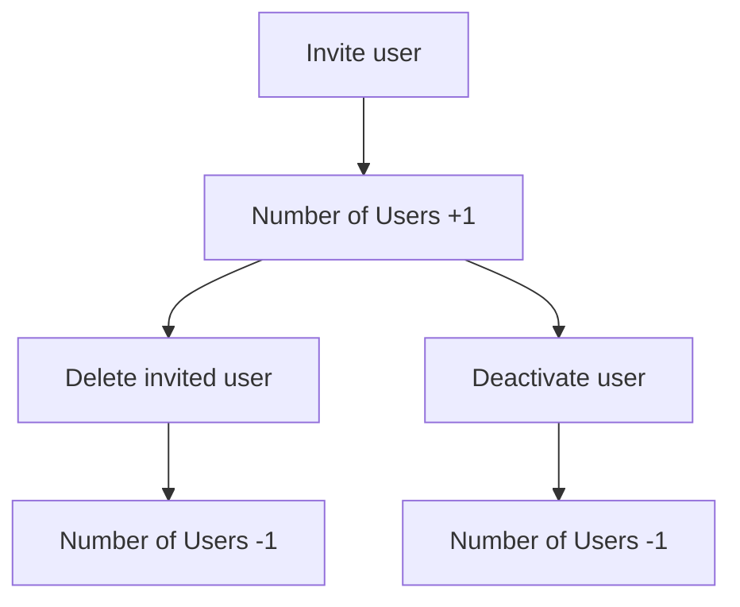
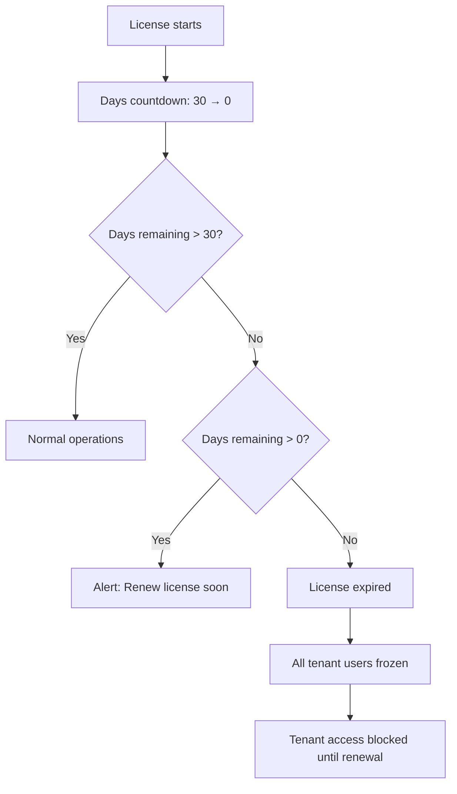
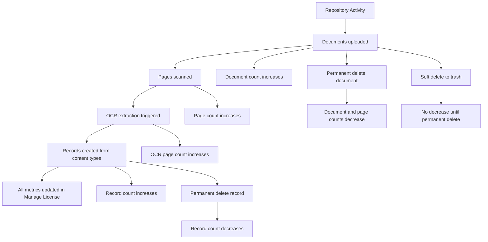
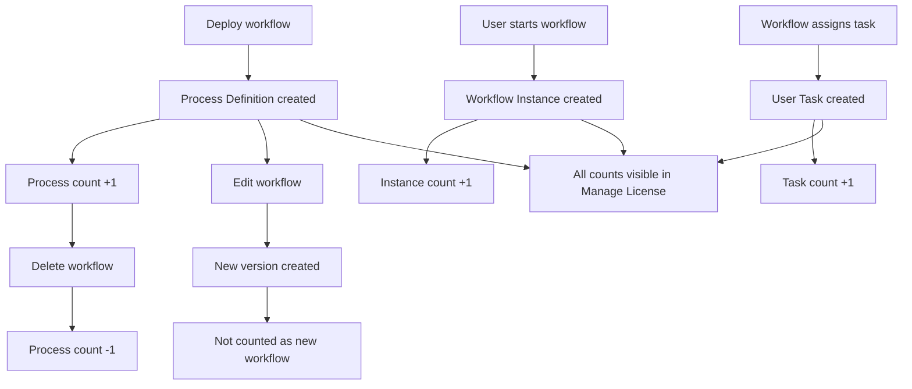
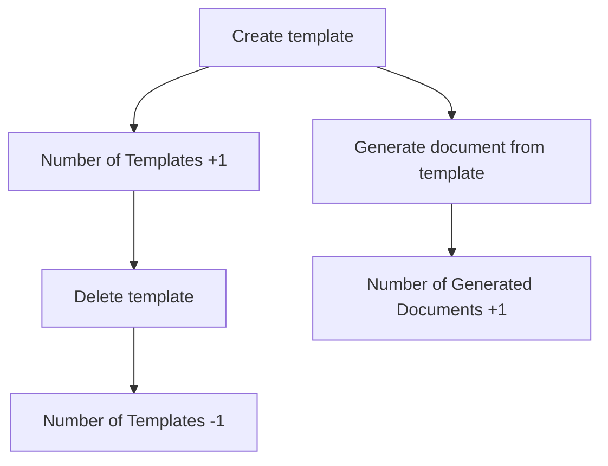
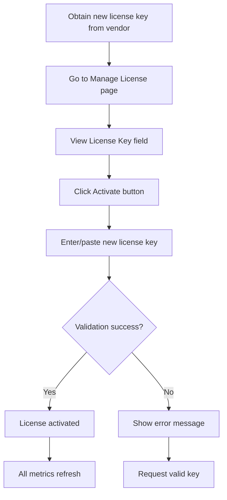

# 📜 Manage License - Diagrams

:::tip 📌 At a Glance
**Document Type**: Diagrams  
**Goal**: Visualize license monitoring structure and lifecycle counters.
:::

## 1) License Monitoring Dashboard Structure

## 2) Storage Lifecycle

## 3) User License Tracking

## 4) Expiration Monitoring

## 5) Drive Resource Usage Pattern

## 6) Workflow Utilization Tracking

## 7) Template Usage Tracking

## 8) License Activation Flow

## Related Guides

- [🧠 Knowledge Overview](%F0%9F%A7%A0%20Knowledge%20Overview.md) - License metrics and counting behavior.
- [📘 Detailed Guide](%F0%9F%93%98%20Detailed%20Guide.md) - Section-by-section operational guidance.

---

Version: live UI exploration  
Last Updated: 2026-06-21