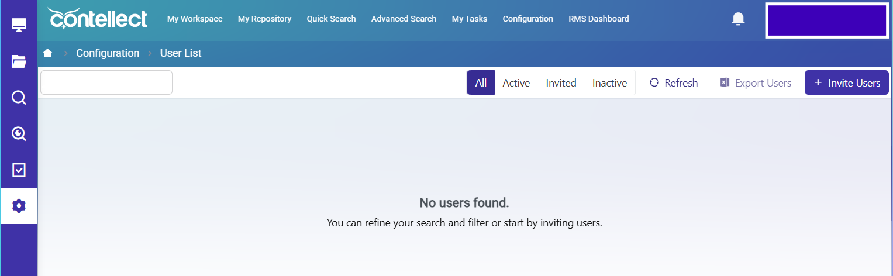
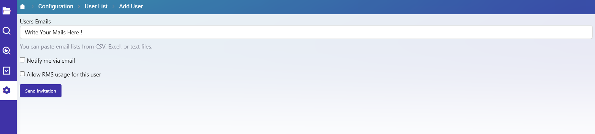

# 👥 Manage Users - Detailed Guide

:::tip 📌 At a Glance
**Document Type**: Detailed Guide
**Goal**: Execute user invitation, lifecycle management, and access assignment confidently.
:::

## 1) Manage Users Main Screen

Main controls on User List screen:

- Search for Users
- Status filters: All, Active, Invited, Inactive
- Refresh
- Export Users
- Invite Users
- User cards list + pagination
  

## 2) Invite Users Flow (Multi Email)

### Step-by-step

1. Click Invite Users.
2. Go to Users Emails input.
3. Type email and press Enter to add first email chip/value.
4. Type another email and press Enter again.
5. Continue until all emails are added.
6. Click Send Invitation.

Optional toggles in invite screen:

- Notify me via email
- Allow RMS usage for this user

## 3) RMS Role During Invite (If RMS Integrated)

When tenant is integrated with RMS, assign one of:

- Administrator
- Client
- Packer
- Driver

This role can also be edited later from user actions.

## 4) Invited Status Actions

After sending invitation, user is in Invited status. In this status, admin actions include:

- Delete (important action, allowed in Invited)
- Manage Groups
- Manage PL
- Resend Invitation
- Edit RMS Role

## 5) Activation Transition

User receives email invitation and completes:

1. Click invitation link.
2. Verify account.
3. Set password and name.

Then status changes to Active.

## 6) Active Status Actions

In Active status, actions include:

- Manage Groups
- Manage PL
- Deactivate
- Edit RMS Role

Rule:

- Delete is not allowed for Active users.

## 7) Inactive / Deactivated Behavior

If user is deactivated:

- User cannot access website.
- Access is blocked until account is activated again.

## 8) Groups Assignment

Users can be assigned to:

- System groups: Everyone (default), Administrator
- Custom groups created by tenant

## 9) Permission Levels (PL)

Admins can assign specific permission levels to control user capabilities across scopes:

- Application
- Repository
- Workflow
- Content Types
- RMS Roles (if available)

Typical action grants inside each scope:

- View
- Create
- Edit
- Delete

## 10) Practical Admin Checklist

Before invitation:

1. Confirm email list is correct.
2. Confirm whether RMS role must be assigned.
3. Confirm initial groups and PL strategy.

After invitation:

1. Track user under Invited filter.
2. Use Resend Invitation when needed.
3. Move to Active after user verification.
4. Apply Manage Groups and Manage PL immediately.

When revoking access:

1. Deactivate user.
2. Confirm user appears as Inactive.
3. Reactivate only when access should return.

## Related Guides

- [🧠 Knowledge Overview](%F0%9F%A7%A0%20Knowledge%20Overview.md) - Concepts, lifecycle, and governance model.
- [🗺 Diagrams](%F0%9F%97%BA%20Diagrams.md) - Visual flows for invitation and status actions.

---

Version: live UI + tenant rules provided by user
Last Updated: 2026-06-21
