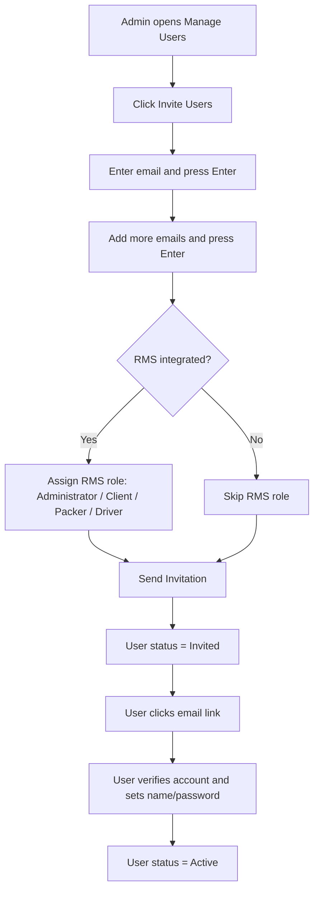
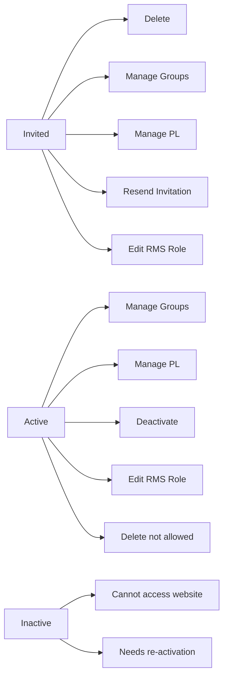
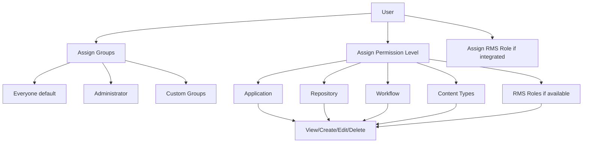
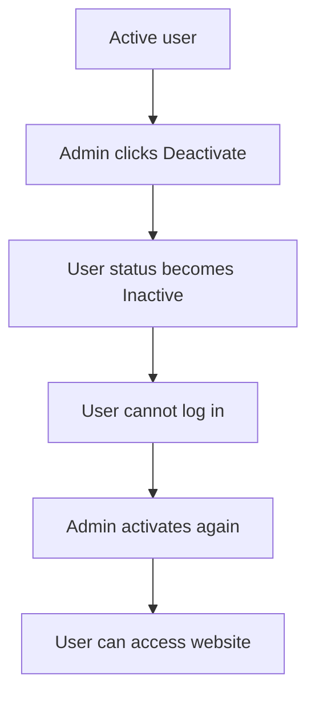

# 👥 Manage Users - Diagrams

:::tip 📌 At a Glance
**Document Type**: Diagrams  
**Goal**: Visualize user invitation lifecycle, status transitions, and authorization model.
:::

## 1) Invitation To Activation Lifecycle

## 2) Status-Based Actions Matrix

## 3) Access Governance Model

## 4) Deactivation Effect

## Related Guides

- [🧠 Knowledge Overview](%F0%9F%A7%A0%20Knowledge%20Overview.md) - Core concepts and rules.
- [📘 Detailed Guide](%F0%9F%93%98%20Detailed%20Guide.md) - Operational steps for admins.

---

Version: live UI + tenant rules provided by user  
Last Updated: 2026-06-21
