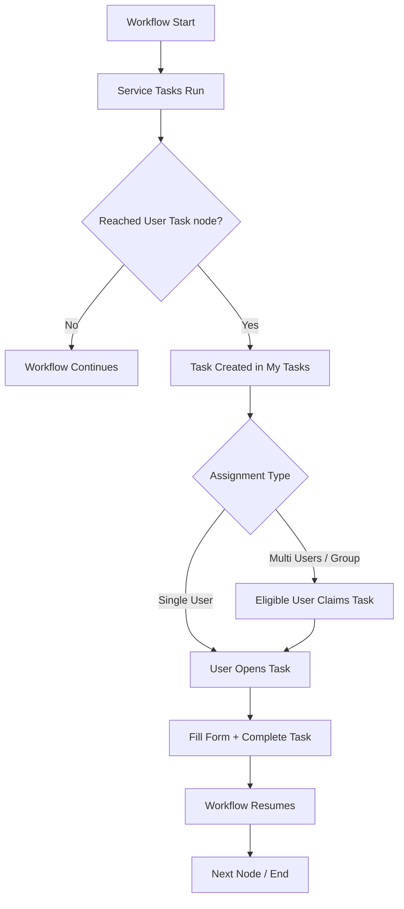
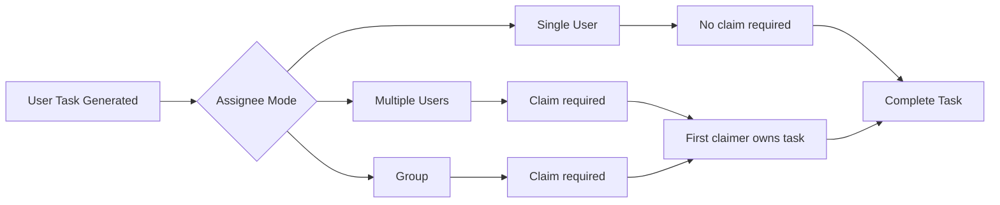
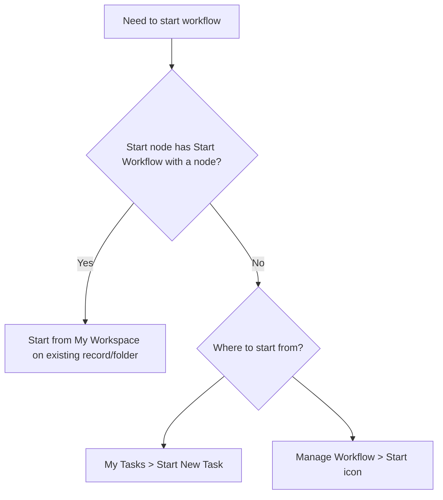
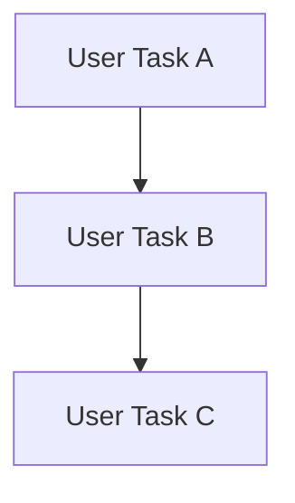
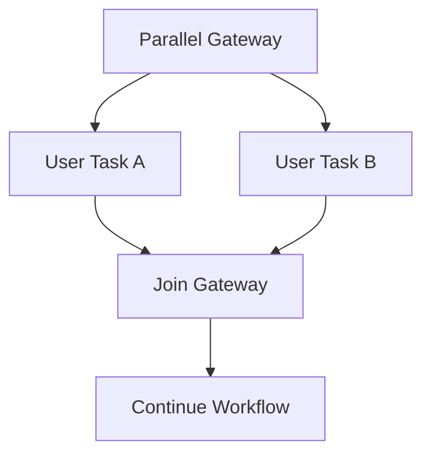
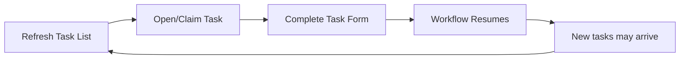

# 🗺 My Tasks - Diagrams

:::tip 📌 At a Glance
**Document Type**: Diagrams
**Goal**: Visualize My Tasks lifecycle, assignment modes, and start-path decisions.
:::

## 1) End-To-End Task Lifecycle

## 2) Assignment And Claim Logic

## 3) Start Method Decision Map

## 4) Sequential vs Parallel User Tasks

## 5) My Tasks Operational Loop

## Related Guides

- [🧠 Knowledge Overview](%F0%9F%A7%A0%20Knowledge%20Overview.md) - Concepts and status model.
- [📘 Detailed Guide](%F0%9F%93%98%20Detailed%20Guide.md) - End-user operations and troubleshooting steps.

---

Version: v7.50-style reference aligned to current source docs  
Last Updated: 2026-06-11
