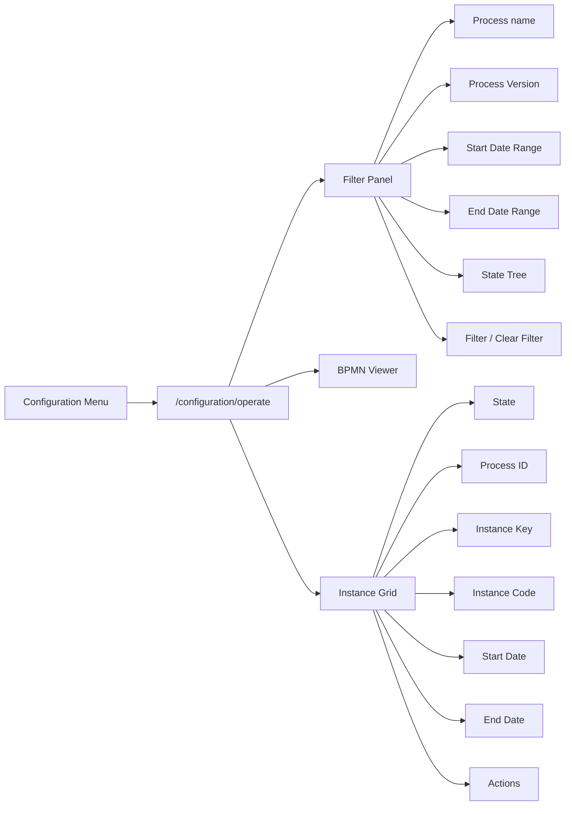
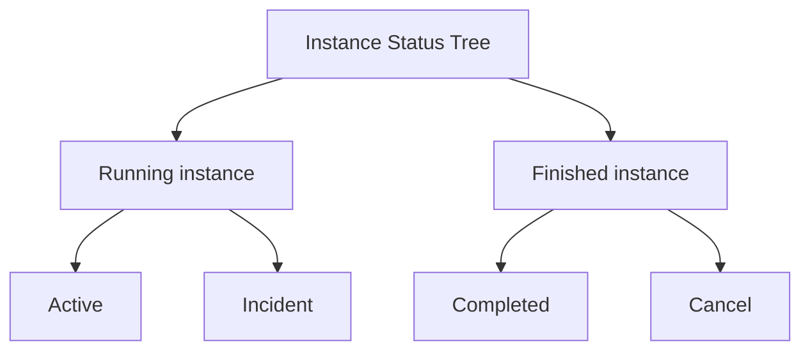
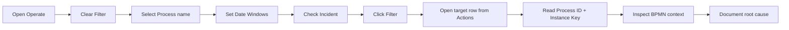
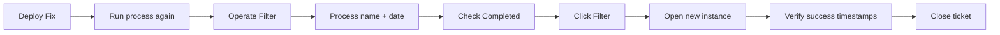
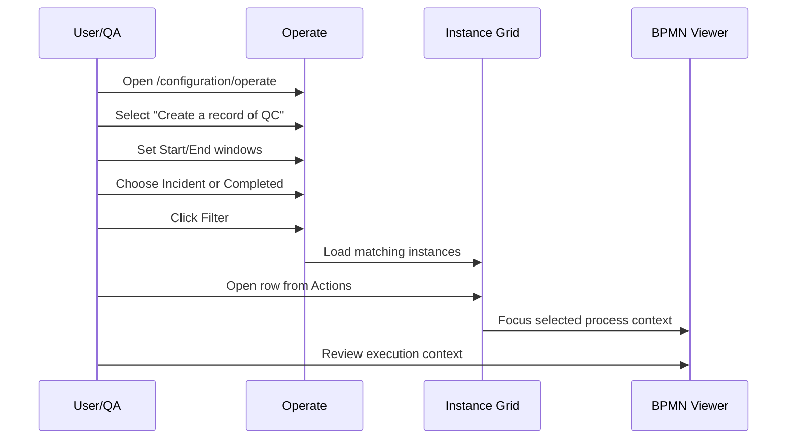
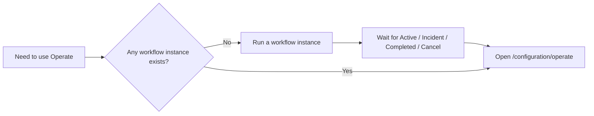
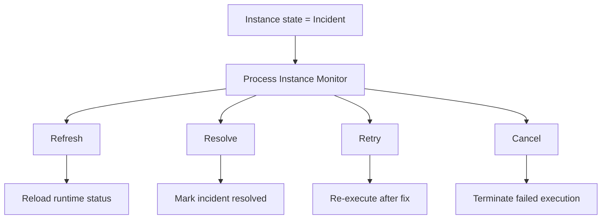

# 🗺 Operate - Diagrams

:::tip 📌 At a Glance
**Document Type**: Diagrams
**Goal**: Visualize Operate runtime monitoring and troubleshooting journeys.
:::

This file contains visual references for how Operate is used in real monitoring and debugging flows.

## 1) Operate Page Map

## 2) Status Tree Model

## 3) Incident Investigation Flow

## 4) Post-Fix Validation Flow

## 5) QC Example Monitoring

## 6) Fast Triage Matrix

| Situation | Filter Setup | Expected Next Action |
|---|---|---|
| Runtime issue now | `Active` + narrow recent dates | watch transition to completed/incident |
| Failure analysis | `Incident` + target process | open row, capture keys, inspect BPMN context |
| Regression retest | `Completed` + latest date window | compare runtime metadata before/after fix |
| Audit sample | mixed statuses + wider range | export/sample instance records |

## 7) Pre-request Flow (Run Workflow First)

## 8) Failed Instance Actions (Process Instance Monitor)

## Related Guides

- [🧠 Knowledge Overview](%F0%9F%A7%A0%20Knowledge%20Overview.md) - Understand Operate concepts and status semantics.
- [📘 Detailed Guide](%F0%9F%93%98%20Detailed%20Guide.md) - Follow complete operational steps.

---

Version: `v7.49.0+`  
Last Updated: `2026-06-11`
