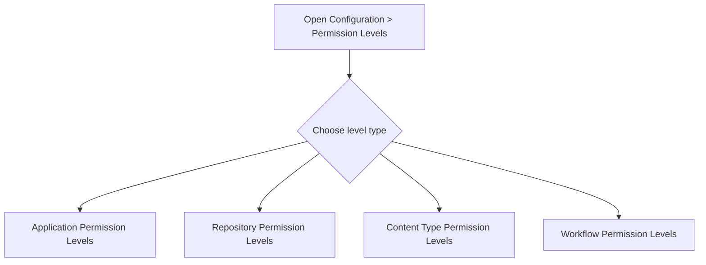
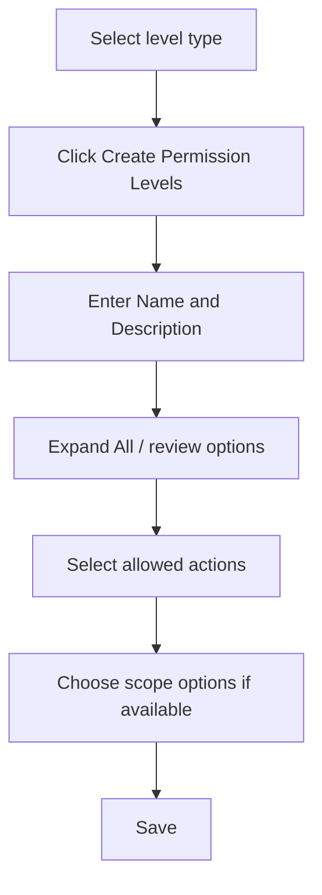
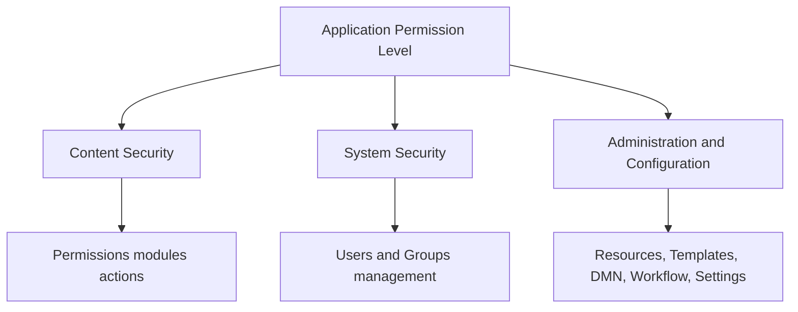
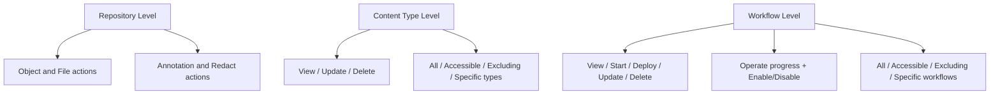
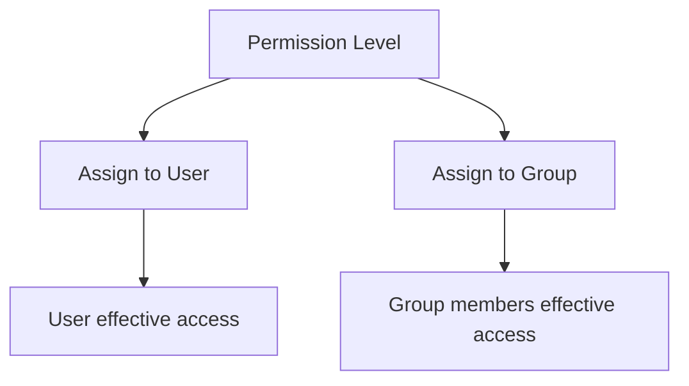

# 🔐 Permission Levels - Diagrams

:::tip 📌 At a Glance
**Document Type**: Diagrams  
**Goal**: Visualize permission level design and assignment paths across ECM modules.
:::

## 1) Permission Level Selection Model

## 2) Shared Create Flow

## 3) Application Permission Architecture

## 4) Module-Specific Scope Model

## 5) Assignment Model

## Related Guides

- [🧠 Knowledge Overview](%F0%9F%A7%A0%20Knowledge%20Overview.md) - Permission types and governance fundamentals.
- [📘 Detailed Guide](%F0%9F%93%98%20Detailed%20Guide.md) - Step-by-step permission setup instructions.
- [🛠 Use Cases](%F0%9F%9B%A0%20Use%20Cases.md) - Applied permission strategies by role.

---

Version: live UI exploration (Create + Expand All)  
Last Updated: 2026-06-21