---
sidebar_label: "🗺 Diagrams"
sidebar_position: 3
name: "🗺 Diagrams"
description: Visual architecture, workflows, and Mongo Search integration diagrams for Quick Search
user-invocable: true
---

# 📊 Quick Search Architecture & Diagrams

:::tip 📌 At a Glance
**Document Type**: Diagrams  
**Audience**: Technical users, architects, and reviewers  
**Goal**: Visualize page flow, architecture, and filter behavior quickly.
:::

## System Architecture

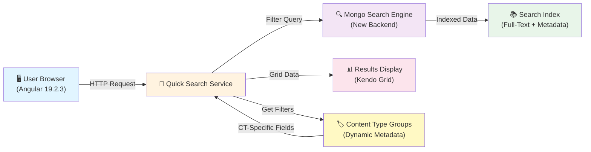

---

## Page Layout Structure

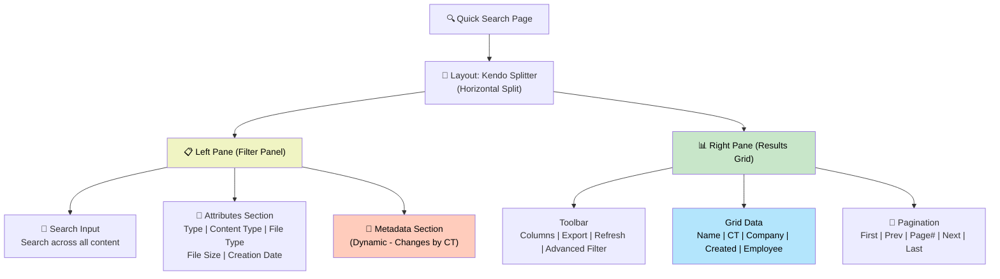

---

## Filter Panel Details (Left Pane)

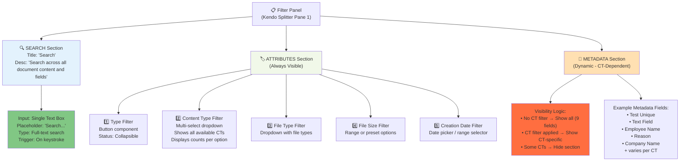

---

## Filter Popup (Content Type Example)

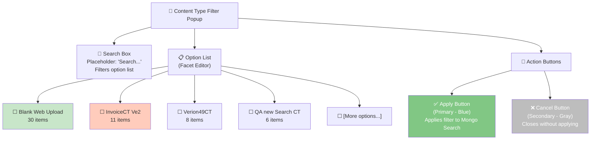

---

## Dynamic Metadata Behavior Flow

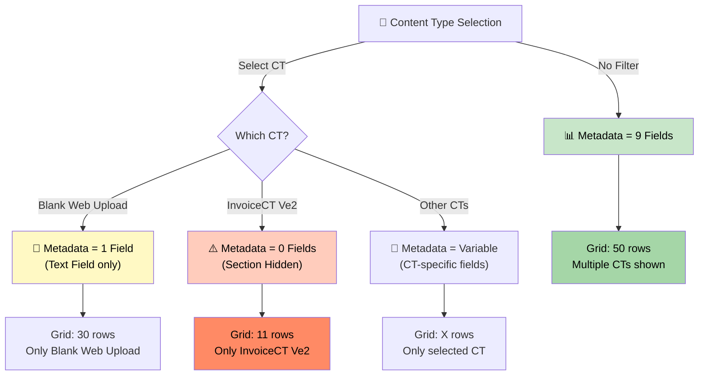

---

## Search Execution Flow (Mongo Search Integration)

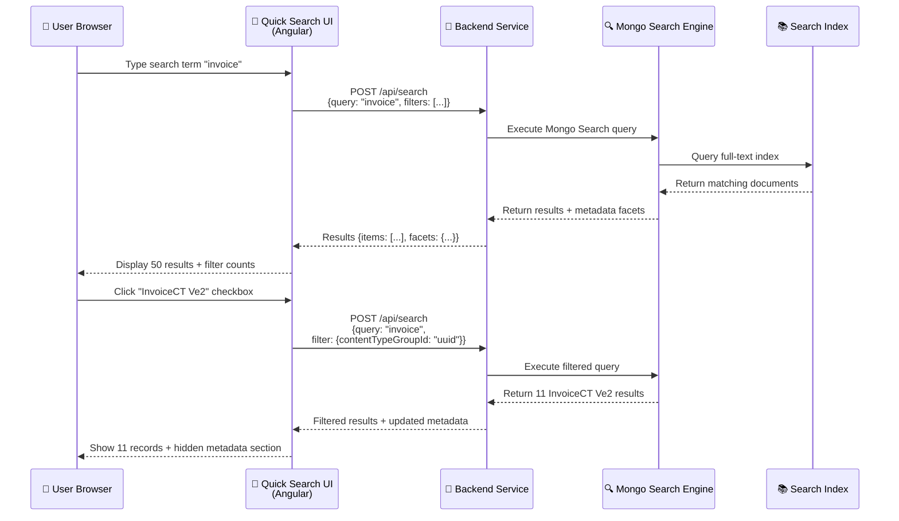

---

## Results Grid Structure

```mermaid
graph TD
    A["📊 Kendo Grid Component"]
    
    A --> B["🎯 Grid Features"]
    B --> B1["Multi-column display<br/>Sortable headers<br/>Filterable columns<br/>Drag to reorder"]
    
    A --> C["📋 Column Definition"]
    C --> C1["Column 1: Name<br/>(Record identifier)"]
    C --> C2["Column 2: Content Type<br/>(filtered by Attributes)"]
    C --> C3["Column 3: Company Name<br/>(CT-specific field)"]
    C --> C4["Column 4: Created At<br/>(Timestamp)"]
    C --> C5["Column 5: Employee Name<br/>(CT-specific field)"]
    C --> C6["Column 6: Text Field<br/>(CT metadata)"]
    C --> C7["+ System columns<br/>Started By | Version | Barcodes"]
    
    A --> D["🔄 Pagination Controls"]
    D --> D1["Buttons: First | Prev | 1 | 2 | 3 | Next | Last"]
    D --> D2["Result Counter: '1 - 50 of 67 items'"]
    D --> D3["Items per page: Default 10-50"]
    
    A --> E["⚙️ Toolbar Buttons"]
    E --> E1["⊞ Columns - Show/hide"]
    E --> E2["🔄 Refresh - Reload results"]
    E --> E3["⬇️ Export - Download Excel"]
    E --> E4["⚙️ Advanced Filter"]
    
    style C fill:#bbdefb
    style D fill:#fff9c4
    style E fill:#f0f4c3
```

---

## Filter Logic with Mongo Search Operators

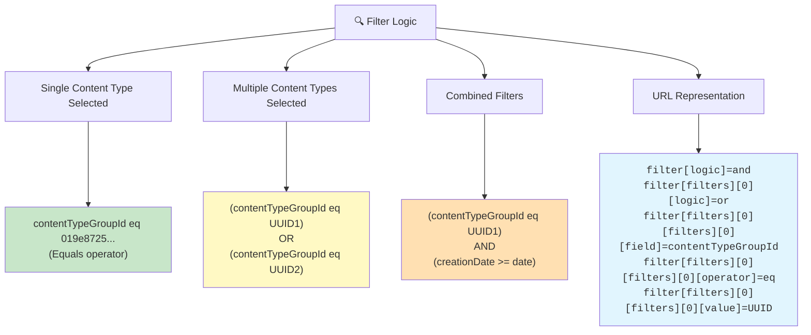

---

## Metadata Field Changes Comparison

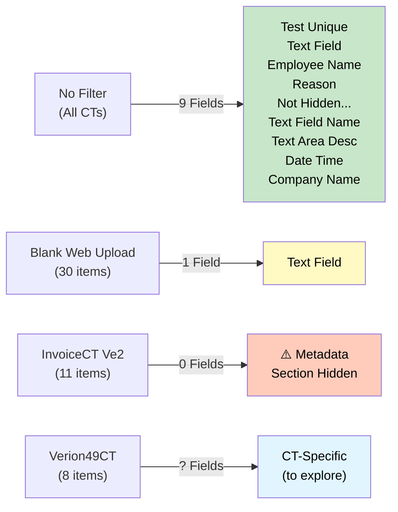

---

## Advanced Filter Panel (Left Pane Open/Collapsed)

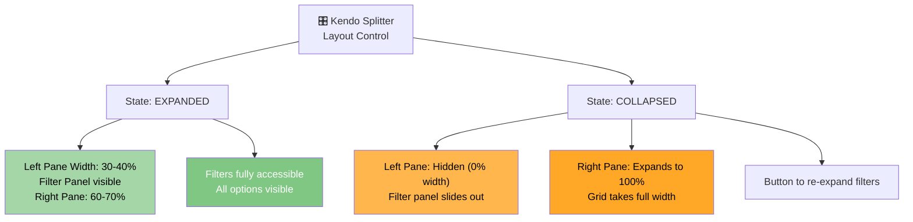

---

## Content Type and Metadata Relationship

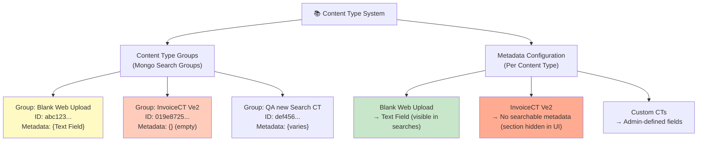

---

## Full Search Journey (End-to-End)

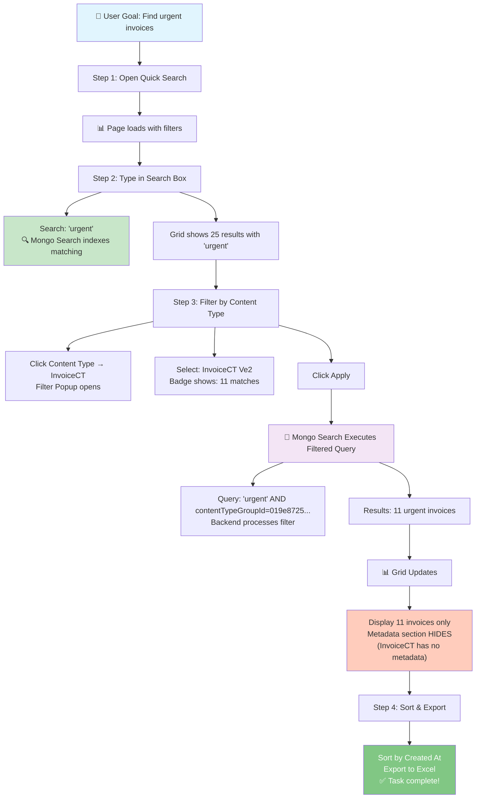

---

## Performance & Caching

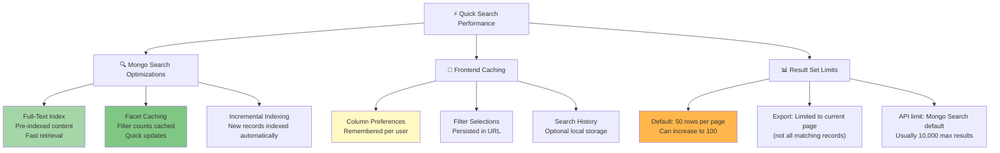

---

## Mobile/Responsive Behavior

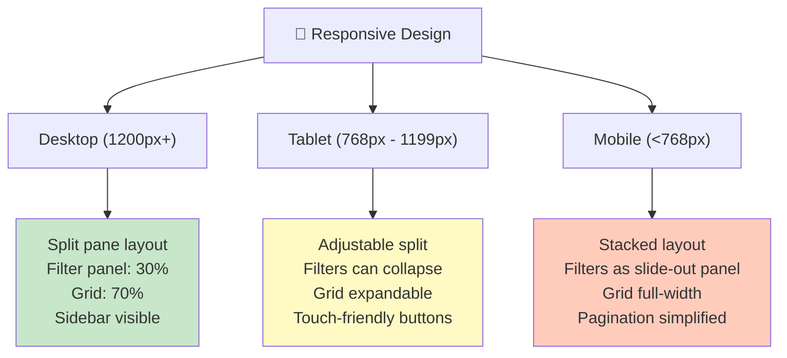

---

## Data Flow from Mongo Search to UI

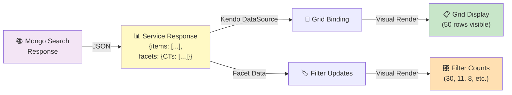

---

## Content Type Filter - Open/Close Animation

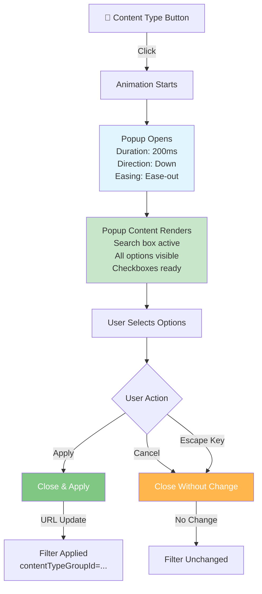

---

## Search Metadata Table

| Property | Value | Notes |
|----------|-------|-------|
| **Search Engine** | Mongo Search | Replaces Elasticsearch |
| **Indexing Type** | Full-text + Metadata | Real-time indexing |
| **Filter Logic** | AND/OR operators | Combinable filters |
| **Default Results** | 50 per page | Configurable |
| **Max Page Size** | 100-200 | Backend dependent |
| **Cached Facets** | 24 hours | Content type counts |
| **Export Format** | Excel (.xlsx) | Current page only |
| **Sort Support** | All columns | Ascending/Descending |
| **Mobile Optimized** | Yes | Responsive design |
| **Real-time Updates** | Yes | Sub-second response |

---

## References & Related Concepts

- **Mongo Search**: Modern search backend (replacing Elasticsearch)
- **Kendo Components**: Grid, splitter, textbox, dropdown used
- **Angular**: Frontend framework (v19.2.3)
- **Content Type Groups**: Organizational structure with metadata
- **Faceted Search**: Filter counts and dynamic options
- **Full-Text Indexing**: Search document content

---

**Last Updated**: June 2026 | **Version**: v7.50.0+ | **Search Backend**: Mongo Search
