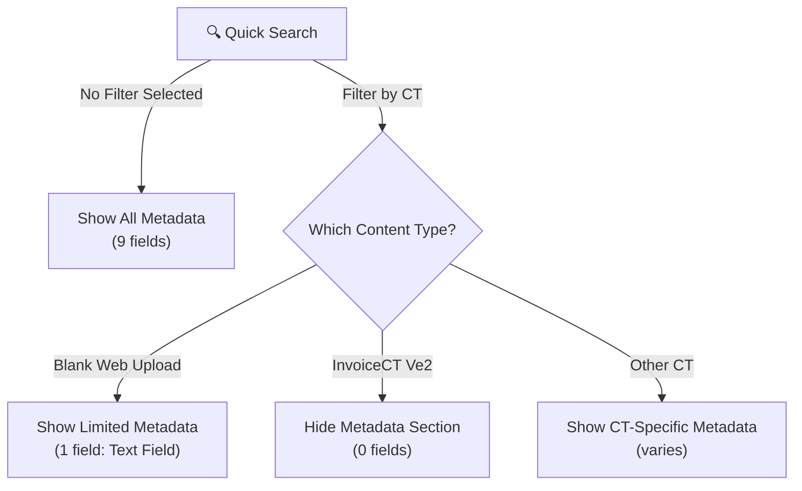

---
sidebar_label: "🧠 Knowledge Overview"
sidebar_position: 1
name: "🧠 Knowledge Overview"
description: Comprehensive guide to understanding Quick Search in Contellect ECM with dynamic metadata filters and Mongo Search backend
user-invocable: true
---

# 🔍 Quick Search Knowledge Overview

:::tip 📌 At a Glance
**Document Type**: Knowledge Overview  
**Audience**: End users, analysts, administrators  
**Goal**: Understand what Quick Search is, when to use it, and its core capabilities.
:::

## What is Quick Search?

**Quick Search** is a fast, unified search interface in Contellect ECM that allows you to search across all documents, records, and files in real-time. It combines global full-text search with dynamic, context-aware filters that automatically adjust based on the content type you're searching.

:::info **Key Feature**
Quick Search uses **Mongo Search**, a modern search engine that provides instant results with intelligent filtering and metadata refinement.
:::

### Quick Search vs Advanced Search vs Repository Search

| Feature | Quick Search | Advanced Search | Repository Search |
|---------|--------------|-----------------|-------------------|
| **Speed** | ⚡ Instant (real-time) | 🟡 Moderate | 🟡 Moderate |
| **Scope** | 🌍 All documents & records | 🌍 All documents & records | 📁 Files & folders only |
| **Filters** | 🎯 Dynamic (context-aware) | 🔧 Custom & saved searches | 📊 Fixed (Name, Date, Type) |
| **Metadata** | 📝 Changes by CT | 📝 Always visible | ❌ Not available |
| **Use Case** | Quick lookup | Advanced filtering | File management |
| **Learning Curve** | 📈 Easiest | 📊 Advanced | 📈 Medium |

---

## Why Use Quick Search?

### ✅ **Advantages**

| Benefit | Description |
|---------|-------------|
| **⚡ Speed** | Get results instantly as you type |
| **🎯 Precision** | Automatically shows relevant filters for your content |
| **📝 Dynamic Metadata** | Filters adapt based on the content type you select |
| **🔍 Full-Text Search** | Search across document content, not just names |
| **🌐 Global Scope** | Search everything in your workspace at once |
| **💡 Smart Suggestions** | Result counts help you refine your search |
| **📊 Multi-select Filters** | Choose multiple content types simultaneously |
| **📱 Responsive UI** | Split-pane layout for easy navigation |

---

## Where to Find Quick Search

### 📍 **Navigation Path**
```
Main Menu → Quick Search
```

### 🔗 **Direct URL**
```
.../search/quick-search
```

### 📊 **URL with Filter Applied**
```
............/search/quick-search?filter[logic]=and&filter[filters][0][logic]=or&filter[filters][0][filters][0][field]=contentTypeGroupId&filter[filters][0][filters][0][operator]=eq&filter[filters][0][filters][0][value]=<CT_GROUP_ID>
```

---

## When to Use Quick Search

| Scenario | Use Quick Search? | Why |
|----------|------------------|-----|
| Find a specific record by name | ✅ YES | Fast and simple |
| Search document content | ✅ YES | Full-text search across all fields |
| Filter by content type | ✅ YES | Multi-select filters with counts |
| Need metadata refinement | ✅ YES | Dynamic filters based on CT |
| Advanced compound filtering | ⚠️ MAYBE | Use Advanced Search instead |
| File-only search in specific folder | ❌ NO | Use Repository Search |

---

## 🎯 Key Features at a Glance

### **1. Real-Time Global Search**
- Search as you type across all documents, records, and content
- Results update instantly with Mongo Search backend
- Full-text indexing of document content

### **2. Dynamic Metadata Filters**
- 📝 Metadata fields **automatically adapt** based on selected content type
- Different CTs show different metadata fields
- Metadata section **appears/disappears** depending on context

#### Example: Metadata by Content Type
- **All Content Types**: 9 metadata fields available
- **Blank Web Upload**: Only 1 metadata field (Text Field)
- **InvoiceCT Ve2**: No metadata fields (section hidden)

### **3. Smart Filter Panel**
- **Attributes Section**: Filter by Type, Content Type, File Type, File Size, Creation Date
- **Metadata Section**: Dynamic fields that change per content type
- Search within filters to find specific options
- View count badges showing matches per option

### **4. Responsive Grid Display**
- Multi-column results with sortable headers
- Columns include: Name, Content Type, Company Name, Created At, Employee Name, Text Field
- System columns: Started By, Created Time, Modification Time, Version, Barcodes
- Pagination with adjustable items per page

### **5. Column Management**
- Show/hide columns based on your preference
- Persistent column configuration
- Quick access via Columns button in toolbar

### **6. Advanced Filtering Options**
- **Content Type Selection**: Multi-select with result counts
- **Date Range Filtering**: Creation Date refinement
- **File Size Filtering**: For document-heavy searches
- **Metadata Refinement**: Specific to selected content type

---

## 🔧 Essential Concepts

### **Content Type Groups**
Quick Search organizes content types into logical groups:
- **File Content Types**: Blank Web Upload, Invoice CT, etc.
- **Record Content Types**: Task CTs, Custom CTs
- **Metadata Content Types**: Fields that appear in metadata section

:::note
When you select a content type, the filter sends `contentTypeGroupId` to the Mongo Search backend for precise filtering.
:::

### **Mongo Search Backend Integration**
The search uses **Mongo Search** (not Elasticsearch) for:
- Fast, real-time indexing
- Intelligent faceting (filter suggestions)
- Complex filter logic (`and`/`or` operations)
- Full-text search across document content

### **Dynamic Metadata Behavior**



---

## Role-Based Quick Starts

### 👤 **For End Users**

<details>
<summary><strong>I want to find a specific record quickly</strong></summary>

1. Click **Quick Search** from main menu
2. Type the record name in the search box
3. Results appear instantly
4. Click any result to open it
5. Or use filters to narrow down

**Time**: ~10 seconds

</details>

<details>
<summary><strong>I need to see all invoices from a specific company</strong></summary>

1. Go to **Quick Search**
2. Expand **Attributes** filter panel
3. Select **Content Type**: InvoiceCT Ve2
4. Check **Metadata**: Company Name = [Your Company]
5. Results filter automatically

**Time**: ~30 seconds

</details>

<details>
<summary><strong>I want to find documents created in the last 30 days</strong></summary>

1. Open **Quick Search**
2. Expand **Attributes** section
3. Click **Creation Date** filter
4. Select date range (Last 30 days)
5. View all recent documents

**Time**: ~20 seconds

</details>

### 👨‍💼 **For Administrators**

<details>
<summary><strong>I need to audit all records of a specific type</strong></summary>

1. Access **Quick Search**
2. Select specific **Content Type** (multi-select if needed)
3. Use **Metadata** section to refine by status, owner, etc.
4. Export results via Excel for reporting
5. Monitor total counts vs filtered results

**Time**: ~1 minute

</details>

<details>
<summary><strong>I want to understand metadata availability per CT</strong></summary>

1. Go to **Quick Search**
2. Note default metadata fields (all CTs): 9 fields visible
3. Select **Blank Web Upload** → Only 1 metadata field shows
4. Select **InvoiceCT Ve2** → Metadata section disappears
5. This helps design custom CTs

**Time**: ~2 minutes

</details>

---

## 📊 Key Features Table

| Feature | Description | Benefit |
|---------|-------------|---------|
| **🔄 Real-Time Search** | Results update as you type | No waiting, instant feedback |
| **🎯 Dynamic Filters** | Filters adapt to content type | Less clutter, more relevance |
| **📝 Metadata Section** | CT-specific fields | Precise refinement options |
| **🏷️ Filter Counts** | See match counts per option | Know what you're filtering |
| **📋 Multi-Select** | Choose multiple CTs at once | Efficient bulk searching |
| **📊 Sortable Columns** | Click headers to sort | Organize results easily |
| **💾 Column Memory** | Preferences saved | Consistent experience |
| **📄 Export to Excel** | Download results | External analysis & sharing |
| **🔍 Full-Text Search** | Search document content | Find text anywhere, not just names |
| **📱 Responsive UI** | Works on all devices | Search from anywhere |

---

## 🔗 Related Guides

- [📖 Using Quick Search](./%F0%9F%9B%A0%20Using%20Quick%20Search.md) - Step-by-step workflows
- [📊 Quick Search Diagrams](./%F0%9F%97%BA%20Diagrams.md) - Visual architecture & flows
- [🗂️ Advanced Search](../Advanced%20Search/%F0%9F%A7%A0%20Knowledge%20Overview.md) - For complex filtering
- [📁 Repository Search](../Repository/%F0%9F%A7%A0%20Knowledge%20Overview.md) - For file-only searches
- [📋 Workspace Records](../Workspace/%F0%9F%A7%A0%20Knowledge%20Overview.md) - Managing records in workspaces

---

## 💡 Pro Tips

:::tip **Tip 1: Use Multiple Filters**
Combine Content Type + Metadata + Date Range for powerful, precise searches. The filter counts help you understand what results you'll get.
:::

:::tip **Tip 2: Monitor Metadata Changes**
If metadata disappears after selecting a CT, it means that CT doesn't have additional searchable metadata. This is by design and helps simplify the UI.
:::

:::tip **Tip 3: Search First, Filter Second**
Enter your search term first, then use filters to refine. The counts update to show how many results match each filter option.
:::

:::tip **Tip 4: Export for Analysis**
Use the Export to Excel button to download results for external analysis, reporting, or sharing with colleagues.
:::

:::warning **Important: Filter Persistence**
Filters are maintained in the URL. Bookmark your frequent search combinations for quick access later.
:::

---

## 🚀 What's Next?

- **Learn workflows**: See [Using Quick Search](./%F0%9F%9B%A0%20Using%20Quick%20Search.md) for detailed step-by-step guides
- **Understand architecture**: Check [Diagrams](./%F0%9F%97%BA%20Diagrams.md) for visual system architecture and data flow
- **Need advanced features?**: Move to [Advanced Search](../Advanced%20Search/%F0%9F%A7%A0%20Knowledge%20Overview.md)
- **File management?**: Try [Repository Search](../Repository/%F0%9F%A7%A0%20Knowledge%20Overview.md)

---

**Last Updated**: June 2026 | **Version**: v7.50.0+ | **Search Backend**: Mongo Search
