---
sidebar_label: "📊 Repository Diagrams"
sidebar_position: 7
name: "📊 Repository Diagrams"
description: Visual workflows and architecture diagrams for Repository features
user-invocable: true
---

# 📊 Repository Diagrams

:::tip 📌 At a Glance
**Document Type**: Diagrams  
**Goal**: Follow the unified ECM User Guide design and structure for this page.
:::

## Repository Architecture

### High-Level System Diagram

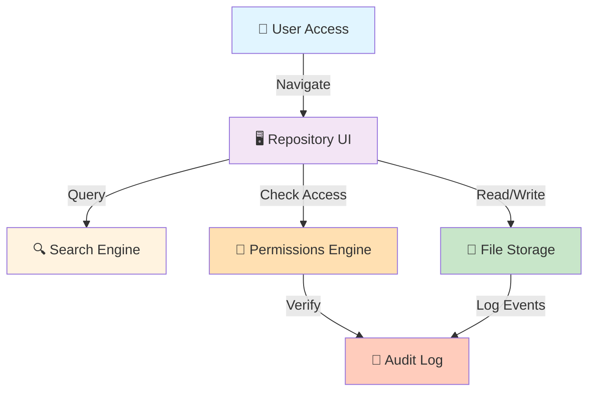

---

## File Upload Workflow

### Complete Upload Process

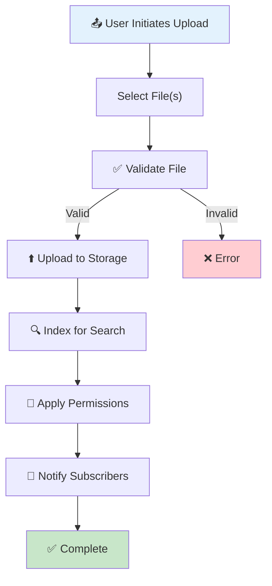

---

## File Sharing Flow

### How Files Get Shared

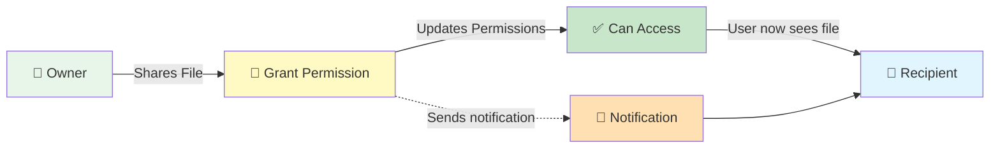

---

## Permission Levels Hierarchy

### Access Control Progression

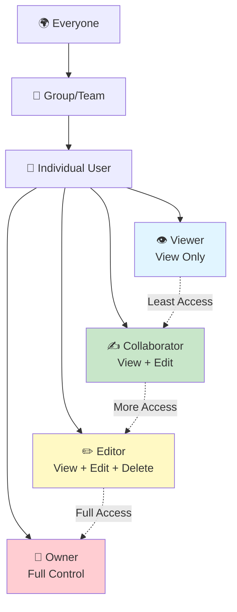

---

## File Lifecycle

### From Creation to Archive

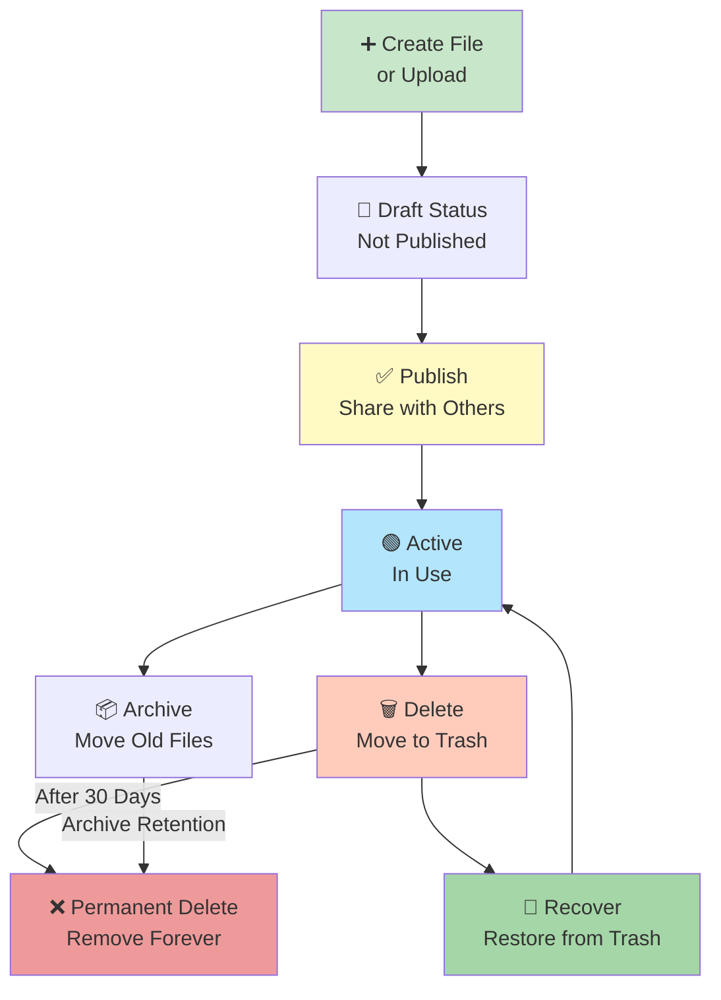

---

## Folder Hierarchy Navigation

### Typical Org Structure

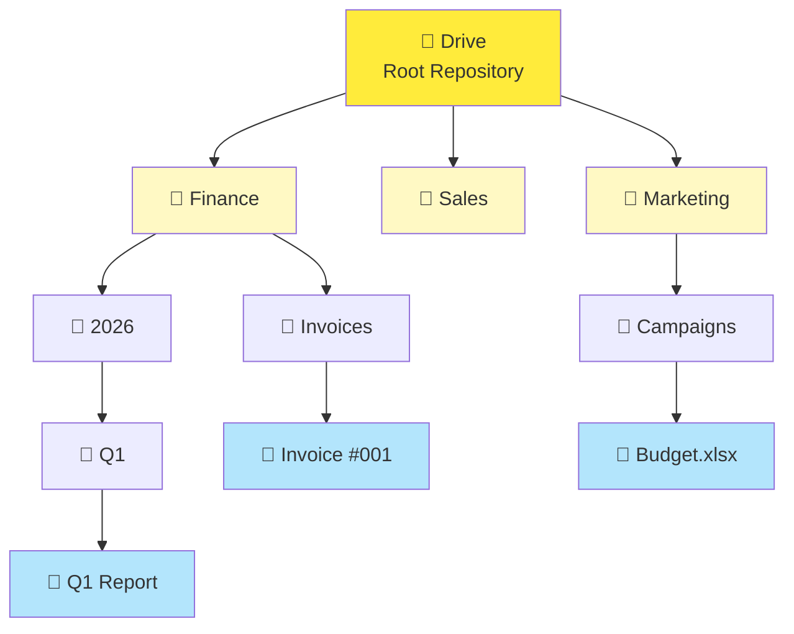

---

## Search Flow

### How Search Finds Files

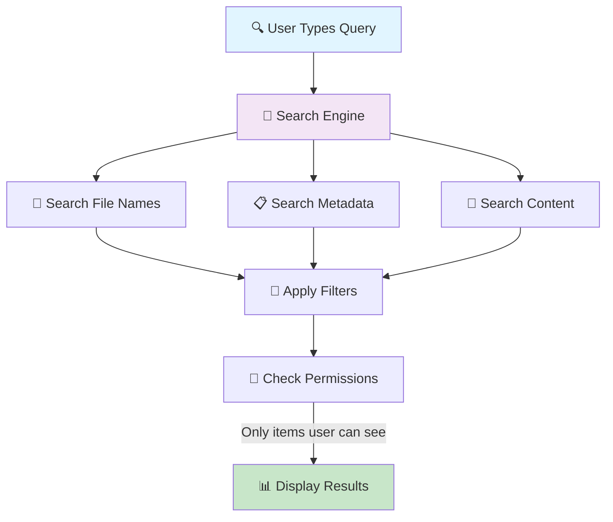

---

## Permission Inheritance

### How Permissions Flow Down

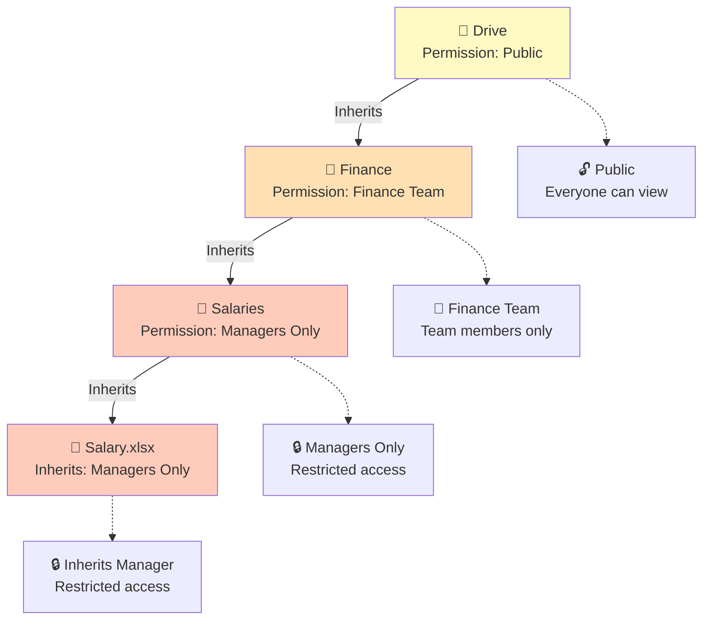

---

## Multi-User Collaboration

### How Teams Work Together

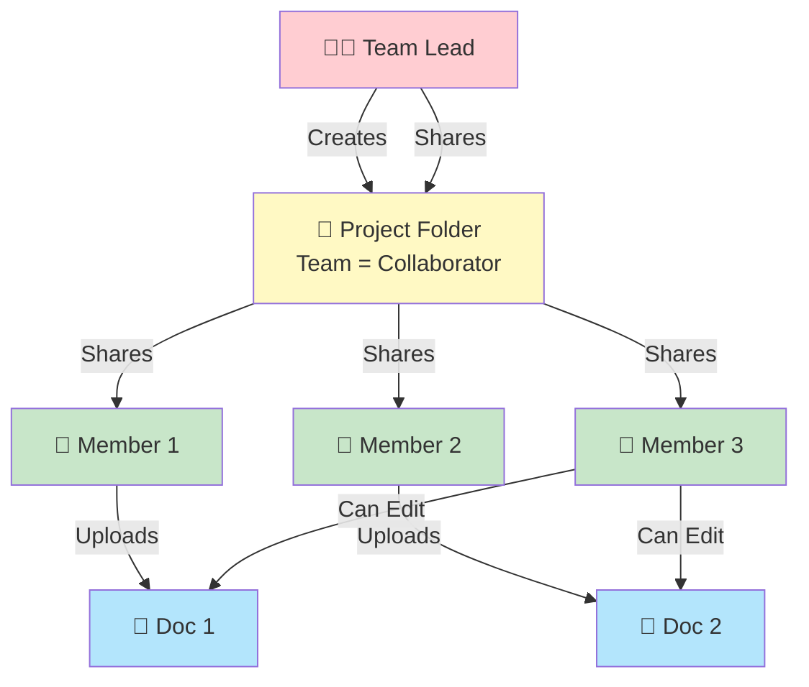

---

## Sidebar Navigation

### All 7 Sections Overview

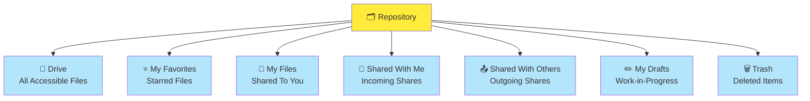

---

## File Action Menu

### Available Operations on Files

```mermaid
graph TD
    File["📄 File Selected"]
    Open["👁️ Open/Preview"]
    Edit["✏️ Edit Metadata"]
    Version["📑 View Versions"]
    Copy["📋 Copy"]
    Move["↪️ Move"]
    Rename["📝 Rename"]
    Delete["🗑️ Delete"]
    Favorite["⭐ Add to Favorites"]
    Share["🔗 Share"]
    Perms["🔐 Manage Permissions"]
    Props["📊 View Properties"]
    Download["📥 Download"]
    Link["🔗 Generate Share Link"]
    
    File --> Open
    File --> Edit
    File --> Version
    File --> Copy
    File --> Move
    File --> Rename
    File --> Delete
    File --> Favorite
    File --> Share
    File --> Perms
    File --> Props
    File --> Download
    File --> Link
    
    style File fill:#ffeb3b
    style Delete fill:#ffccbc
    style Favorite fill:#fff9c4
    style Share fill:#c8e6c9
```

---

## Quick Folder Creation Workflow

### Create Folder in 3 Clicks

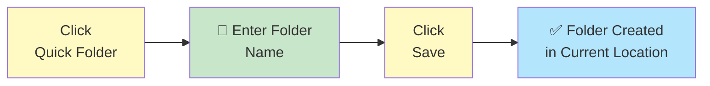

---

## File Deletion & Recovery

### Trash Workflow

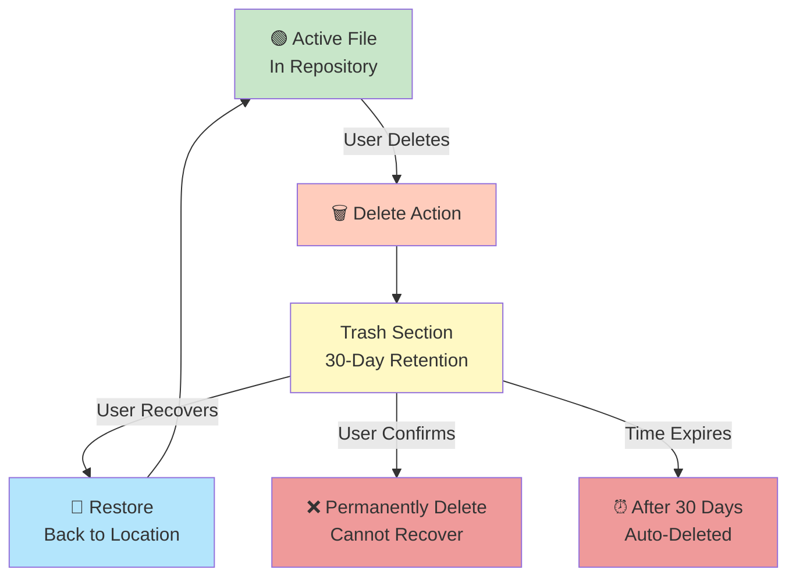

---

## Search & Filter Decision Tree

### How to Find Your File

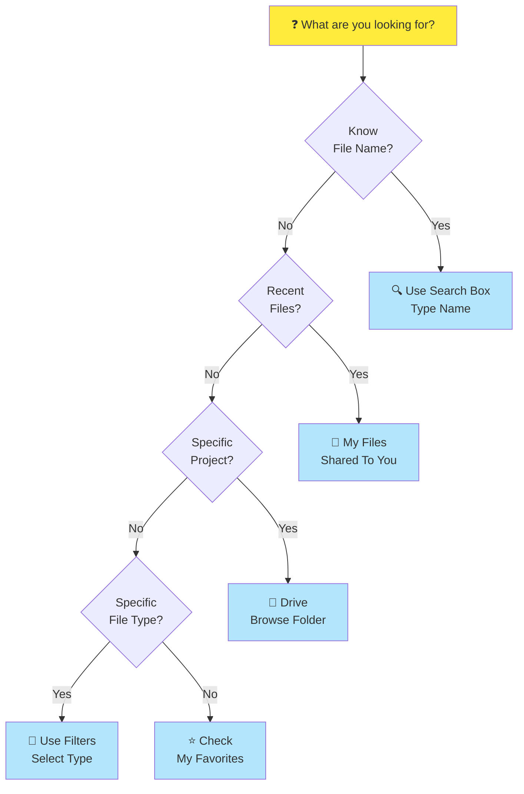

---

## Permission Change Workflow

### How to Update Access

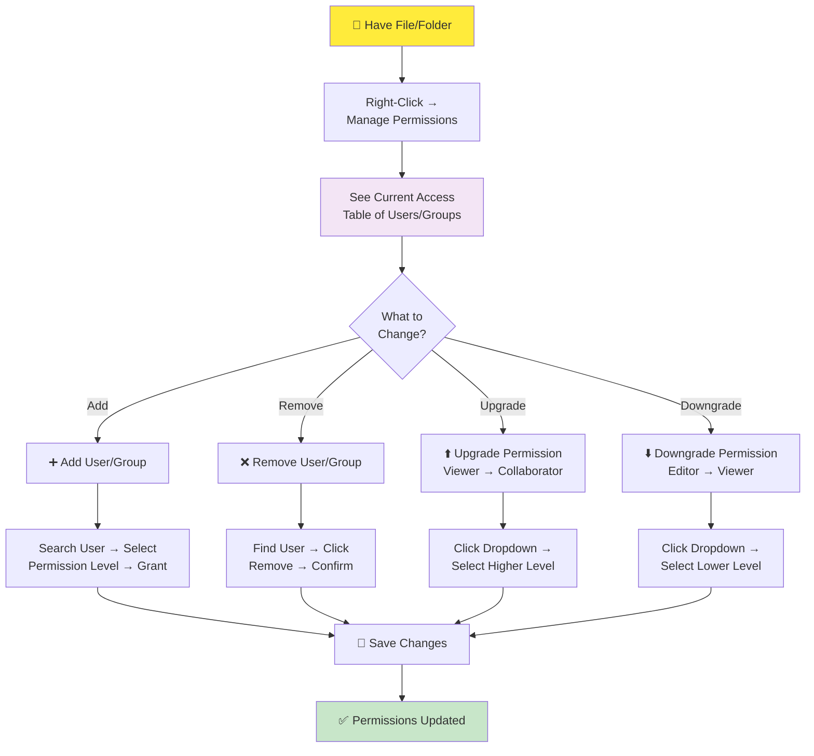

---

## Storage & Quota Management

### How Storage Works

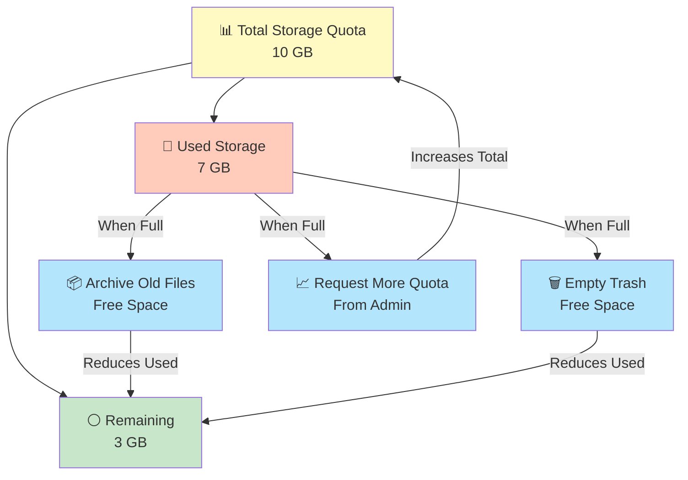

---

## Best Practices Summary

### Repository Guidelines Flowchart

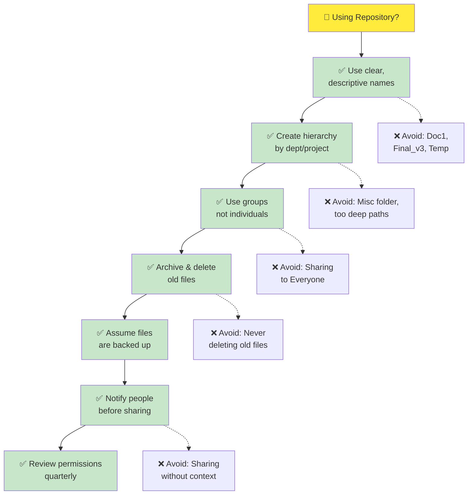

---

## 📚 Related Guides

→ [Knowledge Overview](%F0%9F%A7%A0%20Knowledge%20Overview.md) - Repository basics

→ [File Management](%F0%9F%93%98%20File%20Management.md) - Work with files

→ [Folder Management](%F0%9F%93%98%20Folder%20Management.md) - Organize folders

→ [Search & Organization](%F0%9F%93%98%20Search%20%26%20Organization.md) - Find files

→ [Permissions & Sharing](%F0%9F%93%98%20Permissions%20%26%20Sharing.md) - Control access

→ [Repository Sections](%F0%9F%93%98%20Repository%20Sections.md) - All 7 sections explained
