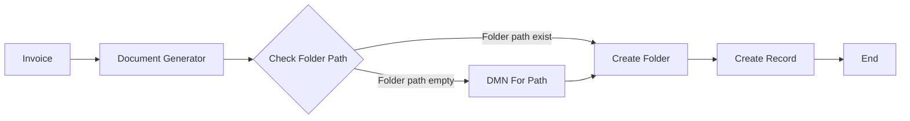

---
id: templates-detailed
title: "📘 Templates - Detailed Guide"
sidebar_label: "📘 Detailed Guide"
sidebar_position: 2
name: "📘 Templates Detailed Guide"
slug: /templates/detailed
tags: [templates, users, document-generator, workflow]
description: Step-by-step instructions to create templates and generate PDF outputs.
---
# 📄 Templates - Detailed Guide

:::tip 📌 At a Glance
**Document Type**: Detailed Guide
**Goal**: Configure templates, run generation, and consume output in downstream workflow steps.
:::

## 1) Step 1 - Create a Template

Path:

- Configuration > Template Form > Create New Template

Required input:

| Field                | Required | Notes                                           |
| -------------------- | -------- | ----------------------------------------------- |
| Template Name        | Yes      | Letters, digits, spaces, tabs; no special chars |
| Template Description | No       | Optional explanation                            |
| Upload Template File | Yes      | `.docx` or `.docm` with placeholders        |

Placeholder rules inside Word template:

- Text: `{{field_name}}`
- Image: `{{IMAGE image_name}}`

Save behavior:

1. System validates name and file.
2. System checks template license quota.
3. On success, template metadata is stored and file uploaded.

## 2) Step 2 - Trigger Document Generation

Document generation runs when workflow reaches the Document Generator task.

User-side expectations in task configuration:

| Parameter         | Required | Description                       |
| ----------------- | -------- | --------------------------------- |
| Document Template | Yes      | Existing template name            |
| Template Content  | Yes      | JSON object matching placeholders |
| File Name         | No       | Defaults to `document`          |

Template Content example:

```json
{
  "customer_name": "John Doe",
  "date": "2026-06-03",
  "amount": 1500
}
```

## 2.1) Folder Path Decision Flow (Invoice Process)

Use this flow when your process needs to create the destination folder before creating the final record.

Data mapping rules for this flow:

1. In the **Start** node, use the selected workflow Content Type (CT) form output as **Template Content** input for **Document Generator**.
2. In **Document Generator**, set the generated document name using **File Name**.
3. Keep the **Document Generator** output object (for example `InvoicePath`) for later steps.
4. After path resolution (including **DMN For Path**) and when reaching **Create Record**, use a CT that contains a **File** component.
5. Map the **Document Generator** output to that File component so the generated file is stored on the created record.

Step-by-step:

1. The **Invoice** process starts and runs **Document Generator**.
2. The process checks whether the target folder path already exists.
3. If the folder path exists, the process goes directly to **Create Folder** (update/ensure path) and then **Create Record**.
4. If the folder path is empty, the process calls **DMN For Path** to compute/build the correct path.
5. The computed path is sent back to **Create Folder**.
6. After folder creation succeeds, the process continues to **Create Record**.
7. The workflow ends after the record is created.



## 3) Step 3 - Retrieve Result

After successful generation, output variable holds file metadata object.

Example output object:

```json
{
  "binaryData": "generated-documents/<GUID>",
  "size": 12345,
  "extension": "pdf",
  "name": "document",
  "prefix": "generated-documents"
}
```

Typical usage in next workflow steps:

- Send email attachment
- Save to folder/archive
- Download via binary streaming endpoint

## 4) Failure Cases For Users

| Case                              | User-visible behavior                           |
| --------------------------------- | ----------------------------------------------- |
| Template quota exceeded           | "Number of Templates exceeds license"           |
| Generated document quota exceeded | "Number of generated documents exceeds license" |
| Feature disabled                  | "Template feature is not enabled"               |
| Invalid template name             | Client-side/server validation error             |
| Missing template at runtime       | Workflow task incident                          |
| Conversion service failure        | Task fails and follows retry policy             |

## 5) User Checklist

Before starting generation:

1. Template exists and is valid.
2. Placeholder names are finalized.
3. Workflow references correct template.
4. Input JSON keys match template placeholders exactly.

After generation:

1. Verify output variable object exists.
2. Confirm extension is `pdf`.
3. Pass object/key to next connector.

## Related Guides

- [🧠 Knowledge Overview](%F0%9F%A7%A0%20Knowledge%20Overview.md) - Core concepts and prerequisites.
- [🗺 Diagrams](%F0%9F%97%BA%20Diagrams.md) - Visual workflows and error paths.

---

Version: user-focused extraction from document-generator.md
Last Updated: 2026-06-14
