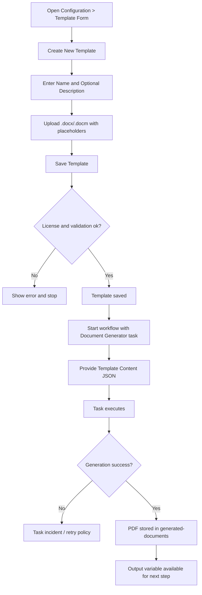
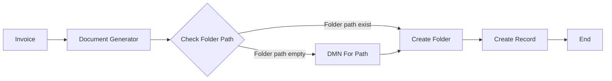
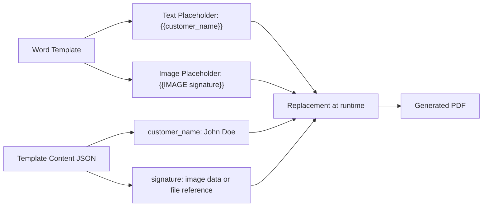
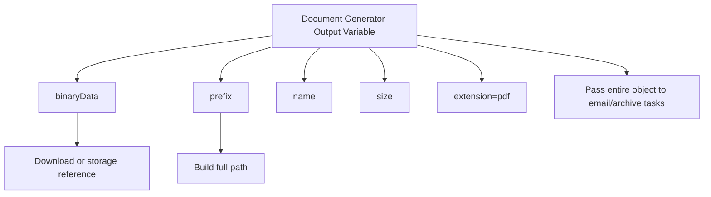
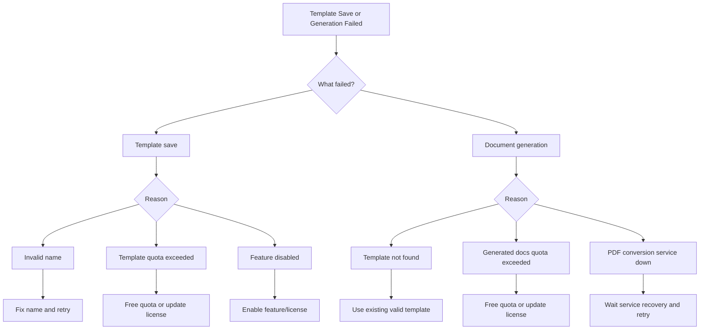

---
id: templates-diagrams
title: "🗺 Templates - Diagrams"
sidebar_label: "🗺 Diagrams"
sidebar_position: 3
name: "🗺 Templates Diagrams"
slug: /templates/diagrams
tags: [templates, diagrams, users, document-generator]
description: Visualize template lifecycle, mapping model, and operational error handling.
---
# 📄 Templates - Diagrams

:::tip 📌 At a Glance
**Document Type**: Diagrams
**Goal**: Provide visual references for template creation, generation, and troubleshooting.
:::

## 1) User Journey (Template To PDF)

## 1.1) Folder Path Decision Flow (Invoice)

Mapping notes:

- Start with the workflow CT form output and pass it as **Template Content** to **Document Generator**.
- In **Document Generator**, define the output file name using **File Name**.
- At **Create Record**, use a CT with a **File** component and map the generated file output into that component.

## 2) Placeholder Mapping Model

## 3) Output Object Usage Flow

## 4) User Error Decision Flow

## Related Guides

- [🧠 Knowledge Overview](%F0%9F%A7%A0%20Knowledge%20Overview.md) - Concepts and context.
- [📘 Detailed Guide](%F0%9F%93%98%20Detailed%20Guide.md) - Operational steps.

---

Version: user-focused extraction from document-generator.md
Last Updated: 2026-06-14
