---
id: workflow-diagrams-business-cases
title: "🗺 Workflow Diagrams, Architecture & Business Cases"
sidebar_label: "🗺 Diagrams & Business Cases"
sidebar_position: 3
name: "🗺 Diagrams & Business Cases"
slug: /workflow/diagrams-business-cases
tags: [workflow, diagrams, business-cases, processes, architecture]
---

# Workflow Diagrams, Architecture & Business Cases


:::tip 📌 At a Glance
**Document Type**: Diagrams  
**Goal**: Follow the unified ECM User Guide design and structure for this page.
:::


This section provides visual representations of workflow concepts, architecture, integration patterns, and real-world business case examples.

## 1. Workflow System Architecture

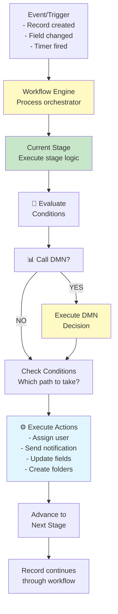

## 2. Workflow Lifecycle - Complete Journey

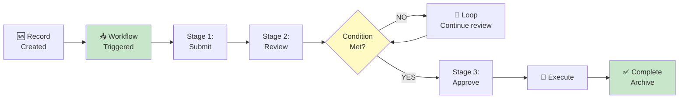

## 3. Workflow Components Breakdown

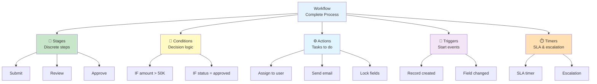

## 4. Invoice Approval Workflow - Complete Business Case

### Business Case Overview
- **Company**: Global Finance Inc.
- **Annual Volume**: 50,000 invoices/year
- **Current Process**: Manual routing, 5-7 day average
- **Goal**: Automated routing, 1-3 day average

### Current State (Before Workflow)

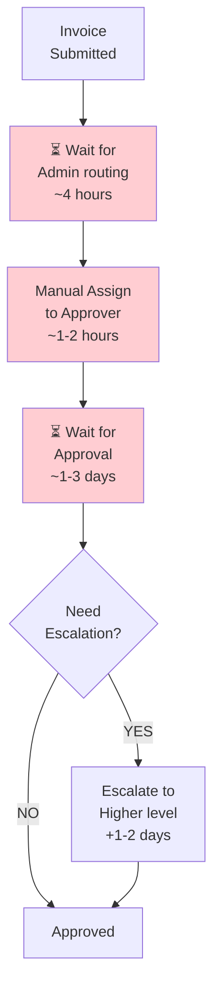

**Pain Points**:
- ❌ Manual routing errors
- ❌ Delays in admin queue
- ❌ Inconsistent approval timelines
- ❌ No escalation for overdue
- ❌ No audit trail of routing decisions

### Future State (With Workflow)

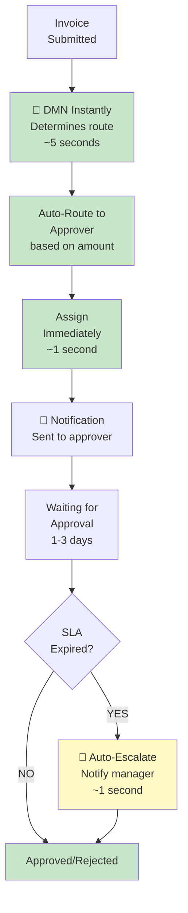

**Benefits**:
- ✅ Instant routing (no admin delays)
- ✅ Accurate assignment every time
- ✅ Consistent SLA tracking
- ✅ Automatic escalation
- ✅ Full audit trail

### Detailed Invoice Workflow Stages

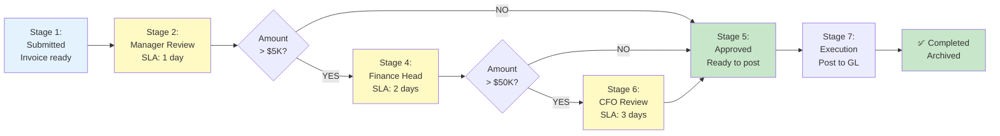

### Business Impact

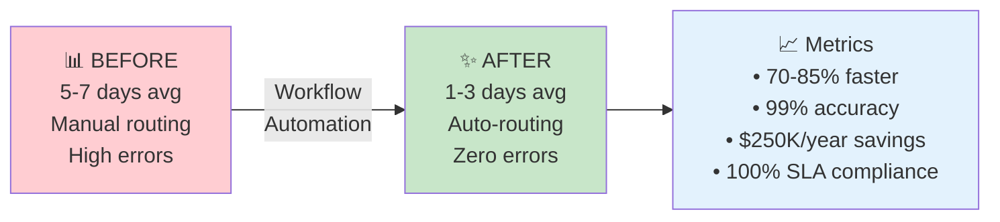

### Time Savings Analysis

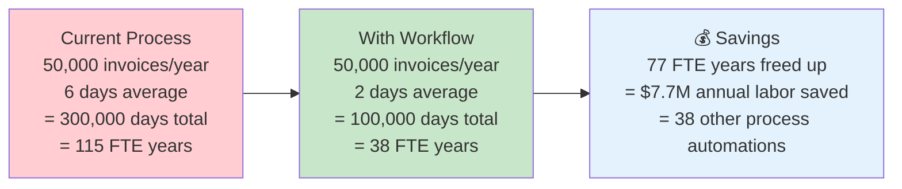

---

## 5. Parallel Review Workflow - Legal Contracts

### Scenario
Legal contracts need simultaneous review by Legal, Finance, and Compliance.

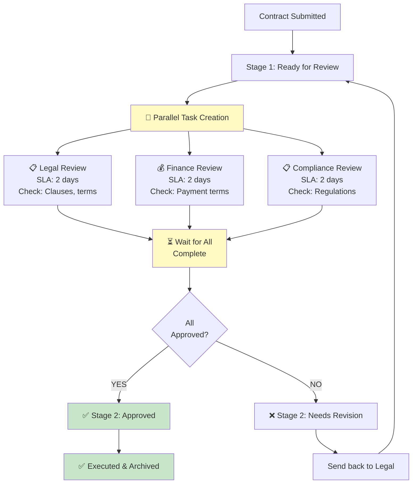

**Time Savings**:
```
Sequential approach: 2 + 2 + 2 = 6 days
Parallel approach: max(2, 2, 2) = 2 days
Savings: 4 days per contract (67% faster)
```

---

## 6. Escalation Workflow - Customer Support

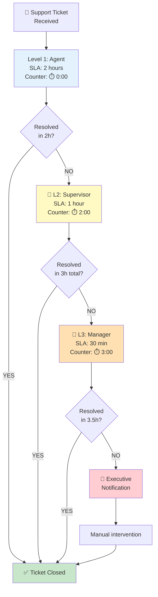

**Escalation Timeline**:
```
T+0h:     Agent receives ticket (no wait)
T+2h:     Agent escalates to supervisor
T+2h:     Supervisor reviews
T+3h:     Supervisor escalates to manager
T+3h:     Manager reviews
T+3.5h:   Manager escalates to executive
T+3.5h:   Executive involvement
T+4h:     All tickets guaranteed resolution
```

---

## 7. Conditional Routing Workflow - Document Classification

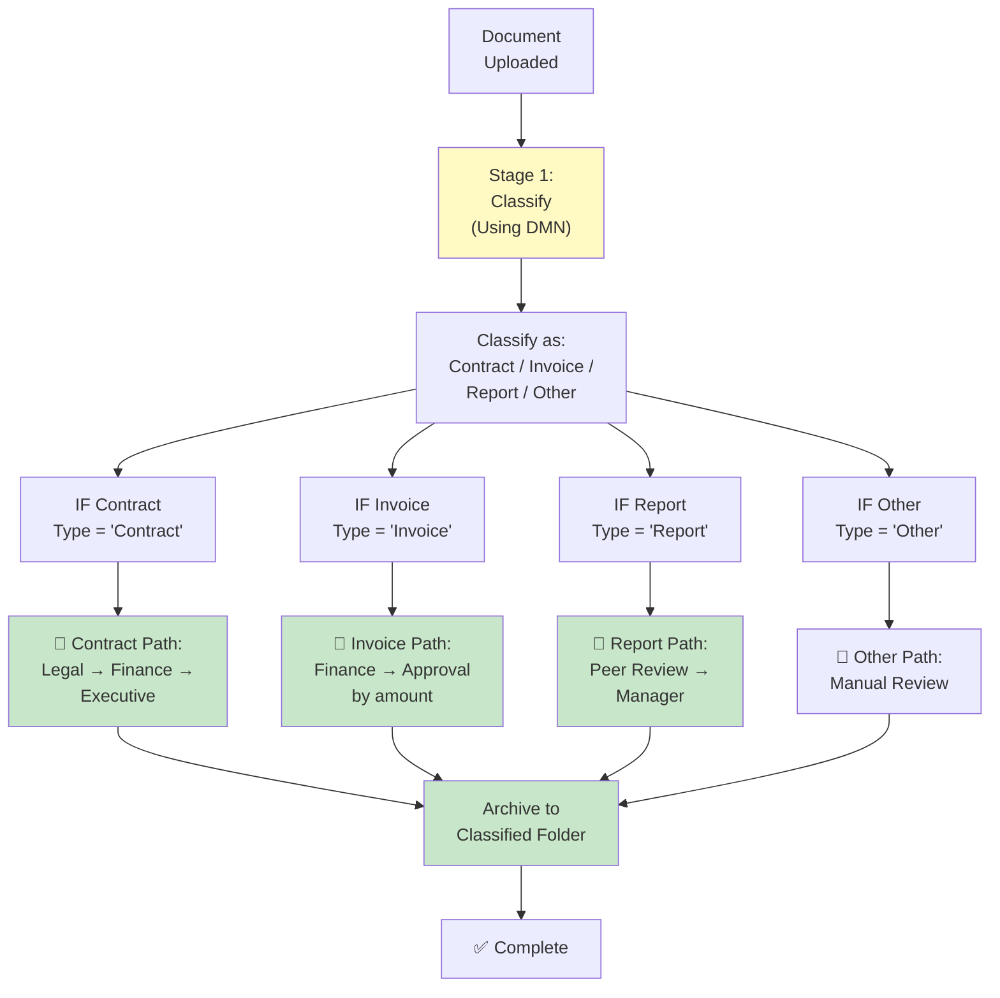

---

## 8. Workflow + DMN Integration

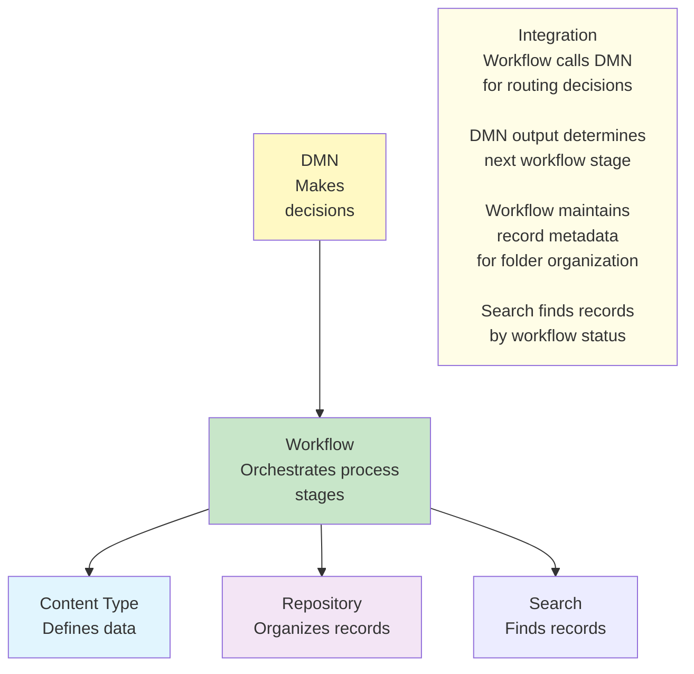

---

## 9. Workflow Stage Structure - Detailed Anatomy

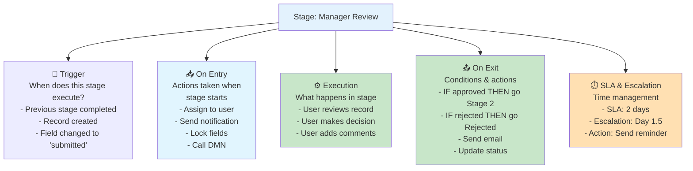

---

## 10. Workflow Conditional Routing Example

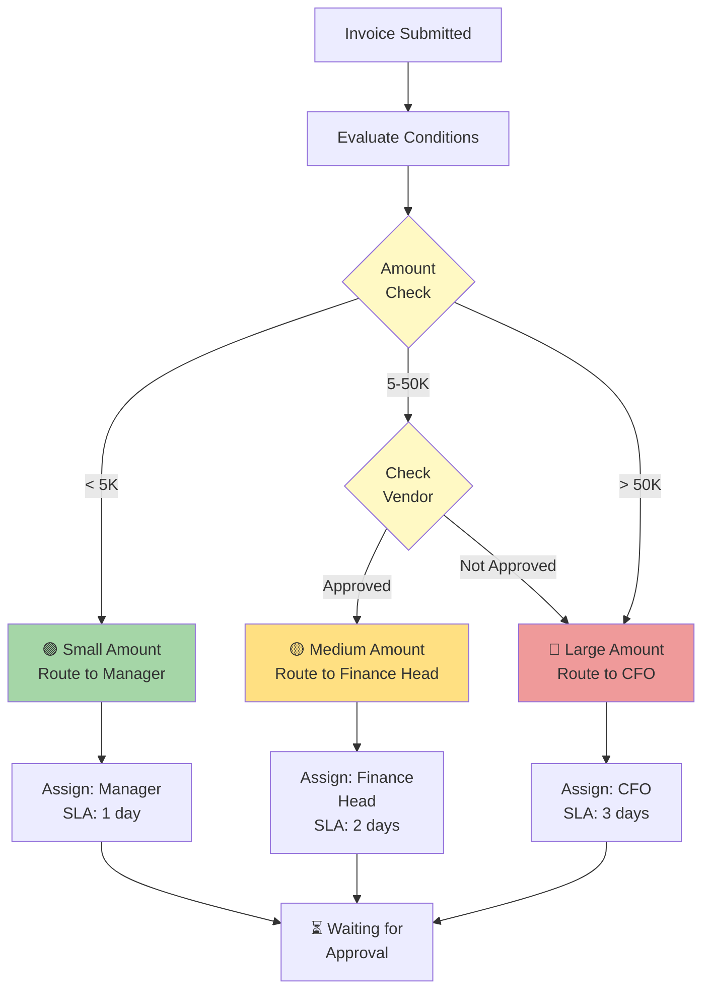

---

## 11. SLA & Escalation Visualization

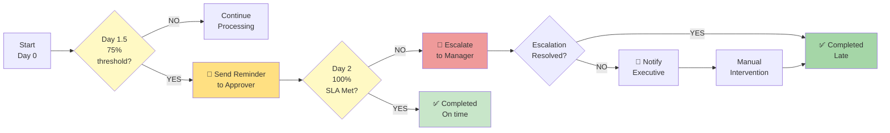

---

## 12. Workflow Patterns - Visual Library

### Sequential Pattern (Most Common)
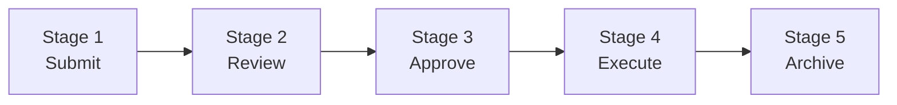

### Conditional Pattern
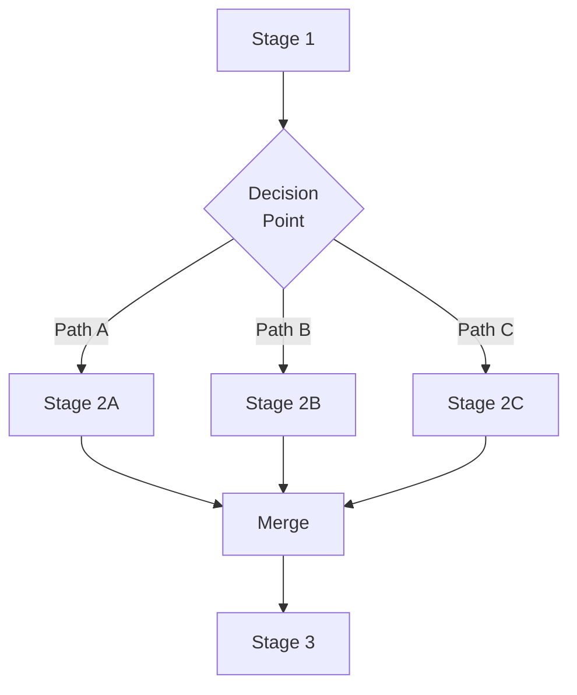

### Parallel Pattern
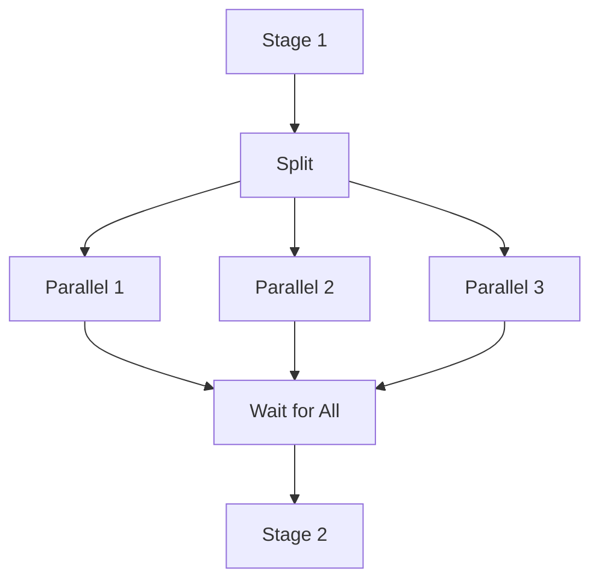

### Loop Pattern
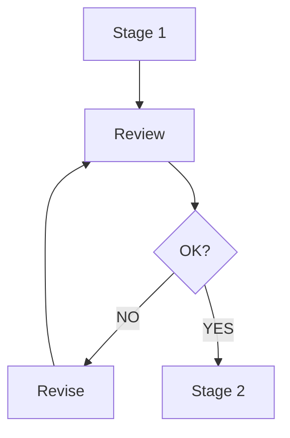

---

## 13. Workflow Integration Touchpoints

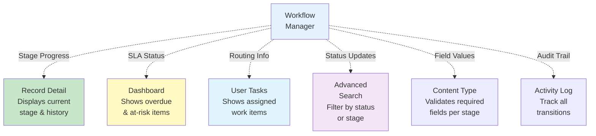

---

## 14. Workflow Metrics & KPIs

```mermaid
graph TB
    WF["Workflow<br/>System"]
    
    WF --> SPEED["⚡ Speed<br/>Avg time per stage<br/>Total duration"]
    
    WF --> QUALITY["✅ Quality<br/>Approval accuracy<br/>Rejection rate"]
    
    WF --> VOLUME["📊 Volume<br/>Records per stage<br/>Throughput"]
    
    WF --> SLA["⏱️ SLA Compliance<br/>% on-time<br/>Escalation count"]
    
    WF --> COST["💰 Cost<br/>Labor saved<br/>Efficiency gain"]
    
    SPEED --> REPORT["📈 Dashboard Report<br/>Track metrics<br/>Identify issues<br/>Optimize process"]
    QUALITY --> REPORT
    VOLUME --> REPORT
    SLA --> REPORT
    COST --> REPORT
    
    style WF fill:#e3f2fd
    style REPORT fill:#c8e6c9
```

---

## 15. Workflow Deployment Lifecycle

```mermaid
flowchart TD
    A["📝 Design<br/>Map process<br/>on paper"] --> B["⚙️ Build<br/>Create in<br/>Manage Workflow"]
    B --> C["🧪 Test<br/>Test all<br/>scenarios"]
    C --> D["✅ Review<br/>Get stakeholder<br/>approval"]
    D --> E["🚀 Deploy<br/>Set to Active<br/>Train users"]
    E --> F["📊 Monitor<br/>Track metrics<br/>Identify issues"]
    F --> G{"Optimize<br/>needed?"}
    G -->|YES| H["🔄 Refine<br/>Adjust logic<br/>or timelines"]
    G -->|NO| I["✅ Maintain<br/>Support users"]
    
    H --> F
    
    style A fill:#e3f2fd
    style B fill:#fff9c4
    style C fill:#f3e5f5
    style D fill:#ffe082
    style E fill:#c8e6c9
    style F fill:#e1f5fe
```

---

## 16. End-to-End Purchase Order Workflow

```mermaid
flowchart TD
    PO["PO Submitted<br/>Amount: $25K<br/>Vendor: ABC Corp"] --> DMN["Call DMN<br/>Determine Route"]
    
    DMN --> OUTPUT["DMN Result:<br/>approval_route=finance_head<br/>urgency=medium<br/>sla=2 days"]
    
    OUTPUT --> S1["Stage 1:<br/>Review & Verify"]
    S1 --> ASSIGN["Assign to:<br/>Finance Head"]
    ASSIGN --> NOTIFY1["Notify:<br/>Finance Head<br/>New PO for approval"]
    
    NOTIFY1 --> S2["Stage 2:<br/>Finance Review<br/>SLA: 2 days"]
    S2 --> APPROVE{"Approved?"}
    
    APPROVE -->|YES| S3["Stage 3:<br/>Procurement"]
    APPROVE -->|NO| REJECT["Rejected<br/>Send to submitter"]
    REJECT --> END1["❌ PO Rejected"]
    
    S3 --> EXEC["Execute:<br/>Create PO<br/>in system"]
    EXEC --> VENDOR["Notify<br/>Vendor"]
    VENDOR --> S4["Stage 4:<br/>Tracking"]
    S4 --> END2["✅ PO Complete"]
    
    style DMN fill:#fff9c4
    style S2 fill:#e1f5fe
    style EXEC fill:#c8e6c9
    style END2 fill:#c8e6c9
```

---

## Key Takeaways

| Concept | Purpose | Impact |
|---------|---------|--------|
| **Workflow** | Orchestrates process | Clear, standard execution |
| **Stages** | Discrete process steps | Accountability, focus |
| **Conditions** | Route based on data | Flexible, intelligent |
| **Actions** | Execute tasks | Automation, efficiency |
| **SLA/Escalation** | Time management | On-time delivery |
| **DMN Integration** | Complex decisions | Powerful routing |
| **Automation** | Reduce manual work | 70-80% labor saved |
| **Visibility** | Track progress | Dashboard metrics |

---

## What's Next?

- **[Using Manage Workflow](%F0%9F%9B%A0%20Using%20Manage%20Workflow.md)** - Step-by-step creation guide
- **[Workflow Detailed Guide](%F0%9F%9B%A0%20All%20BPMN%20Task%20Types%20Reference.md)** - Component reference
- **[Use Case Examples](%F0%9F%9B%A0%20Use%20Cases.md)** - Real-world implementations
- **[Knowledge Overview](%F0%9F%A7%A0%20Knowledge%20Overview.md)** - Core concepts

---

**Version**: v7.49.0+  
**Last Updated**: 2026-06-11  
**Powered by Contellect**
