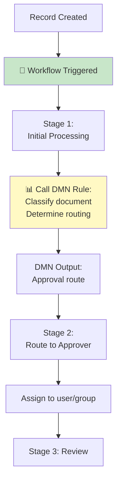
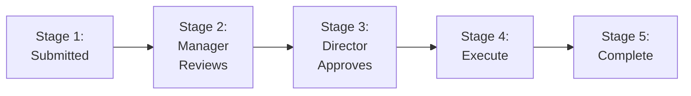
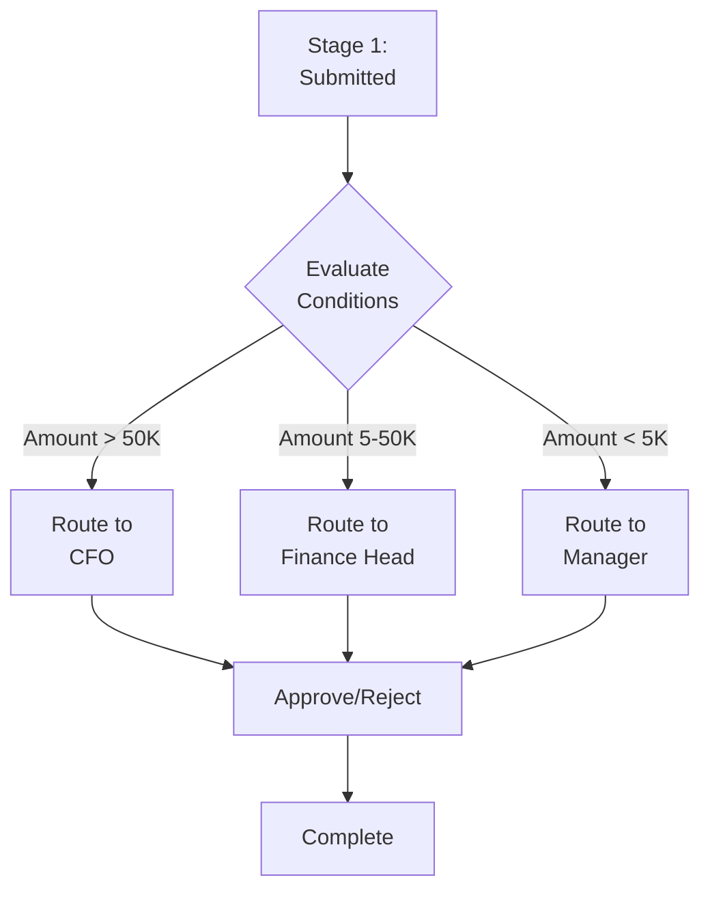
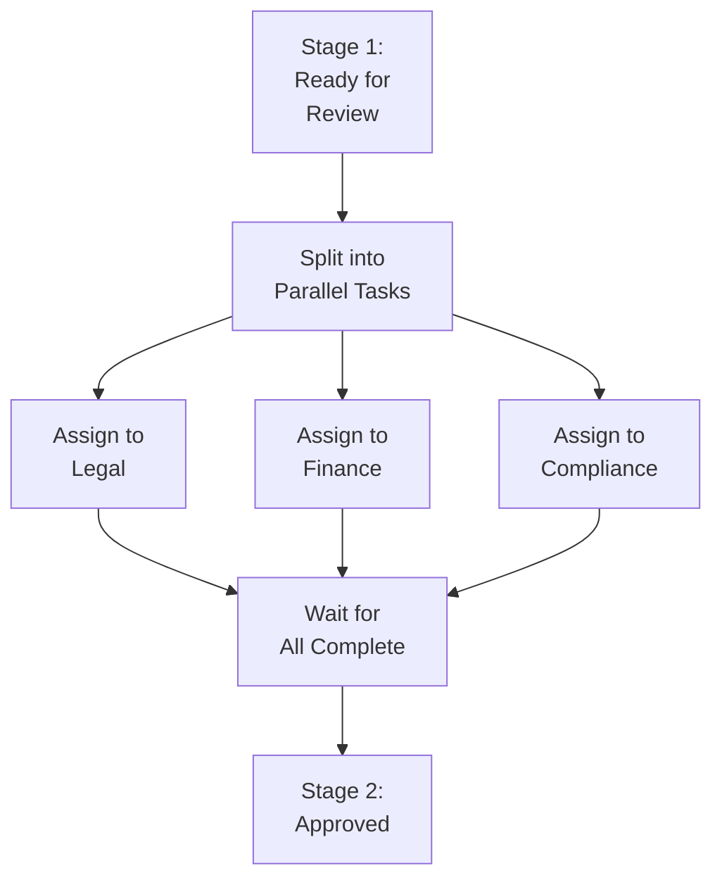
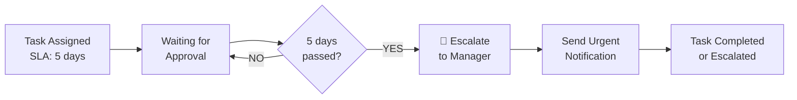
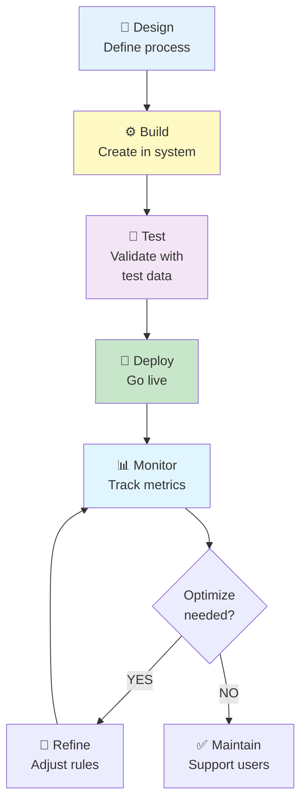

---
id: workflow-knowledge-overview
title: "🧠 Workflow Management - Knowledge Overview"
sidebar_label: "🧠 Knowledge Overview"
sidebar_position: 1
name: "🧠 Knowledge Overview"
slug: /workflow/knowledge-overview
tags: [workflow, process-management, automation, business-process]
---

# Workflow Management - Knowledge Overview


:::tip 📌 At a Glance
**Document Type**: Knowledge Overview  
**Goal**: Follow the unified ECM User Guide design and structure for this page.
:::


## What is Workflow Management?

**Workflow Management** in Contellect ECM is a system for defining and automating the sequential steps that a record must follow as it moves through your business process. It orchestrates who does what, when, and under what conditions.

In simple terms: A workflow is a **step-by-step guidebook** that tells your records what to do at each stage of their lifecycle.

:::info Industry Standard
Workflows are based on BPMN 2.0 (Business Process Model and Notation), a standard used across enterprise applications for process automation.
:::

## Why Use Workflows in Contellect ECM?

### Business Problems Workflows Solve

| Problem | Solution |
|---------|----------|
| Manual tracking of document progress | Auto-track with workflow stages |
| Unclear process steps | Define explicit workflow stages |
| No assignment accountability | Auto-assign tasks to users |
| Inconsistent process execution | Enforce standard workflow for all records |
| Process bottlenecks not visible | Monitor workflow metrics & KPIs |
| Delayed approvals | Set SLA timers, escalations |
| Complex conditional logic | Use DMN for intelligent routing |

### Real-World Scenarios

:::success Invoice Processing
**Problem**: Invoices get lost, approvals delayed, no visibility.
- Without workflow: Manual tracking, duplicate approvals, inconsistent timing
- With workflow: Auto-routes by amount → Approver receives assignment → Timer tracks SLA → Auto-escalates if overdue

**Result**: 3-day process becomes 1-day process
:::

:::success Legal Contract Review
**Problem**: Contracts need review by multiple departments; no clear approval order.
- Without workflow: Email chains, unclear who should review next, versions conflict
- With workflow: Stage 1 (Legal review) → Stage 2 (Finance review) → Stage 3 (Executive approval) → Auto-notifies at each stage

**Result**: Clear sequential process, transparent visibility
:::

:::success Customer Complaint Resolution
**Problem**: Complaints assigned randomly; some get lost; no escalation for aged tickets.
- Without workflow: Manual assignment, no tracking
- With workflow: Auto-assigns by category → Tracks days pending → Auto-escalates if > 5 days → Manager notified

**Result**: 95% same-day response rate achieved
:::

## Key Concepts in Workflow

### Workflow Components

```mermaid
graph TB
    WORKFLOW["Workflow"]
    WORKFLOW --> STAGES["Stages"]
    WORKFLOW --> CONDITIONS["Conditions"]
    WORKFLOW --> ACTIONS["Actions"]
    WORKFLOW --> TRIGGERS["Triggers"]
    WORKFLOW --> TIMERS["Timers"]
    
    STAGES --> S1["Stage 1: Submit"]
    STAGES --> S2["Stage 2: Review"]
    STAGES --> S3["Stage 3: Approve"]
    STAGES --> S4["Stage 4: Execute"]
    
    CONDITIONS --> C1["Status = Submitted?"]
    CONDITIONS --> C2["Amount > $50K?"]
    CONDITIONS --> C3["User = Admin?"]
    
    ACTIONS --> A1["Send notification"]
    ACTIONS --> A2["Assign to user"]
    ACTIONS --> A3["Create folder"]
    ACTIONS --> A4["Update field"]
    
    TRIGGERS --> T1["Record created"]
    TRIGGERS --> T2["Field changed"]
    TRIGGERS --> T3["Stage completed"]
    
    TIMERS --> TM1["SLA timer"]
    TIMERS --> TM2["Escalation"]
    TIMERS --> TM3["Reminder"]
    
    style STAGES fill:#c8e6c9
    style CONDITIONS fill:#fff9c4
    style ACTIONS fill:#e1f5fe
    style TRIGGERS fill:#f3e5f5
```



### Workflow Stages (Workflow Steps)

A **Stage** is a discrete step in the workflow where specific activities happen:

| Stage | Purpose | Example |
|-------|---------|---------|
| **Submit** | User submits record for processing | Invoice submitted for approval |
| **Review** | Designated reviewer examines record | Manager reviews invoice |
| **Decision** | Approval/rejection decision made | Finance head approves or rejects |
| **Execute** | Process the approved record | Post invoice to accounting |
| **Archive** | Final completion or archival | Invoice moved to archive |

### Workflow Conditions

**Conditions** determine which path a record takes based on its data:

```
IF amount > 50000 THEN route to CFO
ELSE IF amount > 5000 THEN route to Finance Head
ELSE route to Manager
```

**Conditions evaluate**:
- Record field values (amount, status, department)
- User properties (role, department)
- Date/time logic
- DMN decision outputs

### Workflow Actions

**Actions** are tasks executed when a record enters a stage or meets a condition:

| Action | Purpose | Trigger |
|--------|---------|---------|
| **Assign** | Assign task to user/group | Record enters stage |
| **Notify** | Send email notification | Task assigned or approved |
| **Create** | Create related records/folders | Based on metadata |
| **Update** | Modify record fields | Status change |
| **Escalate** | Bump to higher authority | SLA timer expires |
| **Lock/Unlock** | Prevent/allow editing | Approved/rejected |
| **Call DMN** | Execute decision logic | Determine routing |

### Workflow Triggers

**Triggers** are events that activate workflow rules:

| Trigger | When It Fires | Example |
|---------|---------------|---------|
| **Record Created** | New record added to system | User uploads new invoice |
| **Field Changed** | Specific field updated | Status changed to "Submitted" |
| **Stage Completed** | Current stage finished | User clicks "Complete Stage" |
| **Timer Fired** | Time-based event | 5 days elapsed without approval |
| **Escalation Met** | Escalation threshold reached | SLA timer expired |

## How Workflows Integrate with Other ECM Features

### Workflow + DMN Integration



### Workflow + Content Types

```
Content Type defines: Fields, validation, structure
         ↓
Workflow defines: Steps, process, approvals
         ↓
Combined: Type ensures data quality, workflow ensures process
```

### Workflow + Repository (Auto-Folder Creation)

```
Record created
  ↓
Workflow Stage 1: Classify
  ↓
Determine folder metadata via DMN
  ↓
Auto-create folder in Repository
  ↓
Link record to auto-folder
  ↓
Continue through workflow stages
```

### Workflow + Search

When searching, you can find records by **workflow status**:
- "Find all invoices in 'Pending Approval' stage"
- "Show me records that are overdue (SLA expired)"
- "List all invoices approved by user 'John'"

## Common Workflow Patterns

### Pattern 1: Sequential Approval Chain



### Pattern 2: Conditional Routing (Based on Rules)



### Pattern 3: Parallel Tasks (Multiple Reviewers Simultaneously)



### Pattern 4: Escalation & SLA Management



## Workflow Stage Details

### Components of a Workflow Stage

```
┌─ Stage: Review ─────────────────────┐
│                                      │
│  Trigger: When record enters stage  │
│  Assignee: Manager                  │
│  SLA: 3 days                        │
│                                      │
│  On Entry Actions:                  │
│  ├─ Send notification               │
│  ├─ Lock certain fields             │
│  └─ Call DMN for routing           │
│                                      │
│  On Exit Conditions:                │
│  ├─ IF approved THEN go to Stage 3  │
│  ├─ IF rejected THEN go to Stage 4  │
│  └─ IF needs info THEN stay in 2    │
│                                      │
└─────────────────────────────────────┘
```

## Workflow vs DMN - Relationship

| Aspect | Workflow | DMN |
|--------|----------|-----|
| **What** | Orchestrates process steps | Makes business decisions |
| **Scope** | Full record lifecycle | Single decision point |
| **Triggers** | Events & time | Data evaluation |
| **Output** | Next stage, assignments | Decision value |
| **Use Together** | Workflow calls DMN for decisions | DMN returns routing info |

**Analogy**:
- **Workflow** = Recipe (step 1, step 2, step 3)
- **DMN** = Decision table (if ingredient A, then use method B)

## Role-Based Quick Starts

### Administrator

:::tip Quick Start
1. Navigate to Configuration → Manage Workflow
2. Review existing workflows for your content types
3. Identify process gaps or inefficiencies
4. Plan new workflow (sketch on paper first)
5. Create stages, assign owners, set SLAs
6. Configure conditions for routing
7. Link to DMN rules for intelligent decisions
8. Test with sample records
9. Deploy to production
10. Monitor performance metrics
:::

### Business Analyst

:::tip Quick Start
1. Document current process (as-is)
2. Identify inefficiencies and delays
3. Design improved process (to-be)
4. Map stages, gates, and decisions
5. Identify where DMN rules needed
6. Define SLA targets and escalations
7. Present to admin for implementation
8. Validate against live records
:::

### End User

:::tip Quick Start
1. Understand your workflow role (e.g., Approver, Reviewer)
2. Know which stages records pass through
3. Know your responsibilities at each stage
4. Understand SLA targets
5. Know how to escalate if stuck
6. Provide feedback on process pain points
:::

## Benefits of Using Workflows

| Benefit | Impact | Metric |
|---------|--------|--------|
| **Process Visibility** | Everyone knows where records are | 100% transparency |
| **Faster Processing** | Parallel stages, automatic routing | 40-60% faster |
| **Reduced Errors** | Standardized steps | 95% accuracy |
| **Accountability** | Assigned owners at each stage | 100% traceability |
| **Automation** | Reduces manual work | 70-80% automation |
| **Compliance** | Audit trail of approvals | Regulatory compliant |
| **Scalability** | Handle 10x volume with same team | 10x throughput |

## Workflow Lifecycle



## Common Challenges & Solutions

| Challenge | Solution |
|-----------|----------|
| **Complex workflows get confusing** | Break into simpler stages, use clear naming |
| **Users don't follow workflow** | Train, monitor compliance, provide feedback |
| **Bottlenecks at certain stages** | Identify cause, add parallel approval, escalate |
| **SLA misses** | Analyze reasons, adjust timelines, add reminders |
| **Too many manual approvals** | Use DMN to automate routine decisions |
| **Hard to change workflows** | Document reasons for changes, test thoroughly |

## What's Next?

- **[Using Manage Workflow](%F0%9F%9B%A0%20Using%20Manage%20Workflow.md)** - Step-by-step creation guide
- **[Workflow Detailed Guide](%F0%9F%9B%A0%20All%20BPMN%20Task%20Types%20Reference.md)** - Component reference
- **[Diagrams & Business Cases](%F0%9F%97%BA%20Diagrams%20%26%20Business%20Cases.md)** - Visual workflows
- **[Use Case Examples](%F0%9F%9B%A0%20Use%20Cases.md)** - Real-world implementations

---

**Version**: v7.49.0+  
**Last Updated**: 2026-06-11  
**Powered by Contellect**
