---
sidebar_label: "📊 Workspace Diagrams"
sidebar_position: 5
name: "📊 Workspace Diagrams"
description: Visual architecture, workflow, and integration diagrams for Workspace
user-invocable: true
---

# 📊 Workspace — Diagrams

:::tip 📌 At a Glance
**Document Type**: Diagrams  
**Goal**: Follow the unified ECM User Guide design and structure for this page.
:::

This page contains comprehensive visual diagrams for the Workspace feature — covering architecture, workflows, permissions, record flows, and integration points.

---

## 🏗️ Workspace System Architecture

### How Workspace Connects to ECM

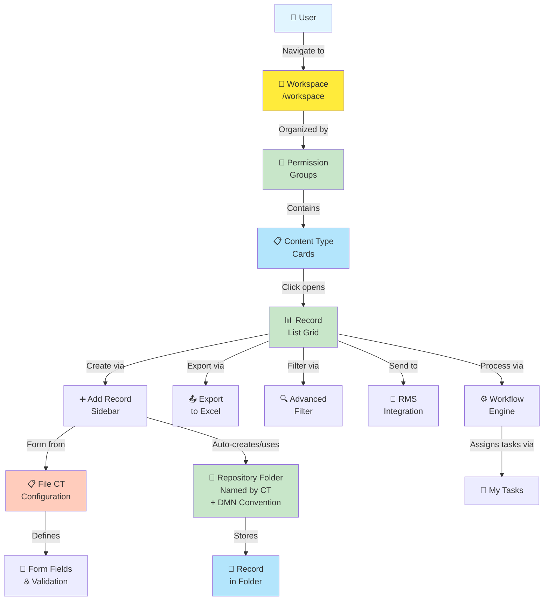

---

## 🗺️ Workspace Landing Page Structure

### Visual Layout of the Landing Page

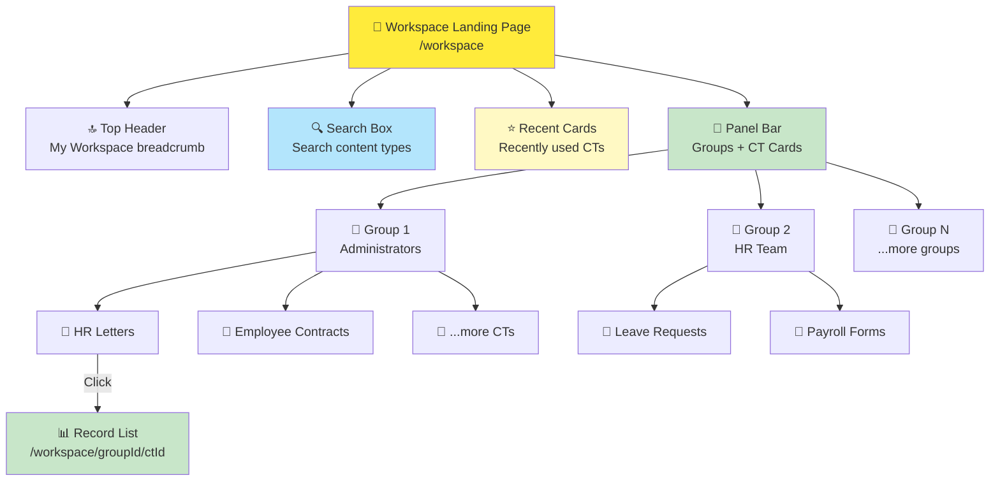

---

## 🎯 Record List Page Structure

### Inside a Content Type

```mermaid
graph TD
    RecordPage["📊 Record List Page<br/>/workspace/{groupId}/{ctId}"]
    
    RecordPage --> Breadcrumb["🧭 Breadcrumb<br/>Home → Workspace → Group/CT"]
    RecordPage --> Toolbar["🔧 Toolbar"]
    RecordPage --> Grid["📋 Grid Table"]
    RecordPage --> Pager["📄 Pagination"]
    
    Toolbar --> T1["📤 Export Excel"]
    Toolbar --> T2["🔄 Refresh"]
    Toolbar --> T3["🔍 Advanced Filter"]
    Toolbar --> T4["🔗 RMS Integration"]
    Toolbar --> T5["➕ Add Record"]
    
    Grid --> G1["☐ Select Column"]
    Grid --> G2["⚙️ Actions Column"]
    Grid --> G3["📝 Record Name"]
    Grid --> G4["📋 CT Dynamic Fields"]
    Grid --> G5["👤 Started By"]
    Grid --> G6["🕐 Created Time"]
    Grid --> G7["🔄 Modification Time"]
    Grid --> G8["🔢 Version"]
    Grid --> G9["🏷️ Barcodes"]
    
    Pager --> P1["◄◄ First Page"]
    Pager --> P2["◄ Previous"]
    Pager --> P3["Page Numbers"]
    Pager --> P4["► Next"]
    Pager --> P5["►► Last Page"]
    Pager --> P6["Items Per Page Selector"]
    Pager --> P7["X - Y of Z Items"]
    
    style RecordPage fill:#ffeb3b
    style Toolbar fill:#c8e6c9
    style Grid fill:#b3e5fc
    style Pager fill:#fff9c4
```

---

## ➕ Add Record Flow

### User Creates a New Record

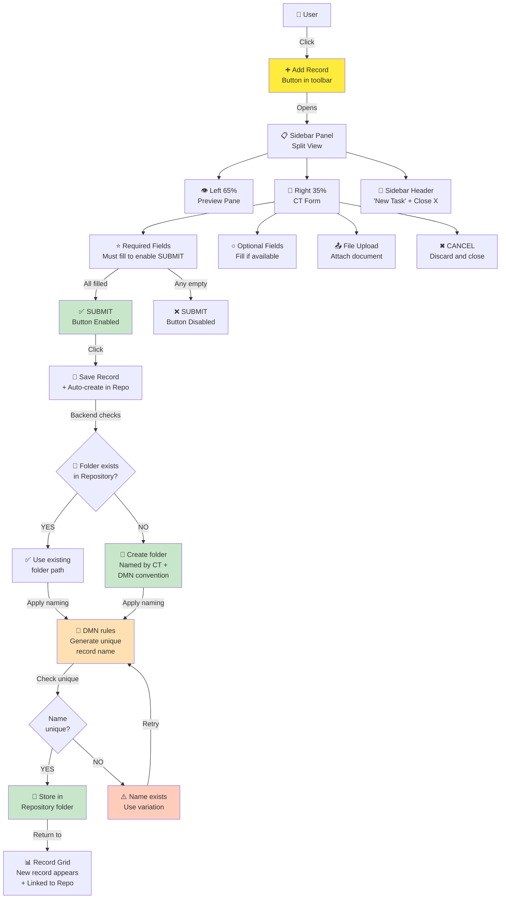

---

## 🔐 Permission Groups Architecture

### How Groups Control Workspace Access

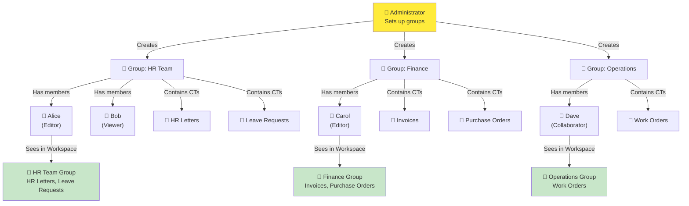

---

## 🔄 Record Lifecycle

### From Creation to Archive

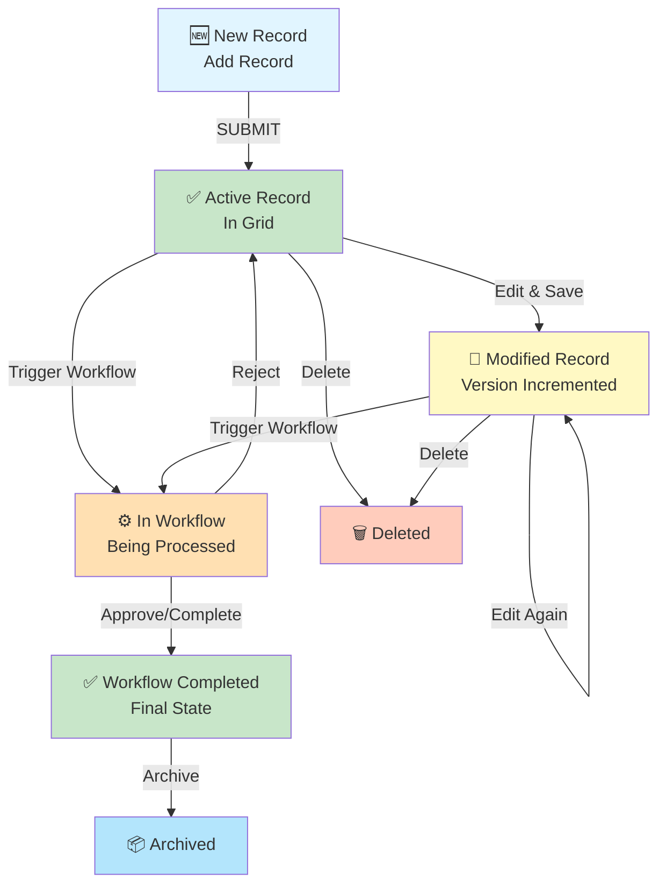

---

## 🔍 Search & Filter Flow

### Finding Records in Workspace

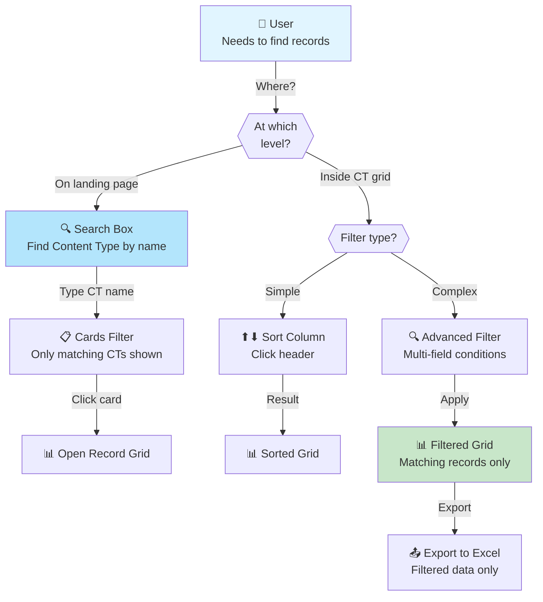

---

## 📊 Pagination Navigation

### How Pagination Works

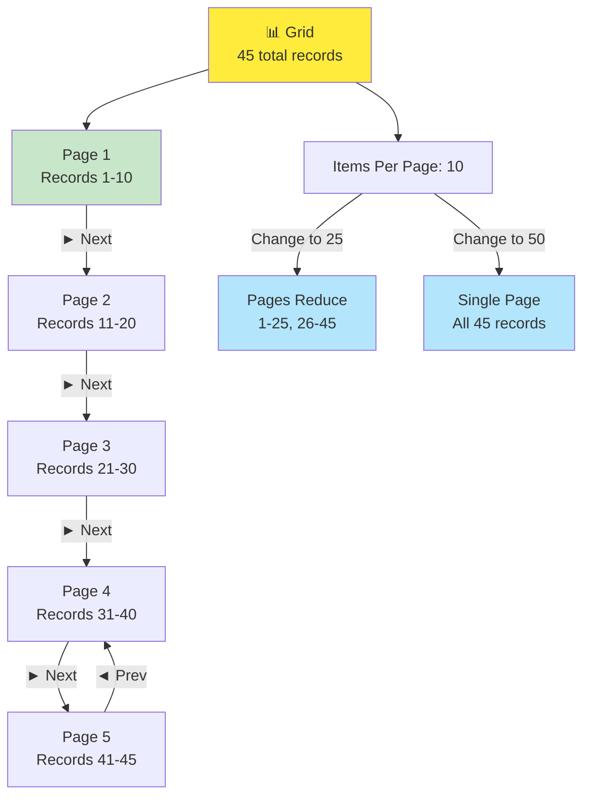

---

## 🔗 RMS Integration Flow

### Sending Records to RMS System

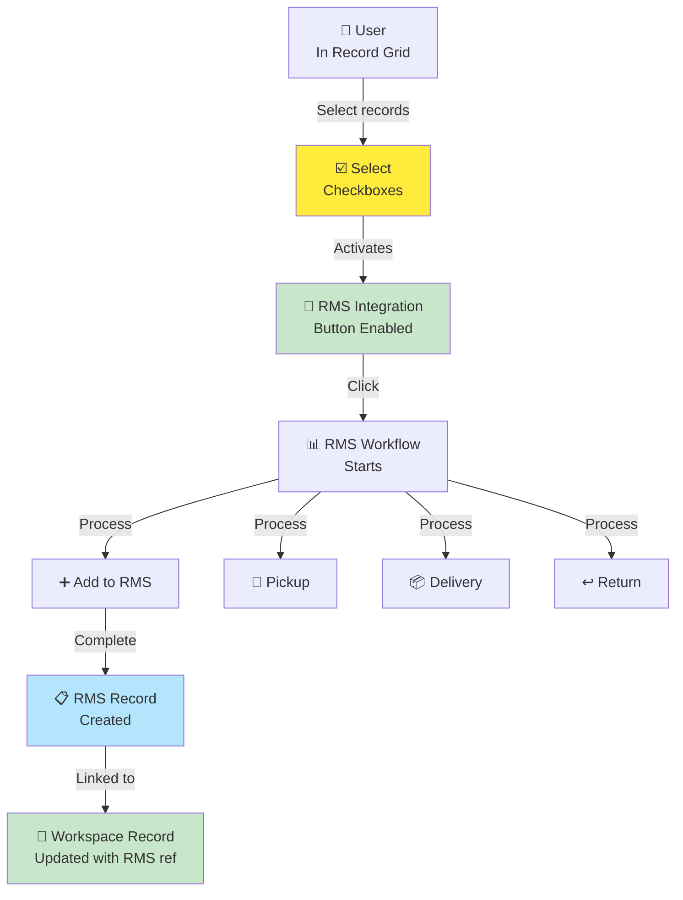

---

## 📋 Content Type Integration

### How File CT Flows into Workspace

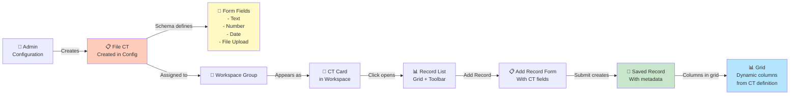

---

## 👥 Multi-Group User Access

### User Belonging to Multiple Groups

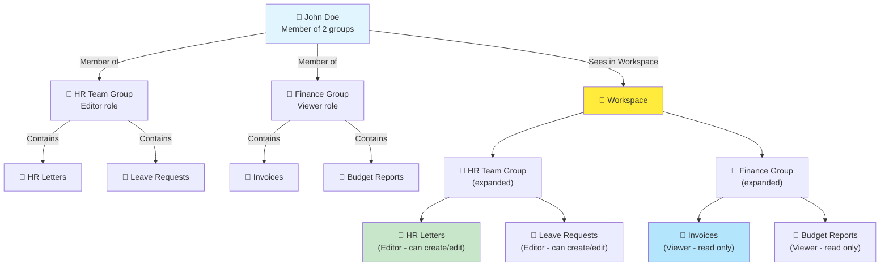

---

## ⚙️ Advanced Filter Logic

### Building Complex Queries

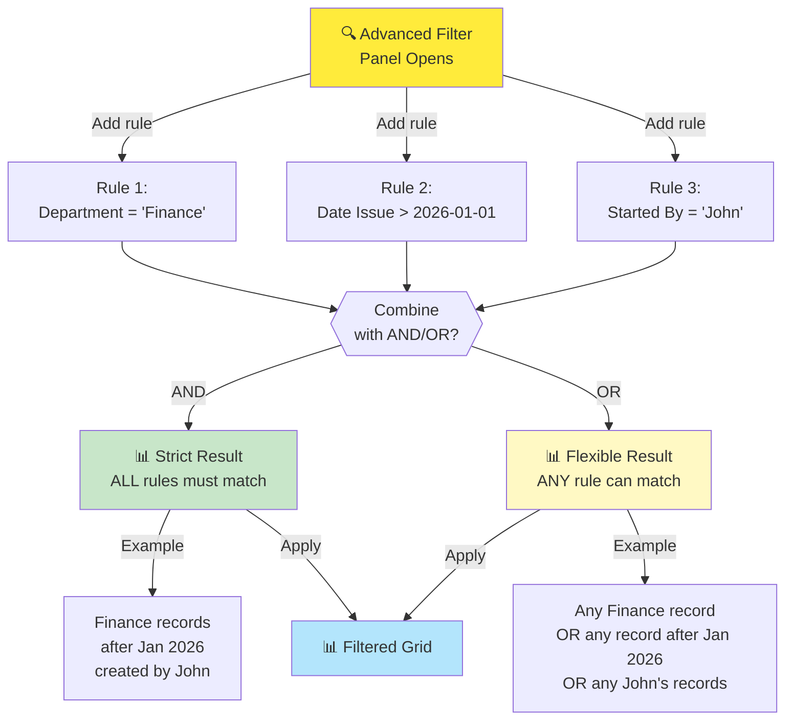

---

## 🏷️ Version Tracking

### How Record Versioning Works

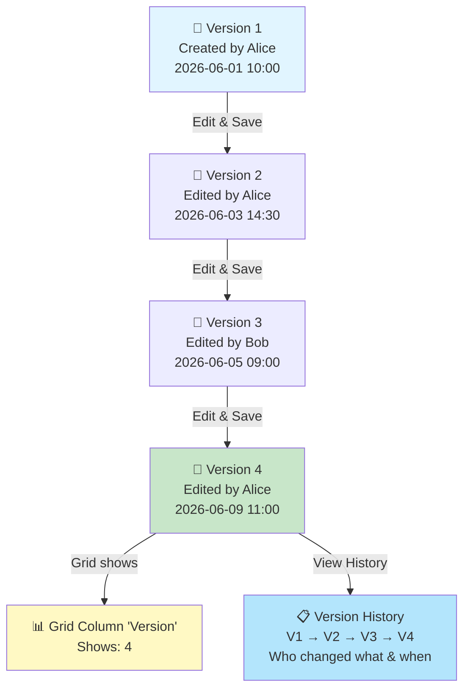

---

## � Workspace-to-Repository Automatic Folder Sync

### Record Auto-Creates Folder in Repository

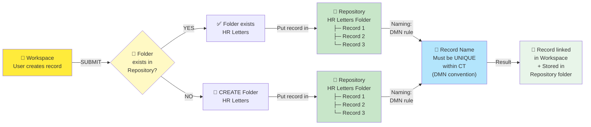

---

## �🔄 Workspace vs Repository Comparison

### When to Use Which

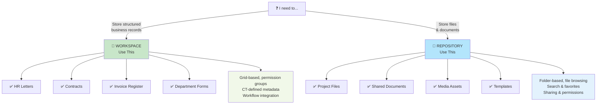

---

## 📋 Best Practices

### Workspace Usage Guidelines

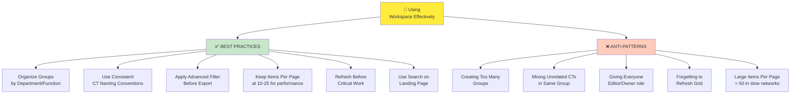

---

## 📚 Related Guides

→ [Knowledge Overview](%F0%9F%A7%A0%20Knowledge%20Overview.md) — Understand Workspace basics

→ [Managing Records](%F0%9F%93%98%20Managing%20Records.md) — Create, edit, delete records

→ [Workspace Groups](%F0%9F%93%98%20Workspace%20Groups.md) — Permission groups setup

→ [Grid & Navigation](%F0%9F%93%98%20Grid%20%26%20Navigation.md) — Toolbar, pagination, filters

→ [Repository Diagrams](../Repository/%F0%9F%97%BA%20🗺 %F0%9F%97%BA%20🗺 %F0%9F%97%BA%20🗺 %F0%9F%97%BA%20🗺 %F0%9F%97%BA%20🗺 Diagrams.md) — Repository visual guides
