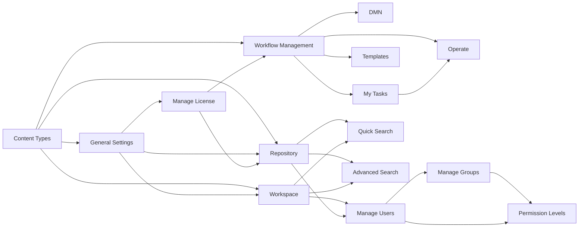

---
sidebar_label: "🏠 Overview"
sidebar_position: 1
name: "🏠 Overview"
---

# Contellect ECM User Guide

:::tip 📌 At a Glance
**Document Type**: Overview  
**Goal**: Follow the unified ECM User Guide design and structure for this page.
:::

## About This Documentation Website

Welcome to the **Contellect ECM User Guide** — your comprehensive resource for understanding, configuring, and managing Enterprise Content Management (ECM) features. This site is designed to help users, administrators, and developers quickly learn how to work with Content Types, build metadata forms, create workflows, and integrate ECM with business systems.

:::info 🧠 Knowledge-First Navigation Update
All ECM sections now start from their **Knowledge Overview** page through category links.
When you open a section from the sidebar, you land on conceptual context first, then move to detailed guides and diagrams.
:::

:::info 📚 What You'll Find Here
- **Comprehensive guides** for File, Task, and Folder Content Types
- **Step-by-step instructions** for creating and configuring metadata forms using the Form.io builder
- **Visual diagrams** explaining workflows, component logic, and system integration
- **Real-world examples** and use cases for each Content Type
- **Reference documentation** for all 33+ form components and their configurations
- **Best practices** for designing forms, managing metadata, and workflow integration
:::

## Quick Start by Role

:::tip 👤 Choose Your Path

<strong>End Users</strong> - Creating and managing files, folders, and records

Start with [File Content Types - Knowledge Overview](./Content%20Types/File%20CT/%F0%9F%A7%A0%20Knowledge%20Overview.md) to understand how metadata works in practice.

<strong>Administrators</strong> - Configuring Content Types and metadata schemas

Begin with [File Content Types - Detailed Guide](./Content%20Types/File%20CT/%F0%9F%93%98%20Detailed%20Guide.md) to learn configuration step-by-step.

<strong>Workflow Designers</strong> - Building task forms and approval workflows

Go to [Task Content Types - Knowledge Overview](./Content%20Types/Task%20CT/%F0%9F%A7%A0%20Knowledge%20Overview.md) to understand task forms and approvals.

<strong>Developers</strong> - Integrating ECM with external systems and APIs

Explore [Diagram sections](./Content%20Types/File%20CT/%F0%9F%97%BA%20Diagram.md) to understand system architecture and integration points.

:::

---

## What Is Contellect ECM?
Contellect ECM is an Enterprise Content Management system that helps organizations manage, organize, and process documents, files, folders, and workflows with standardized metadata and business rules.

## 🎯 Content Types Overview

Content Types is the configuration area that defines the metadata schema and form layouts used throughout ECM. Explore the three main types:

  

    <h3>📄 File Content Types</h3>
    
Metadata forms for file/document records used in Repository, Workspace, Workflows, Template Generation, DMN configurations, and RMS integrations.

    <a href="./Content%20Types/File%20CT/%F0%9F%A7%A0%20Knowledge%20Overview.md" style={{color: '#0066cc', fontWeight: 'bold'}}>Learn More →</a>
  

  

    <h3>✅ Task Form Content Types</h3>
    
Forms used by workflow user tasks for human-driven task execution and approvals in business processes.

    <a href="./Content%20Types/Task%20CT/%F0%9F%A7%A0%20Knowledge%20Overview.md" style={{color: '#0099cc', fontWeight: 'bold'}}>Learn More →</a>
  

  

    <h3>📁 Folder Content Types</h3>
    
Metadata forms for folder entities with structured business attributes and organizational hierarchy.

    <a href="./Content%20Types/Folder%20CT/%F0%9F%A7%A0%20Knowledge%20Overview.md" style={{color: '#00cc99', fontWeight: 'bold'}}>Learn More →</a>
  

:::warning Key Concept
**Content Types define the structure** — they configure what metadata fields appear, how they validate data, and how they integrate with workflows, templates, and external systems.
:::

---

## 📂 Repository Guide

Repository is the **central file and folder storage system** in Contellect ECM. Learn how to upload files, organize folders, manage permissions, and collaborate with your team.

  <h3>🗂️ Repository Features</h3>
  
<strong>Centralized storage</strong> with 7 navigation sections, advanced search, permission management, and collaboration tools.

  <ul>
    <li>📁 <strong>File & Folder Management</strong> — Upload, organize, and delete</li>
    <li>🔐 <strong>Permissions & Sharing</strong> — Control access to files and folders</li>
    <li>🔍 <strong>Search & Organization</strong> — Find files instantly with filters and tags</li>
    <li>🗂️ <strong>All 7 Sections</strong> — Drive, Favorites, My Files, Shared, Drafts, Trash</li>
    <li>📊 <strong>Visual Workflows</strong> — Architecture and operation diagrams</li>
  </ul>
  <a href="./Repository/%F0%9F%A7%A0%20Knowledge%20Overview.md" style={{color: '#cc6600', fontWeight: 'bold'}}>Start with Repository Knowledge Overview →</a>

**Full Repository Documentation:**
- [Knowledge Overview](./Repository/%F0%9F%A7%A0%20Knowledge%20Overview.md) — What is Repository and why use it?
- [File Management](./Repository/%F0%9F%93%98%20File%20Management.md) — Upload, create, and manage files
- [Folder Management](./Repository/%F0%9F%93%98%20Folder%20Management.md) — Create and organize folder hierarchies
- [Search & Organization](./Repository/%F0%9F%93%98%20Search%20%26%20Organization.md) — Find files with search, tags, and favorites
- [Permissions & Sharing](./Repository/%F0%9F%93%98%20Permissions%20%26%20Sharing.md) — Control access and collaborate
- [Repository Sections](./Repository/%F0%9F%93%98%20Repository%20Sections.md) — Guide to all 7 sidebar sections
- [Diagrams](./Repository/%F0%9F%97%BA%20Diagrams.md) — Visual workflows and architecture

---

## 🗂️ How This Guide Is Organized

Each major ECM section follows a knowledge-first structure with three complementary page types:

| Section | Purpose | Best For |
|---------|---------|----------|
| **Knowledge Overview** 📖 | Conceptual understanding | Understanding *what* and *why* |
| **Detailed Guide** 📋 | Step-by-step instructions | Learning *how* to build and configure |
| **Diagram** 📊 | Visual architecture & flows | Understanding system *interactions* |

## 🧭 ECM Sections (Knowledge-First)

The following ECM sections are configured to open on **Knowledge Overview** first:

| Category | Brief |
|---|---|
| Content Types | Defines metadata schemas and forms for File, Folder, and Task entities. |
| Repository | Central storage and organization space for files/folders with permissions and sharing. |
| Workspace | Day-to-day business work area for records, grids, and team collaboration. |
| Workflow Management | Designs and manages BPMN workflows, use cases, and connector usage. |
| DMN | Defines decision logic and business rules used by workflows. |
| Operate | Monitors workflow runtime, incidents, and process instance behavior. |
| My Tasks | Human task inbox for claim, action, and completion of workflow user tasks. |
| Quick Search | Fast, simplified search path for finding content quickly. |
| Advanced Search | Multi-filter and precise search mode for deep retrieval and analysis. |
| Templates | Document template files (.docx/.docm) with placeholders for PDF generation via workflows. |
| Manage Users | Admin area for user invitations, status lifecycle, groups, permission levels, and RMS roles. |
| Manage Groups | Organizes users into reusable groups for permission assignment and workflow task routing. |
| Permission Levels | Defines module-scoped access profiles assigned to users and groups for governance. |
| General Settings | Tenant-wide controls for language, landing page, trash/versioning, and feature toggles. |
| Manage License | Tracks licensed capacity, usage metrics, and expiration status across core modules. |

## 🔗 Section Relationships

- Content Types provides the data structure used across Repository, Workspace, and Workflow Management.
- Workflow Management executes business processes, manages Templates for document generation, handles My Tasks for human steps, and Operate monitors runtime.
- DMN is consumed by workflows for rule-based decisions.
- Quick Search and Advanced Search provide two levels of content retrieval across Repository and Workspace.
- Templates are created and referenced by Workflow Management tasks for PDF document generation.
- Manage Users governs account lifecycle and access controls (groups and permission levels) that affect Repository and Workspace usage.
- Manage Groups organizes users into reusable teams for permission assignment and workflow user task routing.
- Permission Levels define module-level access policies and are assigned through Manage Users and Manage Groups.
- General Settings applies tenant-wide defaults and lifecycle controls that influence Repository and Workspace behavior.
- Manage License provides tenant-level capacity and expiration monitoring tied to Repository and Workflow usage.

## 💡 Key Concepts

:::info Essential Terminology
- **Form.io Builder**: Drag-and-drop interface for designing metadata forms with 33+ components
- **Metadata**: Structured data (fields) associated with files, tasks, and folders
- **Workflow Integration**: Content Types feed into business processes and decision tables
- **RMS Mapping**: File metadata can be synced with external RMS (Record Management System)
- **Schema**: The template definition of what fields and validations apply to a Content Type
:::

## 🔄 Common Workflows

:::tip Usage Scenarios
1. **Create a file record** → File CT defines the metadata form
2. **Assign a workflow task** → Task CT renders the task form to the assignee
3. **Create a folder** → Folder CT provides folder metadata schema
4. **Generate a document** → File CT metadata maps to Template Generator
5. **Make workflow decisions** → File/Task CT data feeds DMN decision tables
6. **Integrate with RMS** → File CT metadata used for Add to RMS, Pickup, Delivery, Return
:::

## 📖 Full Navigation Map

<strong>File Content Types</strong> - Metadata forms for documents and records

- [Knowledge Overview](./Content%20Types/File%20CT/%F0%9F%A7%A0%20Knowledge%20Overview.md) — Understand file metadata and form basics
- [Detailed Guide](./Content%20Types/File%20CT/%F0%9F%93%98%20Detailed%20Guide.md) — Step-by-step: create, configure, add components
- [Diagram](./Content%20Types/File%20CT/%F0%9F%97%BA%20Diagram.md) — Visual architecture and system integration

<strong>Task Content Types</strong> - Forms for workflow tasks and approvals

- [Knowledge Overview](./Content%20Types/Task%20CT/%F0%9F%A7%A0%20Knowledge%20Overview.md) — Learn task forms and approval patterns
- [Detailed Guide](./Content%20Types/Task%20CT/%F0%9F%93%98%20Detailed%20Guide.md) — Build task forms step-by-step
- [Diagram](./Content%20Types/Task%20CT/%F0%9F%97%BA%20Diagram.md) — Visual workflow and task integration

<strong>Folder Content Types</strong> - Metadata schemas for folder hierarchies

- [Knowledge Overview](./Content%20Types/Folder%20CT/%F0%9F%A7%A0%20Knowledge%20Overview.md) — Understand folder structures and metadata
- [Detailed Guide](./Content%20Types/Folder%20CT/%F0%9F%93%98%20Detailed%20Guide.md) — Create and configure folder types
- [Diagram](./Content%20Types/Folder%20CT/%F0%9F%97%BA%20Diagram.md) — Visual architecture and relationships

## 📚 Support & References

:::note Resources
- **Form.io Documentation**: https://help.form.io/userguide/forms/form-building
- **ECM UI Path**: Configuration → Content Type
- **Developer Reference**: Pages/My Configuration/contentType.ts
:::

:::tip Next Steps
1. Pick a Content Type that matches your role
2. Read the **Knowledge Overview** for context
3. Follow the **Detailed Guide** for hands-on learning
4. Reference the **Diagram** when troubleshooting
:::
